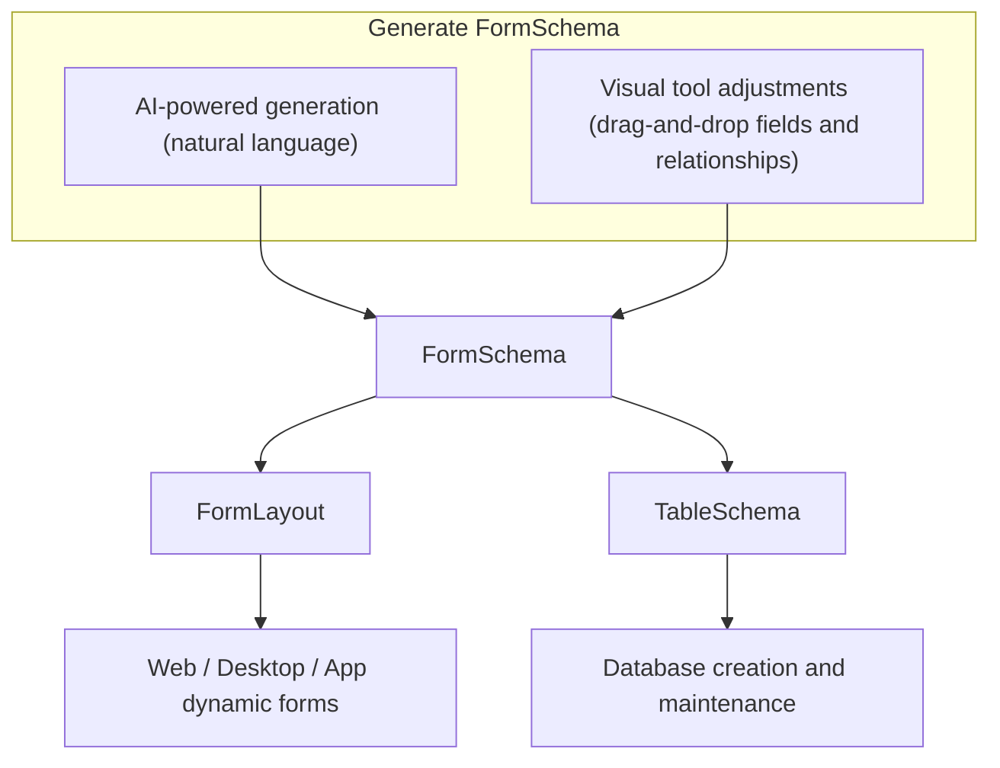
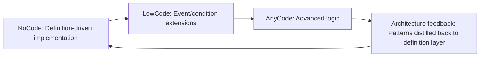

# BeeNET Framework Architecture Overview

[繁體中文](architecture-overview.zh-TW.md)

> Definition-Driven Architecture: design philosophy and practical patterns for ERP systems

---

## Table of Contents

1. [Core Architecture Philosophy](#1-core-architecture-philosophy)
2. [Architecture Pattern Positioning](#2-architecture-pattern-positioning)
3. [FormSchema: The Definition Hub](#3-formschema-the-definition-hub)
4. [FormLayout: UI Layer Definition](#4-formlayout-ui-layer-definition)
5. [TableSchema: Data Layer Definition](#5-tableschema-data-layer-definition)
6. [DataSet as DTO](#6-dataset-as-dto)
7. [Business Object (BO)](#7-business-object-bo)
8. [Repository Dual-Track Strategy](#8-repository-dual-track-strategy)
9. [MVVM Integration](#9-mvvm-integration)
10. [NoCode / LowCode / AnyCode Evolution Axis](#10-nocode--lowcode--anycode-evolution-axis)
11. [Overall Architecture Diagram](#11-overall-architecture-diagram)
12. [Key Design Decision Summary](#12-key-design-decision-summary)

---

## 1. Core Architecture Philosophy

BeeNET adopts a **Definition-Driven Architecture**, using `FormSchema` as the system's single source of truth to uniformly drive UI, database schema, and business logic. This addresses the core pain points of traditional ERP development: specifications scattered across three layers, redundant implementations, and difficulty in maintenance.

**Design Principles:**

- **Encapsulate complexity in the architecture layer** to simplify application-level development
- **Use structural definitions to drive cross-layer automation** (UI / DB / Logic)
- **Make definitions the primary development interface**, not code

### Pain Points of Traditional ERP Development

| Pain Point | Description |
|------------|-------------|
| Specifications scattered across layers | Adding a single field requires separate changes in UI / DTO / DB Migration, easily leading to inconsistencies |
| Scattered business logic | Different modules maintained by different engineers result in inconsistent styles and duplicated efforts |
| Customizations hard to standardize | Custom logic cannot be standardized, accumulating into unmanageable technical debt |

### Applicability Boundaries

| Suitable | Not Suitable |
|----------|--------------|
| Form-centric data applications (master/detail, auditing, validation) | High-concurrency, event-intensive systems (e-commerce, social media, gaming) |
| Multi-endpoint unified backend (Web / App / WinForms) | High-frequency microservice scenarios |
| Enterprise internal management systems (HR, finance, procurement, warehouse, CRM) | |

---

## 2. Architecture Pattern Positioning

BeeNET adopts a **N-Tier + Clean Architecture + MVVM** hybrid pattern, borrowing the most suitable concepts from each pattern for ERP scenarios.

### Pattern Adoption Comparison

| Pattern | Adopted Concepts | Manifested in BeeNET |
|---------|-----------------|----------------------|
| **N-Tier** | Clear layer boundaries, DataSet for cross-layer transfer, pragmatism | Distinct UI / API / BO / Repository / DB layers |
| **Clean Architecture** | Inward dependency direction, Domain Core as the most stable layer, Use Case isolation | FormSchema as Domain Core; BO as Use Case; Repository as Interface Adapter |
| **MVVM** | ViewModel isolates View from Model, two-way binding | FormSchema drives ViewModel structure; DataSet serves as Model |

### Pragmatic Trade-offs vs. Pure Clean Architecture

Pure Clean Architecture requires a strongly-typed Domain Entity for every business concept. ERP systems have a vast number of forms (hundreds or more), making the cost of writing Entity + Mapper for each one prohibitively high.

BeeNET **replaces strongly-typed Entities with DataSet**, which brings:
- No need to define a corresponding Entity for every form
- FormSchema dynamically describes structure; adding a field requires no code changes
- Cross-layer transfer without mapping, eliminating unnecessary conversion layers

This is **pragmatic clean architecture** -- preserving dependency direction and separation of responsibilities while eliminating the unnecessary Entity modeling cost in ERP scenarios.

---

## 3. FormSchema: The Definition Hub

`FormSchema` is the core of the BeeNET architecture -- a **cross-layer shared structural description model**.

### Scope of Responsibility

- **Field definitions**: field name, data type, length, default value
- **Behavior definitions**: required, read-only, hidden, validation rules
- **Relationship definitions**: master/detail relationships between forms (FormSchemas)
- **SQL generation basis**: Repository CRUD dynamically generates SQL from FormSchema
- **UI derivation source**: FormLayout derives layout structure from FormSchema
- **DB derivation source**: TableSchema derives table structure from FormSchema

### Definition Generation Flow



### Override Mechanism

FormLayout and TableSchema are derived from FormSchema by default, but support independent adjustments:

```
FormSchema updated
    |
Re-derive "default values"
    |
Diff against existing FormLayout / TableSchema
    |-- Unmodified parts -> Updated
    +-- Manually overridden parts -> Preserved
```

This ensures that when FormSchema evolves, manually adjusted custom settings are not overwritten.

---

## 4. FormLayout: UI Layer Definition

`FormLayout` is the UI-dimension projection of FormSchema, describing the visual configuration of a form.

### Positioning

| | XAML | FormLayout |
|--|--|--|
| Purpose | General-purpose UI description language | Designed specifically for standardized ERP forms |
| Complexity | High; must handle all UI scenarios | Low; only describes Master / Detail / Field structure |
| Cross-platform | Primarily WPF / MAUI | Unified across Web / Desktop / App |
| Generation | Hand-written | Auto-derived from FormSchema, then fine-tuned |

### Standardized ERP Layout Pattern

```
+------------------------------------+
| Header (master fields)             |  <- Fixed area
+------------------------------------+
| Tab 1: Detail Grid                 |  <- Detail area (One2Many)
| Tab 2: Additional Information      |
+------------------------------------+
| Footer (summary fields)            |  <- Fixed area
+------------------------------------+
```

This constrained layout pattern allows FormLayout to fully describe forms with a far more concise syntax than XAML, and dynamically render across Web / Desktop / App.

---

## 5. TableSchema: Data Layer Definition

`TableSchema` is the database-dimension projection of FormSchema, responsible for describing and maintaining table structures.

### Responsibilities

- Derive table columns, types, and lengths from FormSchema
- Execute database DDL: CREATE TABLE / ALTER TABLE (add and modify columns)
- DBA can independently adjust indexes, precision, and default values

### Adjustment Example

```
FormSchema: field Amount, type Decimal
    | derived
TableSchema default: DECIMAL(18, 2)
    | DBA adjustment (independent of FormSchema)
TableSchema actual: DECIMAL(24, 6)  +  INDEX  +  DEFAULT 0
```

FormSchema does not need to know database-layer optimization details; TableSchema can evolve independently.

---

## 6. DataSet as DTO

BeeNET uses ADO.NET `DataSet` as the cross-layer Data Transfer Object (DTO), rather than custom strongly-typed POCOs.

### Rationale

| Characteristic | Description |
|----------------|-------------|
| **Native Master-Detail support** | `DataRelation` naturally expresses master-detail structure; nearly all ERP forms follow this pattern |
| **Self-describing structure** | DataSet carries its own schema; no additional type definitions needed during transfer |
| **Multi-table transport** | A single DataSet can carry a master table plus multiple detail tables, transferring an entire transaction's data at once |
| **Cross-layer consistency** | UI layer, BO layer, and Repository layer share the same object; no mapping required |

### Design Boundary

DataSet is purely a **data container** and contains no business logic whatsoever. All logic resides in the BO; DataSet only provides data.

---

## 7. Business Object (BO)

`Business Object` (BO) is the core of business logic, corresponding to the Use Case layer in Clean Architecture.

### Responsibilities

- Provide methods corresponding to form operations (Save, Delete, Validate, Query...)
- Execute data validation based on FormSchema
- Coordinate DataSet (data) and Repository (data access)
- **Never access the database directly**; always go through Repository

### Typical Method Structure

```csharp
public class SalesOrderBO
{
    // CRUD: via FormSchema-driven Repository
    public void Save(DataSet ds)
    {
        // 1. Validate DataSet data based on FormSchema
        // 2. Call FormSchema-driven Repository to execute INSERT / UPDATE
    }

    public void Delete(DataSet ds) { ... }

    // Reports: BO implements directly with full control
    public DataSet GetSalesSummaryReport(ReportFilter filter)
    {
        // Write complex SQL or call Stored Procedure directly
    }

    // Batch: BO implements directly, controlling transaction and batching logic
    public void BatchUpdatePrices(IEnumerable<PriceRule> rules)
    {
        // Custom transaction boundaries, error compensation strategies
    }
}
```

A single BO can mix both Repository strategies; the caller does not need to know which track is used underneath.

---

## 8. Repository Dual-Track Strategy

Repository adopts a **dual-track parallel** design, choosing the appropriate implementation based on the nature of the operation.

### Dual-Track Comparison

| Track | Applicable Operations | SQL Source | Characteristics |
|-------|----------------------|------------|-----------------|
| **FormSchema-driven** ([FormMap](formmap.md)) | CRUD (create, update, delete) | Dynamically generated from FormSchema | Define once, auto-sync; no hand-written SQL |
| **AnyCode** | Reports, analytical queries, batch operations | Written by BO | Full control; complex JOINs, aggregations, performance tuning |

### Why This Division

ERP CRUD operations are highly homogeneous; nearly all forms follow:

```
Validate required -> Validate format -> Validate relationships -> INSERT / UPDATE / DELETE
```

This 80% of workload is handled by FormSchema-driven operations -- developers only need to define, not write code.

Reports and batch operations often involve multi-table JOINs + GROUP BY + dynamic conditions, or require control over transaction boundaries and batching strategies. Forcing them into FormSchema would only add unnecessary complexity.

### Shared Infrastructure

Both tracks share underlying connection management and transaction management:

```
FormSchema-driven Repository --+
                                +--> Shared UnitOfWork / ConnectionFactory
AnyCode Repository -------------+
```

This ensures cross-track operations (e.g., CRUD on the main order + batch inventory update) can collaborate within **the same transaction**, keeping commit / rollback consistent.

---

## 9. MVVM Integration

BeeNET integrates with the frontend using the MVVM pattern, with FormSchema directly driving the ViewModel binding structure.

### Layer Mapping

| MVVM Role | BeeNET Counterpart | Description |
|-----------|--------------------|-------------|
| **Model** | DataSet | Carries form data; no logic |
| **ViewModel** | Derived from FormSchema | Field behavior, validation rules, binding structure |
| **View** | Web / Desktop / App | Dynamically rendered via FormLayout |

### Data Flow

```
User interaction
    |^ (two-way binding)
ViewModel (binding structure derived from FormSchema)
    |^
DataSet (Model)
    |
BO.Save(DataSet)
    |
Repository -> Database
```

When FormSchema changes, the ViewModel binding structure updates automatically; the View requires no manual adjustments.

---

## 10. NoCode / LowCode / AnyCode Evolution Axis

BeeNET provides three levels of development depth along a single evolution axis -- they are complementary, not mutually exclusive technology stacks.

### Three-Level Comparison

| Mode | Flexibility | Implementation | Applicable Scenarios |
|------|-------------|----------------|---------------------|
| **NoCode** | Medium | FormSchema -> FormLayout + TableSchema auto-generated | Standard workflows, data-oriented forms |
| **LowCode** | High | Events, conditions, and rules to extend BO | Light customization logic |
| **AnyCode** | Full | Custom UI / BO methods / AnyCode Repository | Complex logic, cross-module integration, reports and batch operations |

### Evolution Cycle



Common patterns discovered during each AnyCode customization can be distilled back into FormSchema or BO base classes, making the next development cycle more automated.

---

## 11. Overall Architecture Diagram

```
+------------------------------------------------------+
|  View                                                |
|  WinForms / Web (Blazor/React) / App (MAUI)         |  MVVM: View
+------------------------------------------------------+
|  ViewModel                                           |  MVVM: ViewModel
|  (binding structure derived from FormSchema)         |
+------------------------------------------------------+
|  API Layer  (Bee.Api.AspNetCore / JSON-RPC 2.0)     |  N-Tier: Presentation
+------------------------------------------------------+
|                                                      |
|  Business Object (BO)                                |  Clean Arch: Use Case
|  +- CRUD methods (FormSchema validation + Repository)|
|  +- Report methods (AnyCode Repository)              |
|  +- Batch methods (AnyCode Repository)               |
|                                                      |
|  +----------------------------------+                |
|  |  FormSchema (definition hub)     |                |  Clean Arch: Domain Core
|  |  Field behavior / Form relations |                |
|  |  / Validation rules              |                |
|  +------+-----------------+---------+                |
|         |                 |                          |
|   FormLayout         TableSchema                     |
|   (UI layout)        (table structure)               |
|                                                      |
+------------------------------------------------------+
|  DataSet (DTO)                                       |  N-Tier: Data Transfer
|  Master Table + Detail Tables                        |
+------------------------------------------------------+
|  Repository                                          |  Clean Arch: Interface Adapter
|  +- FormSchema-driven (CRUD SQL auto-generated)      |
|  +- AnyCode (reports/batch, BO-implemented)          |
|  +- Shared UnitOfWork / ConnectionFactory            |
+------------------------------------------------------+
|  Bee.Db (data access infrastructure)                 |  N-Tier: Data Layer
|  +- IDialectFactory routes per DatabaseType          |
|  +- DbDialectRegistry: SQLServer / PostgreSQL / ...  |
|  +- DbProviderManager: ADO.NET DbProviderFactory     |
+------------------------------------------------------+
|  Database (MSSQL / PostgreSQL / MySQL ...)           |
+------------------------------------------------------+
```

> Provider registration is explicit: the host app calls
> `DbProviderManager.RegisterProvider(...)` and
> `DbDialectRegistry.Register(...)` for each database it actually uses.
> `Bee.Db` itself has zero ADO.NET driver dependencies. See
> [`src/Bee.Db/README.md`](../src/Bee.Db/README.md) for the registration
> code example.

---

## 12. Key Design Decision Summary

| Decision Point | Choice | Rationale |
|----------------|--------|-----------|
| **DTO type** | ADO.NET DataSet | ERP Master-Detail structure; cross-layer consistency without mapping |
| **Domain core** | FormSchema (not Entity) | Vast number of ERP forms; dynamic definitions are superior to modeling each one individually |
| **Logic layer** | BO (independent of data) | Clean Arch Use Case; does not depend on DB implementation details |
| **CRUD SQL** | Dynamically generated from FormSchema | Define once; adding fields auto-syncs |
| **Complex queries/batch** | AnyCode Repository | ERP reports/batch require full control; the framework should not constrain complex scenarios |
| **UI definition** | FormLayout (not XAML) | Designed for standardized ERP layouts; constrained structure, more concise syntax |
| **DB maintenance** | TableSchema derivation + adjustable | Auto-sync with definitions; DBA can still independently optimize indexes and types |
| **Architecture hybrid** | N-Tier + Clean Arch + MVVM | Borrowing the most suitable concepts for ERP from each; not forcing pure theoretical application |
