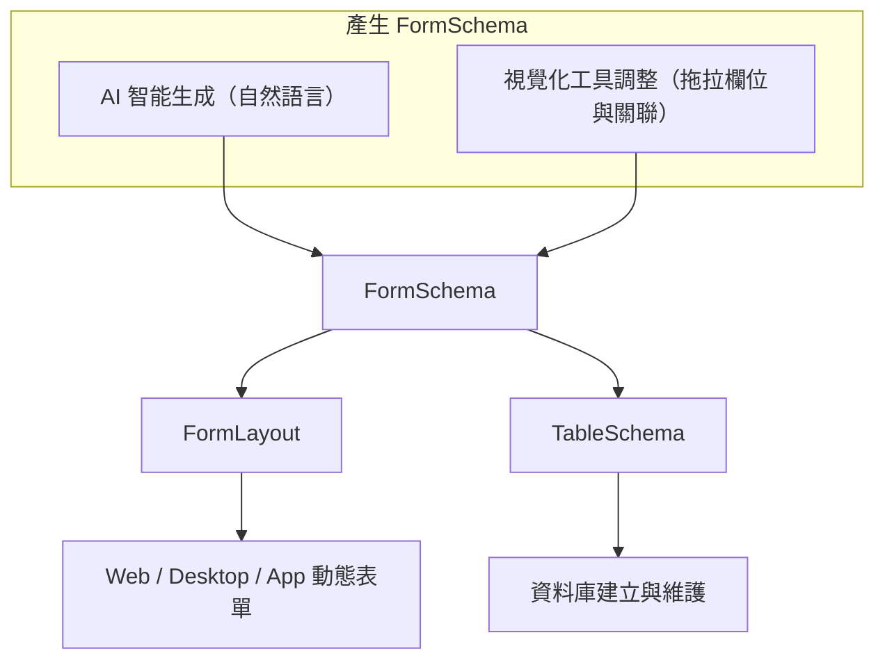
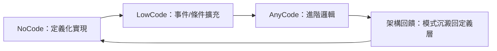

# BeeNET 框架架構總覽

[English](architecture-overview.md)

> 定義導向架構（Definition-Driven Architecture）在 ERP 系統中的設計理念與實踐模式

---

## 目錄

1. [架構核心理念](#1-架構核心理念)
2. [架構模式定位](#2-架構模式定位)
3. [FormSchema 定義中樞](#3-formschema-定義中樞)
4. [FormLayout 介面層定義](#4-formlayout-介面層定義)
5. [TableSchema 資料層定義](#5-tableschema-資料層定義)
6. [DataSet 作為 DTO](#6-dataset-作為-dto)
7. [Business Object（BO）](#7-business-objectbo)
8. [Repository 雙軌策略](#8-repository-雙軌策略)
9. [MVVM 整合](#9-mvvm-整合)
10. [NoCode / LowCode / AnyCode 演進軸線](#10-nocode--lowcode--anycode-演進軸線)
11. [整體架構圖](#11-整體架構圖)
12. [關鍵設計決策摘要](#12-關鍵設計決策摘要)

---

## 1. 架構核心理念

BeeNET 採用**定義導向架構（Definition-Driven Architecture）**，以 `FormSchema` 作為系統的唯一定義來源（Single Source of Truth），統一驅動 UI、資料庫結構與業務邏輯，解決傳統 ERP 開發中規格分散三層、重複實作、難以維護的核心痛點。

**設計精神：**

- **將複雜度封裝在架構層**，簡化上層開發
- **以結構定義驅動跨層自動化**（UI / DB / Logic）
- **讓定義成為主要的開發介面**，而非程式碼

### 傳統 ERP 開發的痛點

| 痛點 | 說明 |
|------|------|
| 規格分散三層 | 新增一個欄位，UI / DTO / DB Migration 各改一次，極易不一致 |
| 業務邏輯分散 | 不同模組由不同工程師維護，風格不一、重複開發 |
| 客製化難回饋 | 客製邏輯無法標準化，累積成難以治理的技術債 |

### 適用邊界

| 適用 | 不適用 |
|------|--------|
| 表單中心資料應用（主/明細、稽核、驗證） | 高併發、事件密集系統（電商、社群、遊戲） |
| 多端統一後台（Web / App / WinForms） | 高頻微服務場景 |
| 企業內部管理系統（HR、財務、採購、倉儲、CRM） | |

---

## 2. 架構模式定位

BeeNET 採用 **N-Tier + Clean Architecture + MVVM** 的混合模式，從各模式取用最適合 ERP 場景的概念。

### 各模式取用對照

| 模式 | 取用的概念 | 體現於 BeeNET |
|------|-----------|--------------|
| **N-Tier** | 明確層次邊界、DataSet 跨層傳遞、實用主義 | UI / API / BO / Repository / DB 各層分明 |
| **Clean Architecture** | 依賴方向向內、Domain Core 最穩定、Use Case 隔離 | FormSchema 為 Domain Core；BO 為 Use Case；Repository 為 Interface Adapter |
| **MVVM** | ViewModel 隔離 View 與 Model、雙向綁定 | FormSchema 驅動 ViewModel 結構；DataSet 為 Model |

### 與純 Clean Architecture 的務實取捨

純 Clean Architecture 要求每個業務概念都有強型別 Domain Entity，ERP 表單數量龐大（百張以上），逐一撰寫 Entity + Mapper 成本極高。

BeeNET 以 **DataSet 取代強型別 Entity**，帶來：
- 不需為每張表單定義對應 Entity
- FormSchema 動態描述結構，新增欄位不需改程式碼
- 跨層傳遞無需 mapping，減少不必要的轉換層

這是 **pragmatic clean architecture**——保留依賴方向與職責隔離，省去 ERP 場景中不必要的 Entity 建模成本。

---

## 3. FormSchema 定義中樞

`FormSchema` 是 BeeNET 架構的核心，一份**跨層共用的結構描述模型**。

### 職責範圍

- **欄位定義**：欄位名稱、資料型別、長度、預設值
- **行為定義**：必填、唯讀、隱藏、驗證規則
- **關聯定義**：與其他表單（FormSchema）之間的主/明細關係
- **SQL 產生依據**：Repository CRUD 從 FormSchema 動態產生 SQL
- **UI 推導來源**：FormLayout 從 FormSchema 推導版面結構
- **DB 推導來源**：TableSchema 從 FormSchema 推導資料表結構

### 定義生成流程



### Override 機制

FormLayout 與 TableSchema 預設由 FormSchema 推導產生，但支援獨立調整：

```
FormSchema 更新
    ↓
重新推導「預設值」
    ↓
與現有 FormLayout / TableSchema 做 diff
    ├─ 未手動調整的部分 → 更新
    └─ 已手動覆寫的部分 → 保留
```

這確保 FormSchema 演進時，人工調整的客製設定不會被覆蓋。

---

## 4. FormLayout 介面層定義

`FormLayout` 是 FormSchema 在 UI 維度的投影，描述表單的視覺配置。

### 定位

| | XAML | FormLayout |
|--|--|--|
| 目的 | 通用 UI 描述語言 | 專為 ERP 制式表單設計 |
| 複雜度 | 高，需處理所有 UI 場景 | 低，只描述 Master / Detail / Field 結構 |
| 跨端 | 主要 WPF / MAUI | Web / Desktop / App 統一 |
| 產生方式 | 手寫 | 從 FormSchema 自動推導，再微調 |

### ERP 制式版面模式

```
┌────────────────────────────────────┐
│ Header（主檔欄位群）               │  ← 固定區
├────────────────────────────────────┤
│ Tab 1：明細 Grid                   │  ← 明細區（One2Many）
│ Tab 2：附加資訊                    │
├────────────────────────────────────┤
│ Footer（統計欄位）                 │  ← 固定區
└────────────────────────────────────┘
```

這種收斂的版面模式讓 FormLayout 能以遠比 XAML 簡潔的語法完整描述，並在 Web / Desktop / App 三端動態渲染。

---

## 5. TableSchema 資料層定義

`TableSchema` 是 FormSchema 在資料庫維度的投影，負責描述並維護資料表結構。

### 職責

- 從 FormSchema 推導資料表欄位、型別、長度
- 執行資料庫 DDL：CREATE TABLE / ALTER TABLE（欄位新增、修改）
- DBA 可針對索引、精度、預設值進行獨立調整

### 調整範例

```
FormSchema：欄位 Amount，型別 Decimal
    ↓ 推導
TableSchema 預設：DECIMAL(18, 2)
    ↓ DBA 調整（獨立於 FormSchema）
TableSchema 實際：DECIMAL(24, 6)  +  INDEX  +  DEFAULT 0
```

FormSchema 不需要知道資料庫層的最佳化細節，TableSchema 可獨立演進。

---

## 6. DataSet 作為 DTO

BeeNET 使用 ADO.NET `DataSet` 作為跨層的資料傳輸物件（DTO），而非自訂強型別 POCO。

### 選用理由

| 特性 | 說明 |
|------|------|
| **原生支援 Master-Detail** | `DataRelation` 天然表達主明細結構，ERP 表單幾乎都是這種形態 |
| **自描述結構** | DataSet 本身含 schema，傳輸時不需額外型別定義 |
| **多表同時攜帶** | 一個 DataSet 可帶主表 + 多個明細表，一次傳遞整筆作業資料 |
| **跨層一致** | UI 層、BO 層、Repository 層共用同一物件，不需 mapping |

### 設計邊界

DataSet 只是**資料的容器**，本身不包含任何業務邏輯。所有邏輯由 BO 負責，DataSet 只提供資料。

---

## 7. Business Object（BO）

`Business Object`（BO）是業務邏輯的核心，對應 Clean Architecture 中的 Use Case 層。

### 職責

- 提供表單作業對應的方法（Save、Delete、Validate、Query…）
- 依據 FormSchema 執行資料驗證
- 協調 DataSet（資料）與 Repository（資料存取）
- **不直接存取資料庫**，一律透過 Repository

### 典型方法結構

```csharp
public class SalesOrderBO
{
    // CRUD：透過 FormSchema 驅動的 Repository
    public void Save(DataSet ds)
    {
        // 1. 依 FormSchema 驗證 DataSet 資料
        // 2. 呼叫 FormSchema-driven Repository 執行 INSERT / UPDATE
    }

    public void Delete(DataSet ds) { ... }

    // 報表：BO 自行實作，完全自控
    public DataSet GetSalesSummaryReport(ReportFilter filter)
    {
        // 自行撰寫複雜 SQL 或呼叫 Stored Procedure
    }

    // 批次：BO 自行實作，控制交易與分批邏輯
    public void BatchUpdatePrices(IEnumerable<PriceRule> rules)
    {
        // 自訂交易邊界、錯誤回補策略
    }
}
```

同一個 BO 內可混用兩種 Repository 策略，上層呼叫端無需感知底層走哪條路。

---

## 8. Repository 雙軌策略

Repository 採用**雙軌並行**設計，依作業性質選擇適合的實作方式。

### 雙軌對照

| 軌道 | 適用作業 | SQL 來源 | 特性 |
|------|----------|----------|------|
| **FormSchema 驅動**（[FormMap](formmap.zh-TW.md)） | CRUD（新增、修改、刪除） | FormSchema 動態產生 | 定義一處，自動同步；無需手寫 SQL |
| **AnyCode** | 報表、分析查詢、批次作業 | BO 自行撰寫 | 完全自控；複雜 JOIN、彙總、效能調校 |

### 為什麼這樣劃分

ERP 的 CRUD 高度同質化，幾乎所有表單都是：

```
驗證必填 → 驗證格式 → 驗證關聯 → INSERT / UPDATE / DELETE
```

這 80% 的作業量讓 FormSchema 驅動，開發者只需定義，不需撰寫程式。

報表與批次作業的 SQL 往往是多表 JOIN + GROUP BY + 動態條件，或需要控制交易邊界與分批策略，強行套入 FormSchema 反而增加不必要的複雜度。

### 基礎設施共用

兩軌共用底層的連線管理與交易管理：

```
FormSchema-driven Repository ─┐
                               ├─→ 共用 UnitOfWork / ConnectionFactory
AnyCode Repository ────────────┘
```

這確保跨軌的操作（例如：CRUD 主單 + 批次更新庫存）可以在**同一個交易**內協作，commit / rollback 保持一致。

---

## 9. MVVM 整合

BeeNET 以 MVVM 模式整合前端，FormSchema 直接驅動 ViewModel 的 binding 結構。

### 層次對應

| MVVM 角色 | BeeNET 對應 | 說明 |
|-----------|------------|------|
| **Model** | DataSet | 承載表單資料，無邏輯 |
| **ViewModel** | 由 FormSchema 推導 | 欄位行為、驗證規則、binding 結構 |
| **View** | Web / Desktop / App | 透過 FormLayout 動態渲染 |

### 資料流

```
使用者操作
    ↓↑（雙向綁定）
ViewModel（FormSchema 推導 binding 結構）
    ↓↑
DataSet（Model）
    ↓
BO.Save(DataSet)
    ↓
Repository → Database
```

FormSchema 改變時，ViewModel 的 binding 結構自動更新，View 無需手動調整。

---

## 10. NoCode / LowCode / AnyCode 演進軸線

BeeNET 提供三種開發深度，同一條演進軸線，非互斥的技術堆疊。

### 三段對照

| 模式 | 自由度 | 實作方式 | 適用情境 |
|------|--------|----------|----------|
| **NoCode** | 中 | FormSchema → FormLayout + TableSchema 自動產生 | 標準流程、資料導向表單 |
| **LowCode** | 高 | 事件、條件、規則擴充 BO | 輕度客製邏輯 |
| **AnyCode** | 完全 | 自訂 UI / BO 方法 / AnyCode Repository | 複雜邏輯、跨模組整合、報表批次 |

### 演進循環



每一次 AnyCode 客製所發現的通用模式，可沉澱回 FormSchema 或 BO 基類，使下一次開發更自動化。

---

## 11. 整體架構圖

```
┌──────────────────────────────────────────────────────┐
│  View                                                │
│  WinForms / Web (Blazor/React) / App (MAUI)         │  MVVM: View
├──────────────────────────────────────────────────────┤
│  ViewModel                                          │  MVVM: ViewModel
│  （由 FormSchema 推導 binding 結構）                 │
├──────────────────────────────────────────────────────┤
│  API Layer  (Bee.Api.AspNetCore / JSON-RPC 2.0)     │  N-Tier: Presentation
├──────────────────────────────────────────────────────┤
│                                                      │
│  Business Object (BO)                               │  Clean Arch: Use Case
│  ├─ CRUD 方法（依 FormSchema 驗證 + Repository）    │
│  ├─ 報表方法（AnyCode Repository）                  │
│  └─ 批次方法（AnyCode Repository）                  │
│                                                      │
│  ┌──────────────────────────────────┐               │
│  │  FormSchema（定義中樞）           │               │  Clean Arch: Domain Core
│  │  欄位行為 / 表單關係 / 驗證規則  │               │
│  └──────┬───────────────┬───────────┘               │
│         ↓               ↓                           │
│   FormLayout         TableSchema                    │
│   （介面配置）       （資料表結構）                  │
│                                                      │
├──────────────────────────────────────────────────────┤
│  DataSet（DTO）                                     │  N-Tier: Data Transfer
│  Master Table + Detail Tables                       │
├──────────────────────────────────────────────────────┤
│  Repository                                         │  Clean Arch: Interface Adapter
│  ├─ FormSchema-driven（CRUD SQL 自動產生）           │
│  └─ AnyCode（報表/批次，BO 自行實作）               │
│  └─ 共用 UnitOfWork / ConnectionFactory             │
├──────────────────────────────────────────────────────┤
│  Bee.Db（資料存取基礎設施）                          │  N-Tier: Data Layer
│  ├─ IDialectFactory 依 DatabaseType 路由             │
│  ├─ DbDialectRegistry：SQLServer / PostgreSQL / …    │
│  └─ DbProviderManager：ADO.NET DbProviderFactory     │
├──────────────────────────────────────────────────────┤
│  Database（MSSQL / PostgreSQL / MySQL …）           │
└──────────────────────────────────────────────────────┘
```

> Provider 註冊由 host 應用程式明示完成：對每個實際使用的資料庫，呼叫
> `DbProviderManager.RegisterProvider(...)` 與 `DbDialectRegistry.Register(...)`。
> `Bee.Db` 本身不引用任何 ADO.NET driver。註冊範例見
> [`src/Bee.Db/README.zh-TW.md`](../src/Bee.Db/README.zh-TW.md)。

---

## 12. 關鍵設計決策摘要

| 決策點 | 選擇 | 理由 |
|--------|------|------|
| **DTO 型別** | ADO.NET DataSet | ERP Master-Detail 結構；跨層一致不需 mapping |
| **Domain 核心** | FormSchema（而非 Entity） | ERP 表單數量龐大，動態定義優於逐一建模 |
| **邏輯層** | BO（獨立於資料） | Clean Arch Use Case；不依賴 DB 實作細節 |
| **CRUD SQL** | FormSchema 動態產生 | 定義一處，欄位新增自動同步 |
| **複雜查詢/批次** | AnyCode Repository | ERP 報表/批次需完整自控；框架不應限制複雜場景 |
| **介面定義** | FormLayout（非 XAML） | 專為 ERP 制式版面；結構收斂，語法更簡潔 |
| **DB 維護** | TableSchema 推導 + 可調整 | 自動同步定義；DBA 仍可獨立最佳化索引與型別 |
| **架構混合** | N-Tier + Clean Arch + MVVM | 各取最適合 ERP 的概念；不強迫純理論套用 |
