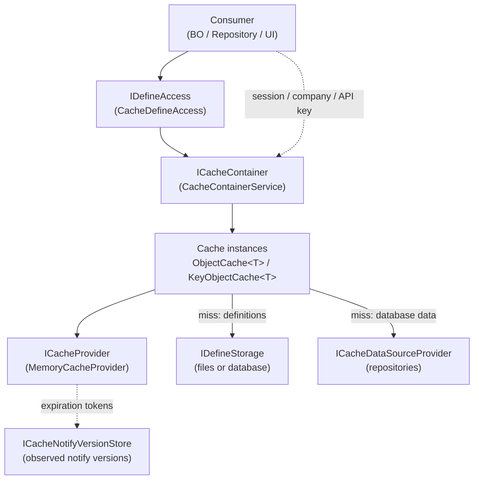

# Caching

[繁體中文](caching.zh-TW.md) · [← Docs Index](README.md)

> How the framework caches definitions and database-backed data, and how an entry stops being valid

---

## Table of Contents

1. [What Every Cache Does](#1-what-every-cache-does)
2. [Components of the Cache Layer](#2-components-of-the-cache-layer)
3. [Two Families of Cache](#3-two-families-of-cache)
4. [Anatomy of a Read](#4-anatomy-of-a-read)
5. [How an Entry Stops Being Valid](#5-how-an-entry-stops-being-valid)
6. [Database-Dependent Caching](#6-database-dependent-caching)
7. [Cache Inventory](#7-cache-inventory)
8. [Containers, DI and Multi-Tenancy](#8-containers-di-and-multi-tenancy)
9. [Cached Definitions Are Immutable](#9-cached-definitions-are-immutable)
10. [The Client-Side Definition Cache](#10-the-client-side-definition-cache)
11. [Replacing the Provider](#11-replacing-the-provider)
12. [Further Reading](#12-further-reading)

---

## 1. What Every Cache Does

Every cache in the framework is an **in-process, lazily populated, read-through** cache: the caller
asks the cache, it asks its source on a miss, and it hands back the *same shared instance* to every
caller until some signal says the source changed.

Each of those three has a practical consequence:

- **Lazily populated** — nothing is warmed at startup, and an invalidation never triggers a reload.
  It only guarantees the *next* read goes back to the source.
- **Same shared instance** — the object you get is not yours. See
  [§9](#9-cached-definitions-are-immutable).
- **In-process** — a write in one process does not, by itself, invalidate anything in another.
  Closing that gap is what [§6](#6-database-dependent-caching) is about.

---

## 2. Components of the Cache Layer



Four roles, and what each is responsible for:

| Piece | Type | Responsibility |
|-------|------|----------------|
| **Cache class** | `ObjectCache<T>` / `KeyObjectCache<T>` subclass | Knows *how to load* one kind of object and *what policy* its entries get |
| **Container** | `ICacheContainer` | Holds one singleton instance of every cache class; the injectable handle |
| **Provider** | `ICacheProvider` | A plain key → object store with expiration. Knows nothing about what it stores |
| **Version store** | `ICacheNotifyVersionStore` | Per-process record of "what notify version have I observed for this key" |

The provider's responsibilities are deliberately kept to a minimum — no atomic get-or-create, no
knowledge of loading, no notion of a definition. Loading and de-duplication stay in the cache
classes, which is why a replacement provider ([§11](#11-replacing-the-provider)) is a small thing
to write.

---

## 3. Two Families of Cache

Every cache in `ICacheContainer` belongs to one of two families. The split is not cosmetic — it
determines where the data comes from, and therefore how a change gets noticed.

|  | **Define caches** (`Bee.ObjectCaching/Define/`) | **Database caches** (`Bee.ObjectCaching/Database/`) |
|--|--|--|
| Source | `IDefineStorage` (XML files, or definition rows in a database) | `ICacheDataSourceProvider` → repositories → tables |
| Populated by | `CacheDefineAccess` on a `GetX` call | The consuming service on a lookup |
| Local invalidation | `IDefineAccess.SaveX` calls `Remove` right after the write | The writing service calls `Remove` |
| Cross-process invalidation | File modification time, *or* cache-notify | Cache-notify only |
| Examples | `FormSchemaCache`, `TableSchemaCache`, `LanguageResourceCache` | `SessionInfoCache`, `CompanyInfoCache`, `ApiKeyCache` |

Both families use the same two base classes and the same provider. `ObjectCache<T>` is for a
single object (`SystemSettings` — there is only one), `KeyObjectCache<T>` for many objects of one
type addressed by a string key (`FormSchema` — one per `progId`). A composite key is flattened
into one string with a dot: `TableSchema` is keyed `"{categoryId}.{tableName}"`,
`LanguageResource` is keyed `"{lang}.{namespace}"`.

> **Three define caches read files directly, not through `IDefineStorage`**: `SystemSettingsCache`,
> `DatabaseSettingsCache` and `PermissionModelsCache` deserialize their XML from a `PathOptions`
> path in `CreateInstance`. They are the bootstrap definitions — the ones that must be readable
> before a database connection exists — so a database-backed `IDefineStorage` does not change where
> they come from.

---

## 4. Anatomy of a Read

`Get()` on either base class is the same three steps:

```
1. Read the provider.  Hit → return it. Done, no lock, no allocation.
2. Miss → enter single-flight for this key.
3. Inside the flight: re-check the provider, then CreateInstance(), store, return.
```

Two details in that flow cannot be skipped.

### Single-flight: concurrent misses produce one instance

Concurrent misses on the same key do **not** each run `CreateInstance`. `CacheSingleFlight<T>`
holds a `ConcurrentDictionary<string, Lazy<T?>>` of *in-flight* creations; the first caller runs
the factory, the rest await the same `Lazy` and receive the same object.

This is not merely an optimization. `SessionInfo` lives in a `KeyObjectCache`, and two callers
holding two different instances of the same session means a write through one — `EnterCompany`, for
example — is invisible through the other. Several consumers also compare cached values by reference
to detect a reload; a duplicate instance would read as a change that never happened.

> **The in-flight map holds only in-flight creations** — each entry is removed in a `finally`, with
> a compare-and-remove so a newer flight is never evicted. It must not be turned into a per-key lock
> table: keys include caller-supplied values such as access tokens, so a table that only grows is
> unbounded.

### Negative caching: a miss can itself be cached

If `CreateInstance` returns `null`, `KeyObjectCache<T>` stores a process-wide sentinel under the key
with a **5-minute absolute** expiry (`GetNegativePolicy`). Subsequent reads of that key return
`null` without touching the source. This guards against cache penetration — repeated lookups of a
key whose data does not exist would otherwise hit the database every time.

The negative window is deliberately shorter than the positive one so that data created elsewhere
becomes visible within a bounded delay. Two caches override the default, and both overrides are
security decisions rather than tuning:

- **`SessionInfoCache` disables negative caching entirely** (`GetNegativePolicy` returns `null`).
  Caching every unauthenticated lookup would let anonymous traffic inflate the cache with markers
  for arbitrary access tokens — memory whose size an attacker chooses. The rebuild it would save is
  one indexed read that returns nothing.
- **`ApiKeyCache` shortens it to 1 minute**, so a newly issued key starts working promptly.

Negative entries carry the same notify dependency as real ones, so a cached miss also clears once
the entry is created in another process.

`ObjectCache<T>` has no negative caching: a single-object cache that cannot load its object is a
configuration error, not a lookup miss.

---

## 5. How an Entry Stops Being Valid

Four independent signals, and an entry can carry several at once.

| Signal | Set by | Scope | Detected |
|--------|--------|-------|----------|
| **Time** | `CacheItemPolicy` — 20-minute sliding by default | This process | On read |
| **Explicit `Remove`** | `IDefineAccess.SaveX`, service write paths | This process | Immediately |
| **File modification** | `ChangeMonitorFilePaths` | Any process sharing the filesystem | On read |
| **Cache-notify version** | `ChangeNotifyKey` | Any process polling the same database | On read |

Three of the four are detected **on read**, not by a background sweep. `MemoryCache` evaluates each
entry's expiration tokens on every `TryGetValue`, and both `FileModificationToken` and
`CacheNotifyToken` compare a snapshot taken at insertion against the current value at that moment.
No timer, no callback, no eager eviction.

One consequence follows: **an invalidated entry costs nothing until somebody reads it.** A `FormSchema` nobody has opened since the change is simply never reloaded.
This is one of the four invariants of the invalidation design — *invalidation does not reload, it
only ensures the next read gets a fresh value*.

### Where the signals come from

A define cache does not invent its own change signal. It asks the storage:

```csharp
var changeSource = _storage.GetChangeSource(DefineType.FormSchema, progId);
policy.ChangeMonitorFilePaths = changeSource.FilePaths;   // file-backed storage answers here
policy.ChangeNotifyKey        = changeSource.NotifyKey;   // database-backed storage answers here
```

`FileDefineStorage` returns the file path it would itself read, so the entry watches exactly the
file behind it. `DbDefineStorage` has no file to watch and returns the notify key it touches on
write — built by the same private helper the write path uses, so the read and write sides cannot
drift apart. `DefineChangeSource` is deliberately a *description of the storage's signal*, not a
cache policy; the translation into a policy happens on the caching side, which is what keeps
`Bee.Definition` free of any dependency on the cache layer.

When a cache does not set `ChangeNotifyKey` itself, the base class fills in a default:
`CacheGroup + ":" + key`, where `CacheGroup` defaults to the cached type's name. A single-object
cache uses `"*"` as the entity, giving keys like `SystemSettings:*`. This is why adding a cache
requires no registration anywhere — the convention *is* the routing.

---

## 6. Database-Dependent Caching

### 6.1 The problem

`Remove` on a write is enough for one process. It is not enough for anything else:

- Two application processes on one machine each hold their own `MemoryCache`. A definition saved
  through process A leaves process B serving the old one until its sliding window lapses.
- Data loaded from database tables (`CompanyInfo`, role permissions, the department tree) has no
  file to watch, so the free file-watch signal does not apply.
- Once definitions are stored in a database rather than files ([ADR-018](adr/adr-018-db-define-storage.md)),
  the file-watch signal disappears for definitions too.

A shared filesystem is not an acceptable answer for a multi-node deployment, and neither is a
message bus the framework does not otherwise need. The framework's answer is a notification table.

### 6.2 Read-through: `ICacheDataSourceProvider`

Database caches load through a single interface in `Bee.Definition`:

```csharp
public interface ICacheDataSourceProvider
{
    SessionInfo? GetSessionInfo(Guid accessToken);
    CompanyInfo? GetCompanyInfo(string companyId);
    CompanyRolePermissions? GetCompanyRolePermissions(string companyId);
    DepartmentTree? GetDepartmentTree(string companyId);
    ApiKeyInfo? GetApiKey(string sysId);
    ApiKeyGateState GetApiKeyGateState();
}
```

Each method is the sole load path for one cache, called from that cache's `CreateInstance` on a
miss. Every method returns a definition-layer type rather than a repository — this interface lives
in `Bee.Definition`, which `Bee.Repository.Abstractions` depends on, so exposing a repository type
here would close a circular project reference.

> **The provider must be resolved lazily, on the first miss.** `CacheContainerService` receives a
> `Func<ICacheDataSourceProvider>`, never an instance. Resolving it during construction closes the
> cycle `ICacheContainer` → `ICacheDataSourceProvider` → repository factory → `IDefineAccess` →
> `ICacheContainer`, which deadlocks service resolution in `AddBeeFramework`. By the first cache
> miss the container is fully constructed and the cycle is broken.

Two load-path rules are security-relevant rather than architectural:

- **A database failure must not be cached.** `GetApiKeyGateState` lets exceptions propagate instead
  of reporting "gate not in force" — caching a failure would hold the gate open for a whole
  lifetime after one blip. The caller turns the exception into a rejection. (Absence of the table
  is a definitive schema answer and *does* report not-in-force.)
- **A rebuilt session is a real authentication path.** `SessionInfoCache.CreateInstance` rebuilds a
  session from its `st_session` seed, which makes every writer of that table a way to mint a token
  that satisfies token validation. Any new writer must authenticate for itself or be confined to
  trusted callers — which is why `SystemBO.CreateSession` is `LocalOnly`.

### 6.3 Cross-process invalidation: the notify table

Four components, in the order a change travels through them:

| Step | Component | Where |
|------|-----------|-------|
| 1. Writer bumps a version | `ICacheNotifyService.Touch(cacheKey, transaction, databaseType)` | `Bee.Db` |
| 2. Row lands in `st_cache_notify` | `cache_key` (PK), `cache_version` (bigint), `sys_update_time` | The configured database (`common` by default) |
| 3. Every node polls the delta | `CacheNotifyPoller` → `CacheNotifyPollSession` | `Bee.Hosting` |
| 4. Observed version published | `CacheInfo.NotifyVersions.SetVersion` | `Bee.ObjectCaching` |
| 5. Entry expires on next read | `CacheNotifyToken.HasChanged` | `MemoryCacheProvider` |

`Touch` issues a single atomic UPSERT using the dialect's native construct — `ON CONFLICT` for
PostgreSQL and SQLite, `ON DUPLICATE KEY` for MySQL, `MERGE` for SQL Server (with `HOLDLOCK`) and
Oracle. The increment is computed by the database (`cache_version = cache_version + 1`) rather than
read-then-written by the application, so the row lock the statement takes serializes concurrent
bumps and no update is lost.

Each node's `CacheNotifyPollSession` keeps an in-memory mirror of `{cache_key → version}` plus a
high-water mark over `sys_update_time`. The first poll **only takes the baseline cursor and evicts
nothing** — historical rows are irrelevant to a just-started, empty local cache. Later polls read
rows at or after `highWater - margin` and act only on a *strictly higher* version than the mirror
holds.

Note what the poller does **not** do: it holds no reference to any cache and touches no entry. It
publishes versions into `CacheInfo.NotifyVersions`, and every entry carrying a matching
`ChangeNotifyKey` expires itself on its next read. That is what lets one poller invalidate entries
in per-tenant and per-fixture containers a single injected container could never have reached.

### 6.4 The four invariants

The four properties this design guarantees. Their full rationale, and the alternatives rejected to
get here, are in [ADR-017](adr/adr-017-db-cache-invalidation.md).

1. **The bump must commit in the same transaction as the data change.** Otherwise a poller can see
   the notification before the data is visible, reload the old value, and mark it fresh — stale
   forever. `Touch` takes a `DbTransaction` explicitly so this cannot be got wrong by accident.
2. **A real change is decided by version, not by time.** `sys_update_time` only makes the delta
   query cheap; the monotonic `cache_version` compared against the mirror decides idempotently. The
   `>=` read with a safety margin means nothing is missed; the strict version comparison means
   nothing is acted on twice.
3. **All time comes from the database clock.** Writes, high-water mark and threshold are all
   sourced from the same server-time expression the column's CREATE-TABLE default uses, so nodes
   with skewed clocks cannot disagree.
4. **Invalidation does not reload.** A key nobody reads is never reloaded; the existing lazy
   `CreateInstance` path does the work when, and only when, someone asks.

### 6.5 A change, end to end

A definition saved on node A, with two nodes and a 5-second poll interval:

```
t=0.0  Node A: DbDefineStorage.SaveFormSchema writes the define row
                and Touches "FormSchema:Employee" — one transaction, one commit.
t=0.0  Node A: CacheDefineAccess.SaveFormSchema calls _cache.FormSchema.Remove("Employee").
                Node A is now correct immediately.
t=0.0  Node B: still serving the old FormSchema from its own MemoryCache.
t=3.7  Node B: poll reads the delta, sees version 8 > mirrored 7,
                publishes NotifyVersions["FormSchema:Employee"] = 8.
                No entry is touched.
t=3.7  Node B: the cached entry is still physically present and still returned —
                nothing has read it yet.
t=9.2  Node B: a request reads FormSchema "Employee". MemoryCache evaluates the entry's
                CacheNotifyToken: snapshot 7 ≠ current 8 → expired → miss →
                CreateInstance reloads from storage.
```

Worst-case propagation is therefore roughly `IntervalSeconds` plus however long until the next read
— and the second term costs nothing, because a value nobody reads has no staleness anyone can
observe.

### 6.6 Getting it wrong

| Symptom | Cause |
|---------|-------|
| Change never propagates to other nodes | The cache sets no `ChangeNotifyKey`, or the writer never calls `Touch` |
| Propagates, but other nodes serve the old value permanently | `Touch` committed in a different transaction from the data (invariant 1) |
| Works on one machine, not after scaling out | `CacheNotifyOptions.Enabled` turned off — "single machine" is not "single process"; multiple app pools each hold their own cache |
| A newly issued API key is rejected for up to an hour | The gate entry was not invalidated alongside the key — `ApiKeyGateCache` deliberately shares `ApiKeyInfo`'s cache group for exactly this reason |
| Notify key looks right but nothing happens | The entity part must match the key the cache's own `Remove` uses, including the dot form for composite keys |

The writer-side recipe — when to `Touch`, how to compose the key, and the configuration knobs — is
in [End-to-End Development Cookbook § Cross-Process Cache Invalidation](development-cookbook.md).

---

## 7. Cache Inventory

`ICacheContainer` is the authoritative list; this table is a map, not a specification. Unless noted,
a cache uses the framework default of a **20-minute sliding** window with negative caching at
5 minutes.

### Define caches

| Cache | Key | Source | Notes |
|-------|-----|--------|-------|
| `SystemSettingsCache` | — (single) | `SystemSettings.xml` | File-only, not via `IDefineStorage` |
| `DatabaseSettingsCache` | — (single) | `DatabaseSettings.xml` | File-only. Raises `GlobalEvents.DatabaseSettingsChanged` on *reload*, never on first load |
| `PermissionModelsCache` | — (single) | `PermissionModels.xml` | File-only. Validates the registry at load and throws on failure |
| `ProgramSettingsCache` | — (single) | `IDefineStorage` | |
| `MenuSettingsCache` | — (single) | `IDefineStorage` | |
| `PluginSettingsCache` | — (single) | `IDefineStorage` | |
| `DbCategorySettingsCache` | — (single) | `IDefineStorage` | |
| `CurrencySettingsCache` | — (single) | `IDefineStorage` | |
| `UnitSettingsCache` | — (single) | `IDefineStorage` | |
| `FormSchemaCache` | `progId` | `IDefineStorage` | |
| `FormLayoutCache` | `layoutId` | `IDefineStorage` | |
| `TableSchemaCache` | `"{categoryId}.{tableName}"` | `IDefineStorage` | |
| `LanguageResourceCache` | `"{lang}.{namespace}"` | `IDefineStorage` | |

### Database caches

| Cache | Key | Source method | Notes |
|-------|-----|---------------|-------|
| `SessionInfoCache` | access token (GUID) | `GetSessionInfo` | **Negative caching disabled**; rebuilds a session from its `st_session` seed |
| `CompanyInfoCache` | `companyId` | `GetCompanyInfo` | Consumed by the repository database router |
| `CompanyRolePermissionsCache` | `companyId` | `GetCompanyRolePermissions` | Per-company permission snapshot |
| `DepartmentTreeCache` | `companyId` | `GetDepartmentTree` | Per-company organization tree |
| `ApiKeyCache` | key identifier | `GetApiKey` | **60-minute absolute**; negative window shortened to 1 minute |
| `ApiKeyGateCache` | single fixed key | `GetApiKeyGateState` | **60-minute absolute**; shares `ApiKeyInfo`'s cache group so key changes invalidate the gate too |

---

## 8. Containers, DI and Multi-Tenancy

`AddBeeFramework` registers `CacheContainerService` as a **singleton**, so one container — and
therefore one instance of each cache — serves the whole host:

```csharp
services.AddSingleton<ICacheContainer>(sp =>
    new CacheContainerService(
        sp.GetRequiredService<IDefineStorage>(),
        sp.GetRequiredService<PathOptions>(),
        string.Empty,                                  // cache prefix
        sp.GetRequiredService<ICacheDataSourceProvider>));   // factory, not instance
```

Consumers inject `ICacheContainer` (or, for definitions, `IDefineAccess`, which wraps it).

### The cache prefix

Cache classes take a `cachePrefix` that is prepended to every key. `CacheInfo.Provider` is
process-wide and static, so two containers in one process would otherwise collide. The prefix gives
each container its own key namespace over the shared store. The production container uses an empty
prefix; test fixtures use a unique one to isolate per-fixture data.

### Per-tenant containers

`CacheContainerProvider.For(customizeId)` builds one **additional** container per customization
code, on demand, backed by `CustomizeOnlyStorage` and prefixed with the customization code. These
hold only the tenant's override layer — the base container is never created or touched by this
path, and the two layers are combined by `CustomizeOverlay`, not by the cache. See
[Tenant Customization](customization.md).

Because the cache-notify poller publishes versions rather than evicting entries, tenant containers
participate in cross-process invalidation automatically, with no registration.

---

## 9. Cached Definitions Are Immutable

**Anything obtained from `IDefineAccess.GetX(...)` is a process-wide shared instance and must not be
mutated after initialization.** Every session holds the same reference; a change made for one
session leaks into all of them, and concurrent mutation races.

To vary a definition per session, `Clone()` it first and mutate the copy. To change it durably, go
through `IDefineAccess.SaveX(...)`, which persists and invalidates. `XmlCodec.Serialize(cached)` is
**not** a free deep-clone — it mutates serialization state on the source object.

`SessionInfo` is the deliberate exception: it is per-session already.

The full rule, the table of concrete violations, and the reasoning are in
[Development Constraints § Cached Data Immutability After Init](development-constraints.md).

---

## 10. The Client-Side Definition Cache

`ClientDefineAccess` (`Bee.Api.Client`) is a **separate mechanism** that shares no code with
`Bee.ObjectCaching`. A remote client has no `IDefineStorage`, no database and no poller; it fetches
definitions over JSON-RPC and caches them per instance.

| | Server (`CacheDefineAccess`) | Client (`ClientDefineAccess`) |
|--|--|--|
| Store | `ICacheProvider`, process-wide | `ConcurrentDictionary` per instance |
| Cached value | The object | The `Task<object>` |
| Expiry | Time, file, notify | **None** — entries live until cleared |
| API | Synchronous | Asynchronous end-to-end (safe on WASM) |

Caching the `Task` rather than the result is what deduplicates concurrent misses: the second caller
awaits the same in-flight fetch instead of issuing a second round trip. A **failed** fetch is
evicted with a compare-and-remove so a failure never poisons the cache and the next read retries.

Because there is no expiry, **`ClearCache()` must be called after a tenant switch**
(`EnterCompany` / `LeaveCompany`). The server overlays FormLayout, Language and ProgramSettings
per the session's customization code, but this cache keys them only by `progId` / `layoutId` /
namespace — without a flush it would keep serving the previous tenant's overlaid result.

---

## 11. Replacing the Provider

`CacheInfo.Provider` defaults to `MemoryCacheProvider` and can be swapped for any `ICacheProvider`
implementation via `BackendConfiguration.Components.CacheProvider`. `AddBeeFramework` calls
`CacheInfo.Initialize(configuration)` at startup; the call is idempotent and only replaces the
provider when the configured type differs from the current one, so entries populated before
initialization survive.

The interface a replacement must satisfy is small — `Contains`, `Set`, `Get`, `Remove`, `GetCount`
— because loading, de-duplication and negative caching all live in the cache classes above it, not
in the provider. Note that this pushes two requirements onto any distributed implementation:

- The values stored are **live object graphs shared by reference** ([§9](#9-cached-definitions-are-immutable)).
  A provider that serializes on `Set` and deserializes on `Get` breaks reference identity, which
  several consumers rely on to detect a reload.
- Expiration tokens (`ChangeMonitorFilePaths`, `ChangeNotifyKey`) are evaluated **on read**. A
  provider that ignores `CacheItemPolicy` silently disables file-watch and cache-notify
  invalidation, leaving time-based expiry as the only signal.

---

## 12. Further Reading

- [ADR-009: Cache Implementation](adr/adr-009-cache-implementation.md) — why
  `Microsoft.Extensions.Caching.Memory` + `IChangeToken`, and the negative-caching extension
- [ADR-017: Database Cache Invalidation](adr/adr-017-db-cache-invalidation.md) — the notify-table
  design, its invariants, and the alternatives rejected
- [ADR-018: Database-Backed Define Storage](adr/adr-018-db-define-storage.md) — the main consumer of
  cache-notify on the definition side
- [End-to-End Development Cookbook](development-cookbook.md) — § Cross-Process Cache Invalidation:
  the writer-side recipe and configuration
- [Development Constraints](development-constraints.md) — the immutability rule in full
- [Tenant Customization](customization.md) — how the override containers are used
- [Bee.ObjectCaching README](../src/Bee.ObjectCaching/README.md) — package overview and public API
