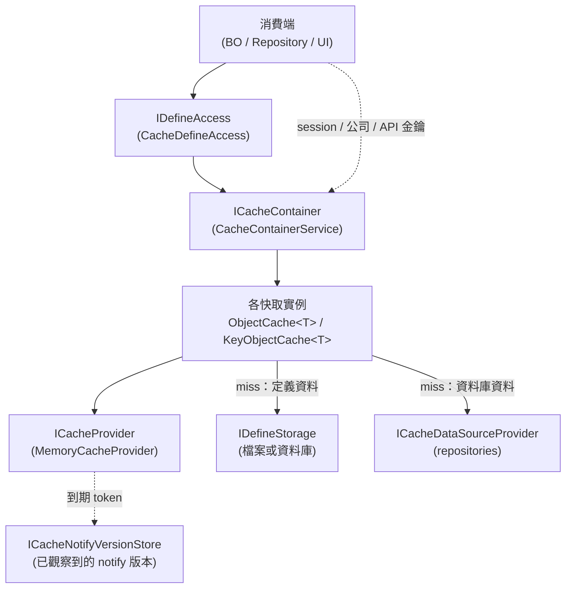

# 快取機制

[English](caching.md) · [← 文件索引](README.zh-TW.md)

> 框架如何快取定義資料與資料庫相依資料，以及一筆條目何時失去效力

---

## 目錄

1. [共通行為](#1-共通行為)
2. [快取層的組成](#2-快取層的組成)
3. [兩類快取](#3-兩類快取)
4. [一次讀取的內部流程](#4-一次讀取的內部流程)
5. [條目如何失去效力](#5-條目如何失去效力)
6. [資料庫相依的快取](#6-資料庫相依的快取)
7. [快取清單](#7-快取清單)
8. [容器、DI 與多租戶](#8-容器di-與多租戶)
9. [快取中的定義資料不可異動](#9-快取中的定義資料不可異動)
10. [用戶端的定義快取](#10-用戶端的定義快取)
11. [替換 Provider](#11-替換-provider)
12. [延伸閱讀](#12-延伸閱讀)

---

## 1. 共通行為

框架裡的每一個快取都是**行程內（in-process）、延遲載入、read-through** 的快取：呼叫端跟快取要，
miss 時它去問來源，然後把**同一個共用實例**交給每一位呼叫者，直到某個信號說來源變了為止。

這三點各自有實務上的後果：

- **延遲載入** —— 啟動時不預熱，失效也**不會**觸發重載，它只保證**下一次**讀取會回到來源。
- **同一個共用實例** —— 拿到的物件不是你的。見[§9](#9-快取中的定義資料不可異動)。
- **行程內** —— 某個 process 的寫入本身不會讓另一個 process 的任何條目失效。
  補上這個缺口正是[§6](#6-資料庫相依的快取)在講的事。

---

## 2. 快取層的組成



四個角色，各自的職責：

| 角色 | 型別 | 職責 |
|------|------|------|
| **快取類別** | `ObjectCache<T>` / `KeyObjectCache<T>` 子類 | 知道某一種物件**怎麼載入**、其條目該套**什麼政策** |
| **容器** | `ICacheContainer` | 持有每個快取類別的單一實例；對外可注入的把手 |
| **Provider** | `ICacheProvider` | 一個帶到期時間的 key → object 儲存體。**不知道**自己存的是什麼 |
| **版本存放區** | `ICacheNotifyVersionStore` | 各 process 自己的「我看到這個 key 的 notify 版本是多少」紀錄 |

Provider 的職責刻意壓到最小 —— 沒有 atomic get-or-create、不懂載入、不認識定義資料。載入與去重
全部留在快取類別裡，這也是為什麼寫一個替代 provider（[§11](#11-替換-provider)）是件小事。

---

## 3. 兩類快取

`ICacheContainer` 裡的每個快取都屬於兩類之一。這個切分不是為了整齊 —— 它決定資料**從哪來**，
因而也決定**變更怎麼被察覺**。

|  | **定義快取**（`Bee.ObjectCaching/Define/`） | **資料庫快取**（`Bee.ObjectCaching/Database/`） |
|--|--|--|
| 來源 | `IDefineStorage`（XML 檔，或資料庫中的定義列） | `ICacheDataSourceProvider` → repositories → 資料表 |
| 由誰填入 | `CacheDefineAccess` 在 `GetX` 時 | 消費該資料的服務在查詢時 |
| 本機失效 | `IDefineAccess.SaveX` 寫完隨即 `Remove` | 寫入端服務自行 `Remove` |
| 跨 process 失效 | 檔案異動時間，**或** cache-notify | 只有 cache-notify |
| 例 | `FormSchemaCache`、`TableSchemaCache`、`LanguageResourceCache` | `SessionInfoCache`、`CompanyInfoCache`、`ApiKeyCache` |

兩類共用同樣兩個基底類別、同一個 provider。`ObjectCache<T>` 用於單一物件
（`SystemSettings` —— 只有一份），`KeyObjectCache<T>` 用於同型別、以字串 key 定址的多個物件
（`FormSchema` —— 每個 `progId` 一份）。複合鍵以**點**壓平成單一字串：`TableSchema` 的 key 是
`"{categoryId}.{tableName}"`，`LanguageResource` 是 `"{lang}.{namespace}"`。

> **有三個定義快取直接讀檔，不經 `IDefineStorage`**：`SystemSettingsCache`、
> `DatabaseSettingsCache` 與 `PermissionModelsCache` 在 `CreateInstance` 中直接由 `PathOptions`
> 解析路徑並反序列化 XML。它們是 bootstrap 定義 —— 必須在資料庫連線存在**之前**就讀得到 ——
> 所以即使 `IDefineStorage` 改為資料庫版，它們的來源也不變。

---

## 4. 一次讀取的內部流程

兩個基底類別的 `Get()` 都是同樣三步：

```
1. 讀 provider。命中 → 直接回傳。沒有鎖、沒有配置。
2. Miss → 對這個 key 進入 single-flight。
3. 在 flight 內：再確認一次 provider，然後 CreateInstance()、寫入、回傳。
```

其中兩個細節不能省。

### Single-flight：並行 miss 只產生一個實例

同一個 key 的並行 miss **不會**各跑一次 `CreateInstance`。`CacheSingleFlight<T>` 以
`ConcurrentDictionary<string, Lazy<T?>>` 持有**進行中**的建立；第一位呼叫者跑 factory，
其餘等待同一個 `Lazy`，拿到同一個物件。

這不只是效能優化。`SessionInfo` 就放在 `KeyObjectCache` 裡，兩位呼叫者若各持同一個 session 的
不同實例，透過其中一個做的寫入（例如 `EnterCompany`）在另一個眼中就是不存在的。也有數個消費端
以**參照比對**快取值來偵測「有沒有重載過」，多出一個實例會被讀成一次從未發生的變更。

> **in-flight 表只裝進行中的建立** —— 每筆都在 `finally` 移除，且用 compare-and-remove
> 確保不會誤刪比自己新的 flight。**不可**把它改成 per-key 鎖表：key 含呼叫端提供的值
> （例如 access token），一張只增不減的表等於無上限。

### 負向快取：miss 本身也可以被快取

若 `CreateInstance` 回 `null`，`KeyObjectCache<T>` 會在該 key 下存入一個 process-wide 哨兵值，
套用 **5 分鐘絕對到期**（`GetNegativePolicy`）。後續讀取直接回 `null`，不再碰來源。這是在防
cache penetration —— 反覆查詢一個資料不存在的 key，否則每次都會打到資料庫。

負向視窗刻意比正向短，好讓「在別處被建立出來的資料」在有界的延遲內可見。有兩個快取覆寫了預設，
而兩者都是**安全決策**而非調校：

- **`SessionInfoCache` 完全停用負向快取**（`GetNegativePolicy` 回 `null`）。若把每次未通過認證的
  查詢都記成負向條目，等於讓匿名流量以任意 access token 灌爆快取 —— 記憶體用量由攻擊者決定。
  而它省下的重建，不過是一次回傳空集合的索引查詢。
- **`ApiKeyCache` 縮短為 1 分鐘**，讓剛簽發的金鑰能盡快生效。

負向條目帶有與正常條目相同的 notify 相依，所以「被快取的 miss」也會在該筆資料於其他 process
被建立後清掉。

`ObjectCache<T>` 沒有負向快取：單一物件快取載不到自己的物件，那是設定錯誤，不是查無此鍵。

---

## 5. 條目如何失去效力

四種互相獨立的信號，一筆條目可以同時帶多種。

| 信號 | 由誰設定 | 影響範圍 | 何時偵測 |
|------|---------|---------|---------|
| **時間** | `CacheItemPolicy` —— 預設 20 分鐘 sliding | 本 process | 讀取時 |
| **顯式 `Remove`** | `IDefineAccess.SaveX`、各服務寫入路徑 | 本 process | 立即 |
| **檔案異動** | `ChangeMonitorFilePaths` | 共用同一檔案系統的所有 process | 讀取時 |
| **cache-notify 版本** | `ChangeNotifyKey` | 輪詢同一個資料庫的所有 process | 讀取時 |

四者中有三者是在**讀取時**偵測，而非由背景巡掃。`MemoryCache` 在每次 `TryGetValue` 都會評估條目
的到期 token，而 `FileModificationToken` 與 `CacheNotifyToken` 都是把「插入當下取的快照」與
「此刻的值」相比。沒有計時器、沒有 callback、不主動驅逐。

由此得到一個結果：**沒人讀的失效條目不花任何成本。** 一個自變更後就沒人打開過的
`FormSchema`，根本不會被重載。這正是失效設計四條不變式之一 ——
*失效不重載，只保證下次讀取拿到新值*。

### 信號從哪來

定義快取不會自己發明變更信號，而是問 storage：

```csharp
var changeSource = _storage.GetChangeSource(DefineType.FormSchema, progId);
policy.ChangeMonitorFilePaths = changeSource.FilePaths;   // 檔案式 storage 在此作答
policy.ChangeNotifyKey        = changeSource.NotifyKey;   // 資料庫式 storage 在此作答
```

`FileDefineStorage` 回傳它自己會去讀的那個檔案路徑，所以條目監看的恰好是它背後的那個檔。
`DbDefineStorage` 沒有檔可監看，改回傳它在寫入時會 touch 的 notify key —— 由寫入路徑共用的同一個
私有 helper 產生，讀寫兩側因此不可能漂開。`DefineChangeSource` 刻意是**對 storage 變更信號的描述**
而非快取政策；轉譯成政策這件事發生在快取這一側，這正是 `Bee.Definition` 得以完全不相依快取層的原因。

當快取自己沒設 `ChangeNotifyKey` 時，基底類別會補上預設值：`CacheGroup + ":" + key`，其中
`CacheGroup` 預設為被快取型別的名稱。單一物件快取以 `"*"` 當實體，於是得到 `SystemSettings:*`
這樣的 key。**這就是為什麼新增快取不需要在任何地方註冊** —— 慣例本身就是路由。

---

## 6. 資料庫相依的快取

### 6.1 問題

寫入時 `Remove` 對單一 process 夠用，但對其他情況都不夠：

- 同一台機器上的兩個應用程式 process 各持自己的 `MemoryCache`。經由 process A 存檔的定義，
  在 process B 會一直是舊的，直到它的 sliding 視窗過期。
- 由資料表載入的資料（`CompanyInfo`、角色權限、部門樹）沒有檔案可監看，
  檔案監看這條免費信號用不上。
- 一旦定義改存資料庫而非檔案（[ADR-018](adr/adr-018-db-define-storage.md)），
  連定義也失去檔案監看信號。

多節點部署不該依賴共用檔案系統，也不值得為此引進一套框架其他地方都用不到的訊息匯流排。
框架的做法是一張通知表。

### 6.2 Read-through：`ICacheDataSourceProvider`

資料庫快取一律透過 `Bee.Definition` 的單一介面載入：

```csharp
public interface ICacheDataSourceProvider
{
    SessionInfo? GetSessionInfo(Guid accessToken);
    CompanyInfo? GetCompanyInfo(string companyId);
    CompanyRolePermissions? GetCompanyRolePermissions(string companyId);
    DepartmentTree? GetDepartmentTree(string companyId);
    ApiKeyInfo? GetApiKey(string sysId);
    ApiKeyGateState GetApiKeyGateState();
}
```

每個方法都是某一個快取**唯一**的載入路徑，由該快取的 `CreateInstance` 在 miss 時呼叫。
每個方法都回傳**定義層型別**而非 repository —— 這個介面位於 `Bee.Definition`，而
`Bee.Repository.Abstractions` 相依於它，在此暴露 repository 型別會形成循環專案參考。

> **provider 必須延遲解析，在第一次 miss 時才取。** `CacheContainerService` 收的是
> `Func<ICacheDataSourceProvider>`，不是實例。在建構期就解析會閉合
> `ICacheContainer` → `ICacheDataSourceProvider` → repository factory → `IDefineAccess` →
> `ICacheContainer` 這個環，導致 `AddBeeFramework` 的服務解析死鎖。延到第一次 cache miss 時，
> 容器已完全建構完成，環就斷了。

有兩條載入路徑上的規則屬於**安全**而非架構：

- **資料庫失敗不得被快取。** `GetApiKeyGateState` 讓例外往外拋，而不是回報「閘門未啟用」——
  把失敗快取起來會讓閘門在一次瞬斷後整整一個生命週期都是開的。呼叫端把例外轉為拒絕。
  （表不存在則是明確的 schema 答案，**確實**回報未啟用。）
- **重建 session 是一條真正的認證路徑。** `SessionInfoCache.CreateInstance` 會由 `st_session`
  的種子重建 session，這使得**每一個寫入該表的人**都成了鑄造合法 token 的管道。任何新增的寫入端
  必須自行完成認證、或限定為可信呼叫者 —— 這正是 `SystemBO.CreateSession` 標為 `LocalOnly` 的原因。

### 6.3 跨 process 失效：通知表

四個元件，依變更流經的順序：

| 步驟 | 元件 | 位置 |
|------|------|------|
| 1. 寫入端 bump 版本 | `ICacheNotifyService.Touch(cacheKey, transaction, databaseType)` | `Bee.Db` |
| 2. 資料落入 `st_cache_notify` | `cache_key`(PK)、`cache_version`(bigint)、`sys_update_time` | 設定指定的資料庫（預設 `common`） |
| 3. 各節點輪詢增量 | `CacheNotifyPoller` → `CacheNotifyPollSession` | `Bee.Hosting` |
| 4. 發布觀察到的版本 | `CacheInfo.NotifyVersions.SetVersion` | `Bee.ObjectCaching` |
| 5. 條目於下次讀取時過期 | `CacheNotifyToken.HasChanged` | `MemoryCacheProvider` |

`Touch` 以各方言的原生語法送出單一原子 UPSERT —— PostgreSQL / SQLite 用 `ON CONFLICT`、
MySQL 用 `ON DUPLICATE KEY`、SQL Server（加 `HOLDLOCK`）與 Oracle 用 `MERGE`。
遞增由**資料庫**計算（`cache_version = cache_version + 1`）而非由應用程式讀出再寫回，
因此該語句取得的 row lock 會序列化並行的 bump，不會遺失更新。

各節點的 `CacheNotifyPollSession` 持有 `{cache_key → version}` 的記憶體鏡像，加上一個對
`sys_update_time` 的 high-water 游標。**第一次輪詢只取基準游標、不驅逐任何東西** ——
對一個剛啟動、還是空的本機快取而言，歷史列毫無意義。之後的輪詢讀取 `highWater - margin`
以後的列，且**只在版本嚴格大於**鏡像值時才動作。

注意 poller **不做**什麼：它不持有任何快取的參照，也不碰任何一筆條目。它只把版本發布到
`CacheInfo.NotifyVersions`，而每一筆帶有相符 `ChangeNotifyKey` 的條目會在下次讀取時**自己**過期。
正是這一點，讓單一 poller 能失效掉「單一注入容器根本搆不到」的 per-tenant / per-fixture 容器裡的條目。

### 6.4 四條不變式

以下四點是這個設計要保證的性質。完整理由與被否決的替代方案見
[ADR-017](adr/adr-017-db-cache-invalidation.md)。

1. **bump 必須與資料變更在同一 transaction 提交。** 否則 poller 可能在資料可見之前就看到通知，
   重載到舊值又把它標記為新鮮 —— 永久 stale。`Touch` 顯式收 `DbTransaction`，就是為了讓這件事
   不會不小心做錯。
2. **判定「真的變了」靠版本，不靠時間。** `sys_update_time` 只負責讓增量查詢便宜；
   單調遞增的 `cache_version` 與鏡像比對才負責冪等判定。`>=` 加安全餘量讀取確保不漏，
   嚴格大於的版本比較確保不重。
3. **所有時間都取自資料庫時鐘。** 寫入、high-water 與門檻三者同源，都取自該欄位 CREATE TABLE
   預設值所用的同一個伺服器時間運算式，因此時鐘有偏移的節點之間不會出現分歧。
4. **失效不重載。** 沒人讀的 key 永遠不會被重載；工作交由既有的 lazy `CreateInstance` 路徑，
   在、且僅在有人來問的時候才做。

### 6.5 一次變更的完整歷程

以節點 A 存檔一份定義為例，兩個節點、輪詢間隔 5 秒：

```
t=0.0  節點 A：DbDefineStorage.SaveFormSchema 寫入定義列，
                並 Touch "FormSchema:Employee" —— 同一個 transaction、同一次 commit。
t=0.0  節點 A：CacheDefineAccess.SaveFormSchema 呼叫 _cache.FormSchema.Remove("Employee")。
                節點 A 此刻起即正確。
t=0.0  節點 B：仍從自己的 MemoryCache 提供舊的 FormSchema。
t=3.7  節點 B：輪詢讀到增量，發現 version 8 > 鏡像的 7，
                發布 NotifyVersions["FormSchema:Employee"] = 8。
                沒有碰任何一筆條目。
t=3.7  節點 B：那筆快取條目仍然實際存在、仍然會被回傳 —— 因為還沒有人讀它。
t=9.2  節點 B：某個請求讀取 FormSchema "Employee"。MemoryCache 評估該條目的
                CacheNotifyToken：快照 7 ≠ 現值 8 → 過期 → miss →
                CreateInstance 從 storage 重載。
```

因此最壞情況的傳播延遲大約是 `IntervalSeconds` 加上「距離下次讀取還有多久」——
而後面那一項不花成本，因為沒人讀的值，其陳舊沒有任何人觀察得到。

### 6.6 做錯時的樣子

| 症狀 | 原因 |
|------|------|
| 變更從來傳不到其他節點 | 該快取沒設 `ChangeNotifyKey`，或寫入端從未呼叫 `Touch` |
| 傳得到，但其他節點永遠提供舊值 | `Touch` 與資料在**不同** transaction 提交（不變式 1） |
| 單機正常，橫向擴充後失效 | `CacheNotifyOptions.Enabled` 被關掉 ——「單機」不等於「單 process」，多個 app pool 各持自己的快取 |
| 新簽發的 API 金鑰最長一小時內被拒 | 金鑰失效時沒一併失效閘門條目 —— `ApiKeyGateCache` 刻意與 `ApiKeyInfo` 共用 cache group 正是為此 |
| notify key 看起來對，卻沒反應 | 實體那一段必須與該快取自己 `Remove` 所用的 key 完全一致，複合鍵含點的形式也要一樣 |

寫入端的操作配方 —— 何時該 `Touch`、key 怎麼組、以及各項設定 —— 見
[端到端開發指引 § 跨 process 快取失效](development-cookbook.zh-TW.md)。

---

## 7. 快取清單

權威清單是 `ICacheContainer`，本表是地圖而非規格。除另行標註者外，一律套用框架預設的
**20 分鐘 sliding**，負向快取 5 分鐘。

### 定義快取

| 快取 | Key | 來源 | 備註 |
|------|-----|------|------|
| `SystemSettingsCache` | —（單一） | `SystemSettings.xml` | 純檔案，不經 `IDefineStorage` |
| `DatabaseSettingsCache` | —（單一） | `DatabaseSettings.xml` | 純檔案。**重載**時觸發 `GlobalEvents.DatabaseSettingsChanged`，首次載入不觸發 |
| `PermissionModelsCache` | —（單一） | `PermissionModels.xml` | 純檔案。載入時驗證 registry，不合法即擲例外 |
| `ProgramSettingsCache` | —（單一） | `IDefineStorage` | |
| `MenuSettingsCache` | —（單一） | `IDefineStorage` | |
| `PluginSettingsCache` | —（單一） | `IDefineStorage` | |
| `DbCategorySettingsCache` | —（單一） | `IDefineStorage` | |
| `CurrencySettingsCache` | —（單一） | `IDefineStorage` | |
| `UnitSettingsCache` | —（單一） | `IDefineStorage` | |
| `FormSchemaCache` | `progId` | `IDefineStorage` | |
| `FormLayoutCache` | `layoutId` | `IDefineStorage` | |
| `TableSchemaCache` | `"{categoryId}.{tableName}"` | `IDefineStorage` | |
| `LanguageResourceCache` | `"{lang}.{namespace}"` | `IDefineStorage` | |

### 資料庫快取

| 快取 | Key | 來源方法 | 備註 |
|------|-----|---------|------|
| `SessionInfoCache` | access token（GUID） | `GetSessionInfo` | **停用負向快取**；由 `st_session` 種子重建 session |
| `CompanyInfoCache` | `companyId` | `GetCompanyInfo` | 由 repository 資料庫 router 消費 |
| `CompanyRolePermissionsCache` | `companyId` | `GetCompanyRolePermissions` | 各公司的權限快照 |
| `DepartmentTreeCache` | `companyId` | `GetDepartmentTree` | 各公司的組織樹 |
| `ApiKeyCache` | 金鑰識別碼 | `GetApiKey` | **60 分鐘絕對到期**；負向視窗縮短為 1 分鐘 |
| `ApiKeyGateCache` | 單一固定 key | `GetApiKeyGateState` | **60 分鐘絕對到期**；與 `ApiKeyInfo` 共用 cache group，金鑰異動也會失效閘門 |

---

## 8. 容器、DI 與多租戶

`AddBeeFramework` 將 `CacheContainerService` 註冊為 **singleton**，因此一個 host 只有一個容器 ——
也就是每個快取類別只有一個實例：

```csharp
services.AddSingleton<ICacheContainer>(sp =>
    new CacheContainerService(
        sp.GetRequiredService<IDefineStorage>(),
        sp.GetRequiredService<PathOptions>(),
        string.Empty,                                  // cache prefix
        sp.GetRequiredService<ICacheDataSourceProvider>));   // factory，不是 instance
```

消費端注入 `ICacheContainer`（定義資料則注入包在外層的 `IDefineAccess`）。

### Cache prefix

快取類別接收一個 `cachePrefix`，會前置到每一個 key。`CacheInfo.Provider` 是 process-wide 的
static，若無此前綴，同一 process 內的兩個容器就會互撞。前綴讓每個容器在共用儲存體上各有自己的
key 命名空間。正式環境的容器用空字串；測試 fixture 用唯一值以隔離各自的資料。

### 各租戶的容器

`CacheContainerProvider.For(customizeId)` 會依需要，為每個客製化代碼建立一個**額外**的容器，
背後是 `CustomizeOnlyStorage`，並以客製化代碼為前綴。這些容器只裝該租戶的覆蓋層 ——
基底容器不會被這條路徑建立或碰觸，兩層由 `CustomizeOverlay` 而非快取本身合併。
見[租戶客製化](customization.zh-TW.md)。

由於 cache-notify 的 poller 是**發布版本**而非驅逐條目，租戶容器自動參與跨 process 失效，
無需任何註冊。

---

## 9. 快取中的定義資料不可異動

**任何由 `IDefineAccess.GetX(...)` 取得的物件都是 process-wide 共用實例，init 完成後不得異動。**
每個 session 拿到的是同一個 reference；為某個 session 做的改動會洩漏到所有 session，
並行異動則會 race。

要讓定義隨 session 而異，先 `Clone()` 再改副本。要持久化變更，走 `IDefineAccess.SaveX(...)`
（寫入 storage 並失效快取）。`XmlCodec.Serialize(cached)` **不是**免費的 deep-clone ——
它會在來源物件上翻動序列化狀態。

`SessionInfo` 是刻意的例外：它本來就是 per-session。

完整規則、具體違規樣態表與推導，見
[開發限制與反模式 § 定義資料在 init 後的不可異動性](development-constraints.zh-TW.md)。

---

## 10. 用戶端的定義快取

`ClientDefineAccess`（`Bee.Api.Client`）是**另一套機制**，與 `Bee.ObjectCaching` 沒有共用程式碼。
遠端用戶端沒有 `IDefineStorage`、沒有資料庫、也沒有 poller；它透過 JSON-RPC 取得定義，
並以**實例為範圍**快取。

| | 伺服端（`CacheDefineAccess`） | 用戶端（`ClientDefineAccess`） |
|--|--|--|
| 儲存 | `ICacheProvider`，process-wide | 每個實例一份 `ConcurrentDictionary` |
| 快取的值 | 物件本身 | `Task<object>` |
| 到期 | 時間、檔案、notify | **無** —— 條目直到被清空為止都有效 |
| API | 同步 | 端到端非同步（WASM 上安全） |

快取的是 `Task` 而非結果，這正是並行 miss 去重的手法：第二位呼叫者 await 同一個進行中的請求，
而不是再發一次 round trip。**失敗**的請求會以 compare-and-remove 移除，因此一次失敗不會毒化快取，
下次讀取會重試。

由於沒有到期機制，**切換租戶（`EnterCompany` / `LeaveCompany`）後必須呼叫 `ClearCache()`**。
伺服端會依 session 的客製化代碼覆蓋 FormLayout、Language 與 ProgramSettings，但這個快取只以
`progId` / `layoutId` / namespace 當 key —— 不清空的話，會繼續提供前一個租戶的覆蓋結果。

---

## 11. 替換 Provider

`CacheInfo.Provider` 預設為 `MemoryCacheProvider`，可透過
`BackendConfiguration.Components.CacheProvider` 換成任何 `ICacheProvider` 實作。
`AddBeeFramework` 啟動時呼叫 `CacheInfo.Initialize(configuration)`；該呼叫是冪等的，
且僅在設定的型別與當前 provider 不同時才替換，因此在初始化前就已填入的條目得以保留。

替代實作要滿足的介面很小 —— `Contains`、`Set`、`Get`、`Remove`、`GetCount` ——
因為載入、去重與負向快取全都在其上的快取類別裡，不在 provider。但這也把兩個要求推給了任何
分散式實作：

- 存進去的是**以 reference 共用的活物件圖**（[§9](#9-快取中的定義資料不可異動)）。
  一個在 `Set` 時序列化、`Get` 時反序列化的 provider 會破壞 reference identity，
  而數個消費端正是靠它偵測重載。
- 到期 token（`ChangeMonitorFilePaths`、`ChangeNotifyKey`）是**讀取時**評估的。
  忽略 `CacheItemPolicy` 的 provider 會靜默地停掉檔案監看與 cache-notify 失效，
  只剩時間到期這一個信號。

---

## 12. 延伸閱讀

- [ADR-009：快取實作](adr/adr-009-cache-implementation.md) —— 為何選
  `Microsoft.Extensions.Caching.Memory` + `IChangeToken`，以及負向快取的後續延伸
- [ADR-017：資料庫快取相依/失效機制](adr/adr-017-db-cache-invalidation.md) —— 通知表設計、
  其不變式，以及被否決的替代方案
- [ADR-018：定義儲存於資料庫](adr/adr-018-db-define-storage.md) —— 定義側最主要的 cache-notify 消費端
- [端到端開發指引](development-cookbook.zh-TW.md) —— § 跨 process 快取失效：寫入端配方與設定
- [開發限制與反模式](development-constraints.zh-TW.md) —— 不可異動規則的完整條文
- [租戶客製化](customization.zh-TW.md) —— 覆蓋層容器的使用方式
- [Bee.ObjectCaching README](../src/Bee.ObjectCaching/README.zh-TW.md) —— 套件總覽與公開 API
