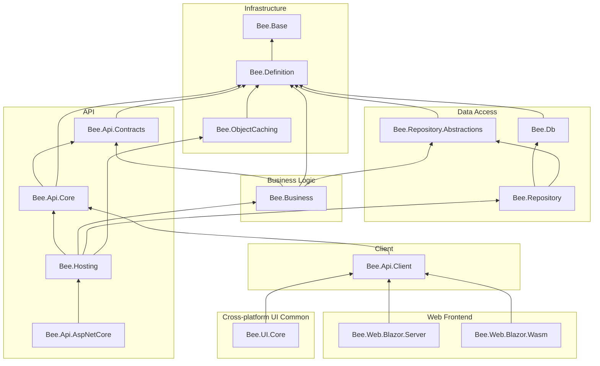

# Project Dependency Map

[繁體中文](dependency-map.zh-TW.md)

This document visualizes the dependencies among the 15 `src/` projects of the Bee.NET framework.

**How to read**: an arrow A → B means "A depends on B"; the diagram is laid out bottom-up, with the most foundational packages (no dependencies) at the bottom.

## Dependency Diagram

## External Package Dependencies

| Project | External Packages |
|---------|-------------------|
| Bee.Base | *(none)* |
| Bee.Definition | MessagePack 3.x |
| Bee.Db | *(none)* |
| Bee.ObjectCaching | Microsoft.Extensions.Caching.Memory 10.x, Microsoft.Extensions.FileProviders.Physical 10.x |
| Bee.Hosting | Microsoft.Extensions.DependencyInjection 10.x |
| Bee.Api.AspNetCore | `FrameworkReference: Microsoft.AspNetCore.App` |
| Bee.Web.Blazor.Server | `Microsoft.AspNetCore.Components.Web` and related Blazor Server packages |
| Bee.Web.Blazor.Wasm | `Microsoft.AspNetCore.Components.WebAssembly` and related WASM packages |
| Bee.Api.Contracts / Bee.Api.Core / Bee.Api.Client / Bee.Business / Bee.Repository / Bee.Repository.Abstractions / Bee.UI.Core | *(none)* |

## Target Framework Summary

All projects target `net10.0`. `Bee.Web.Blazor.Wasm` additionally requires the `wasm-tools` workload.

## Architectural Notes

- **Bee.Base** is the lowest-level foundation package with no internal dependencies.
- **Bee.Definition** is the most depended-on project, with 6 direct dependents (Contracts, Db, RepoAbs, Caching, Business, Core).
- **Bee.Hosting** is the composition root: it consolidates the backend services (`Bee.Api.Core`, `Bee.Business`, `Bee.Repository`, `Bee.ObjectCaching`) behind a single `AddBeeFramework` extension on `IServiceCollection`, with no ASP.NET Core dependency. Non-web hosts (WinForms, Console, Worker Service) reference it directly.
- **Bee.Api.AspNetCore** is the ASP.NET Core integration layer (`UseBeeFramework` middleware + `ApiServiceController`); it pulls in `Bee.Hosting` transitively, so web hosts get DI registration plus middleware in one package reference.
- Both the client (Bee.Api.Client) and the server (Bee.Api.AspNetCore) share protocol logic via **Bee.Api.Core**, ensuring consistent serialization and encryption behavior.
- **Bee.UI.Core** is the cross-platform UI common layer (`ClientInfo` / `IEndpointStorage` / `IUIViewService` / `VersionInfo`), shared by desktop hosts (WinForms / WPF / Avalonia), web frontends, and future MAUI for client-side connection state and endpoint persistence. It contains no platform-specific UI code and depends only on `Bee.Api.Client`.
- The **Web frontend layer** (`Bee.Web.Blazor.Server`, `Bee.Web.Blazor.Wasm`) consists of Razor Class Libraries (RCLs). Both depend only on `Bee.Api.Client`; the host application decides the `IApiProvider` implementation (`LocalApiProvider` / `RemoteApiProvider`) and whether to call `AddBeeFramework`.
- **Bee.Web.Blazor.Wasm must not depend on any backend project** (Repository / Business / Hosting, etc.): the Browser runtime cannot load server-only assemblies. The constraint is enforced by the dependency chain — `Bee.Api.Client → Bee.Api.Core → Bee.Api.Contracts/Definition` are all pure data/protocol layers with no server-only code.
