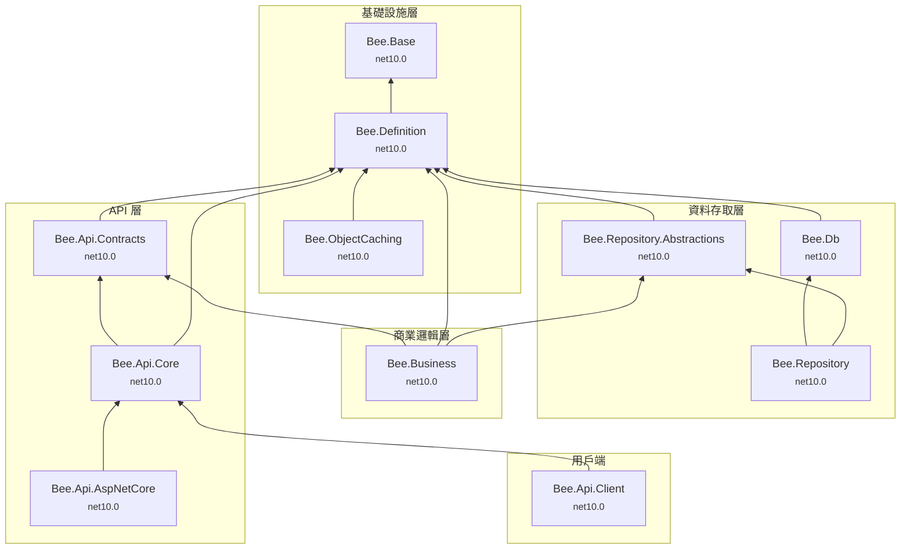

# 專案相依性全景圖

本文件以視覺化方式呈現 Bee.NET 框架中 11 個 `src/` 專案之間的相依關係。

**閱讀方式**：箭頭方向 A → B 表示「A 依賴 B」；圖表由下而上排列，最底層為無相依性的基礎套件。

## 相依性圖表

## 外部相依套件

| 專案 | 外部套件 |
|------|----------|
| Bee.Base | Newtonsoft.Json |
| Bee.Definition | MessagePack |
| Bee.Db | *(none)* |
| Bee.ObjectCaching | System.Runtime.Caching |
| Bee.Api.AspNetCore | Microsoft.AspNetCore.Mvc.Core |

## 目標框架摘要

所有專案皆以 `net10.0` 單一目標發布。

## 架構要點

- **Bee.Base** 為最底層基礎套件，無任何內部相依性。
- **Bee.Definition** 為被依賴次數最多的專案，共有 6 個直接相依者（Contracts、Db、RepoAbs、Caching、Business、Core）。
- **Bee.Api.AspNetCore** 為 API 託管套件，適用於伺服器端部署。
- 用戶端（Bee.Api.Client）與伺服器端（Bee.Api.AspNetCore）皆透過 **Bee.Api.Core** 共享協定邏輯，確保序列化與加解密行為一致。
