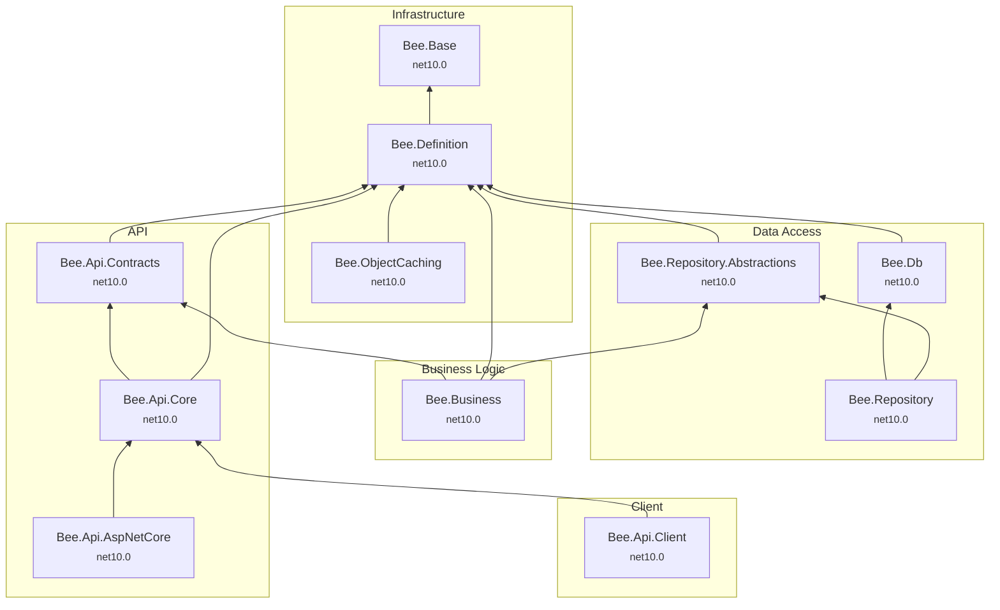

# Project Dependency Map

[繁體中文](dependency-map.zh-TW.md)

This document visualizes the dependencies among the 11 `src/` projects of the Bee.NET framework.

**How to read**: an arrow A → B means "A depends on B"; the diagram is laid out bottom-up, with the most foundational packages (no dependencies) at the bottom.

## Dependency Diagram

## External Package Dependencies

| Project | External Packages |
|---------|-------------------|
| Bee.Base | *(none)* |
| Bee.Definition | MessagePack 3.x |
| Bee.Db | *(none)* |
| Bee.ObjectCaching | Microsoft.Extensions.Caching.Memory 10.x, Microsoft.Extensions.FileProviders.Physical 10.x |
| Bee.Api.AspNetCore | `FrameworkReference: Microsoft.AspNetCore.App` |
| Bee.Api.Contracts / Bee.Api.Core / Bee.Api.Client / Bee.Business / Bee.Repository / Bee.Repository.Abstractions | *(none)* |

## Target Framework Summary

All projects target a single framework: `net10.0`.

## Architectural Notes

- **Bee.Base** is the lowest-level foundation package with no internal dependencies.
- **Bee.Definition** is the most depended-on project, with 6 direct dependents (Contracts, Db, RepoAbs, Caching, Business, Core).
- **Bee.Api.AspNetCore** is the API hosting package, used for server-side deployment.
- Both the client (Bee.Api.Client) and the server (Bee.Api.AspNetCore) share protocol logic via **Bee.Api.Core**, ensuring consistent serialization and encryption behavior.
