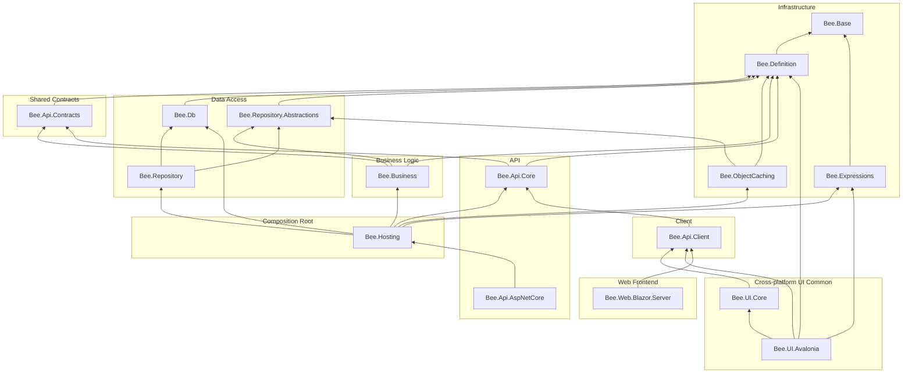

# Project Dependency Map

[繁體中文](dependency-map.zh-TW.md) · [← Docs Index](README.md)

This document visualizes the dependencies among the `src/` projects of the Bee.NET framework.
The diagram covers the runtime packages; `Bee.Analyzers` is left out because nothing references it
at runtime — consumers get it as a build-time analyzer, and drawing it would add an edge that does
not exist in the assembly graph. (No project count here: it drifts, and the `src/` directory is the
authority.)

**How to read**: an arrow A → B means "A depends on B"; the diagram is laid out bottom-up, with the most foundational packages (no dependencies) at the bottom.

## Dependency Diagram

```mermaid
graph BT
  subgraph Infrastructure
    Base["Bee.Base"]
    Expressions["Bee.Expressions"]
    Definition["Bee.Definition"]
    Caching["Bee.ObjectCaching"]
  end

  subgraph DataAccess [Data Access]
    RepoAbs["Bee.Repository.Abstractions"]
    Db["Bee.Db"]
    Repo["Bee.Repository"]
  end

  subgraph BusinessLogic [Business Logic]
    Business["Bee.Business"]
  end

  subgraph SharedContracts [Shared Contracts]
    Contracts["Bee.Api.Contracts"]
  end

  subgraph API
    Core["Bee.Api.Core"]
    AspNet["Bee.Api.AspNetCore"]
  end

  subgraph CompositionRoot [Composition Root]
    Hosting["Bee.Hosting"]
  end

  subgraph ClientLayer [Client]
    Client["Bee.Api.Client"]
  end

  subgraph CrossPlatformUI [Cross-platform UI Common]
    UICore["Bee.UI.Core"]
    UIAvalonia["Bee.UI.Avalonia"]
  end

  subgraph WebFrontend [Web Frontend]
    BlazorSrv["Bee.Web.Blazor.Server"]
  end

  Definition --> Base
  Expressions --> Base
  Hosting --> Expressions
  UIAvalonia --> Expressions
  Contracts --> Definition
  Db --> Definition
  RepoAbs --> Definition
  Caching --> Definition
  Caching --> RepoAbs
  Business --> Contracts
  Business --> Definition
  Business --> RepoAbs
  Repo --> Db
  Repo --> RepoAbs
  Core --> Contracts
  Core --> Definition
  Hosting --> Core
  Hosting --> Business
  Hosting --> Db
  Hosting --> Repo
  Hosting --> Caching
  AspNet --> Hosting
  Client --> Core
  UICore --> Client
  UIAvalonia --> UICore
  UIAvalonia --> Client
  UIAvalonia --> Definition
  BlazorSrv --> Client
```

## External Package Dependencies

| Project | External Packages |
|---------|-------------------|
| Bee.Base | *(none)* |
| Bee.Expressions | DynamicExpresso.Core 2.x |
| Bee.Definition | Microsoft.Extensions.Localization.Abstractions 10.x |
| Bee.Db | *(none)* |
| Bee.ObjectCaching | Microsoft.Extensions.Caching.Memory 10.x |
| Bee.Api.Core | MessagePack 3.x |
| Bee.Business | Microsoft.Extensions.Logging.Abstractions 10.x |
| Bee.Repository | Microsoft.Extensions.DependencyInjection.Abstractions 10.x |
| Bee.Hosting | Microsoft.Extensions.DependencyInjection 10.x, Microsoft.Extensions.Hosting.Abstractions 10.x |
| Bee.Api.AspNetCore | `FrameworkReference: Microsoft.AspNetCore.App` |
| Bee.Web.Blazor.Server | `FrameworkReference: Microsoft.AspNetCore.App` |
| Bee.UI.Avalonia | Avalonia 12.0.x, Avalonia.Controls.DataGrid 12.0.x |
| Bee.Api.Contracts / Bee.Api.Client / Bee.Repository.Abstractions / Bee.UI.Core | *(none)* |

> `Bee.Api.Core`'s MessagePack reference is the only transport-format package in the framework, and
> keeping it the only one is the point of [ADR-036](adr/adr-036-wire-serialization-externalized.md).
> Build-time-only references (`PrivateAssets="all"`: SourceLink, the public API analyzers, the
> repository's own analyzers) are omitted — they reach no consumer.

## Target Framework Summary

All runtime packages target `net10.0`. The exception is `Bee.Analyzers`, which targets
`netstandard2.0` — that is what Roslyn loads analyzers as, so it is a requirement of the analyzer
host rather than a choice.

## Tooling Packages (separately distributed)

Not part of the `src/` library graph above — these ship as `dotnet tool` global tools on NuGet:

| Package | Command | Description |
|---------|---------|-------------|
| **Bee.Cli** (`tools/Bee.Cli/`) | `dotnet bee` | Framework CLI. Currently ships the `defines` subcommand group. References `Bee.Definition` to call its public `Defaults` API for materialise / list operations on embedded framework defaults. Version-locked to the framework. |

Also under `tools/` but not on NuGet:

- **Bee.DefineEditor** (`tools/DefineEditor/`) — Avalonia desktop tool for visually editing the define types. Distributed as a downloadable `.app` / `.exe` rather than as a library or dotnet tool. Calls `Bee.Definition.Defaults.MaterializeTo(...)` in-process on folder open.

## Architectural Notes

- **Bee.Base** is the lowest-level foundation package with no internal dependencies.
- **Bee.Expressions** holds `DynamicExpressoEvaluator`, the DynamicExpresso-backed implementation of the expression engine. The *abstraction* — `IExpressionEvaluator`, `ExpressionPolicy`, `ExpressionEvaluationException` — lives in `Bee.Base.Expressions`, so `Bee.Definition` (the `FormExpressionCalculator`) and `Bee.Business` (the rule processor) consume the engine without taking a dependency on DynamicExpresso; only the composition roots that pick an implementation (`Bee.Hosting` for DI registration, `Bee.UI.Avalonia` for client-side live preview) reference this package. That split keeps the definition layer free of third-party packages while a field computed on the client still matches what the server writes on save. See [adr-028](adr/adr-028-expression-rule-engine.md) and [adr-038](adr/adr-038-definition-dependency-boundary.md).
- **Bee.Definition** is the most depended-on project, with 7 direct dependents (Contracts, Db, RepoAbs, Caching, Business, Api.Core, UI.Avalonia).
- **Bee.Api.Contracts** is a shared contract/abstraction layer, not an application-level API project. Despite the "API" name, both `Bee.Business` and `Bee.Api.Core` depend on it (`Business → Contracts`, `Core → Contracts`), so it sits *below* them — the diagram groups it under **Shared Contracts** rather than the API application layer.
- **Bee.Hosting** is the composition root: it consolidates the backend services (`Bee.Api.Core`, `Bee.Business`, `Bee.Db`, `Bee.Repository`, `Bee.ObjectCaching`) behind a single `AddBeeFramework` extension on `IServiceCollection`, with no ASP.NET Core dependency. Non-web hosts (WinForms, Console, Worker Service) reference it directly. It is shown in its own **Composition Root** group rather than under API: reaching across every layer is what a composition root does, so the "API layer must not reference the Repository layer" constraint does not apply to it. What *does* apply is that it holds no data access of its own — statements live in `Bee.Db` / `Bee.Repository`, and Hosting keeps only the hosted-service shells and DI wiring.
- **Bee.Api.AspNetCore** is the ASP.NET Core integration layer (`UseBeeFramework` middleware + `ApiServiceController`); it pulls in `Bee.Hosting` transitively, so web hosts get DI registration plus middleware in one package reference.
- Both the client (Bee.Api.Client) and the server (Bee.Api.AspNetCore) share protocol logic via **Bee.Api.Core**, ensuring consistent serialization and encryption behavior.
- **Bee.UI.Core** is the cross-platform UI common layer (`ClientInfo` / `IEndpointStorage` / `IUIViewService` / `VersionInfo`), shared by every native-UI family (currently Avalonia, which covers desktop / iOS / Android / WASM from one project; future WinForms / WPF) for client-side connection state and endpoint persistence. It contains no platform-specific UI code and depends only on `Bee.Api.Client`.
- **Bee.UI.Avalonia** is the Avalonia desktop control library (Windows / macOS / Linux). Ships FormSchema-driven controls (`FormView` for a single record, `ListView` for the list, `GridControl` for grids, plus a field-editor family with `FormScope` ambient binding, all backed by `FormDataObject`) plus a file-backed `FileEndpointStorage` over a single `net10.0` TFM. Lower bound is `Avalonia 12.0.0` + `Avalonia.Controls.DataGrid 12.0.0` (latest stable for DataGrid); hosts may bring a newer `Avalonia 12.0.x` transitively. See [adr-020](adr/adr-020-avalonia-datagrid-binding-strategy.md) for the DataGrid binding strategy and [adr-021](adr/adr-021-avalonia-datagrid-editing-strategy.md) for the editing strategy.
- **`Bee.UI.*` family criterion**: whether the package consumes the `Bee.UI.Core` abstractions (`ClientInfo` / `IEndpointStorage` / `IUIViewService`, etc.).
  - Consumes → `Bee.UI.*` (current: `Bee.UI.Core`, `Bee.UI.Avalonia`; future: `Bee.UI.WinForms`, `Bee.UI.Wpf`, etc.)
  - Does not consume, has its own state management → independent family prefix (e.g. `Bee.Web.Blazor.*`: a Blazor circuit has no file IO and no dialog service concept, so an independent path is appropriate).
- The **Web frontend layer** (`Bee.Web.Blazor.Server`) is a Razor Class Library (RCL). It depends only on `Bee.Api.Client`; the host application decides the `IJsonRpcProvider` implementation (`LocalApiProvider` / `RemoteApiProvider`) and whether to call `AddBeeFramework`.
