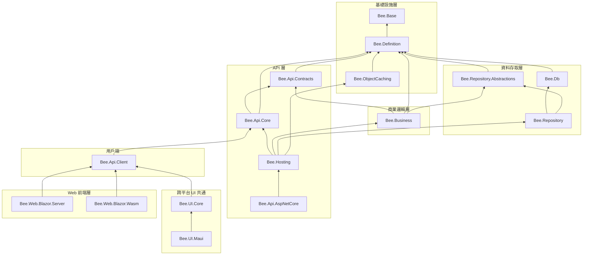

# 專案相依性全景圖

[English](dependency-map.md)

本文件以視覺化方式呈現 Bee.NET 框架中 16 個 `src/` 專案之間的相依關係。

**閱讀方式**：箭頭方向 A → B 表示「A 依賴 B」；圖表由下而上排列，最底層為無相依性的基礎套件。

## 相依性圖表

## 外部相依套件

| 專案 | 外部套件 |
|------|----------|
| Bee.Base | *(none)* |
| Bee.Definition | MessagePack 3.x、Microsoft.Extensions.Localization.Abstractions 10.x |
| Bee.Db | *(none)* |
| Bee.ObjectCaching | Microsoft.Extensions.Caching.Memory 10.x、Microsoft.Extensions.FileProviders.Physical 10.x |
| Bee.Hosting | Microsoft.Extensions.DependencyInjection 10.x |
| Bee.Api.AspNetCore | `FrameworkReference: Microsoft.AspNetCore.App` |
| Bee.Web.Blazor.Server | `Microsoft.AspNetCore.Components.Web` 等 Blazor Server 套件 |
| Bee.Web.Blazor.Wasm | `Microsoft.AspNetCore.Components.WebAssembly` 等 WASM 套件 |
| Bee.Api.Contracts / Bee.Api.Core / Bee.Api.Client / Bee.Business / Bee.Repository / Bee.Repository.Abstractions / Bee.UI.Core / Bee.UI.Maui | *(none)* |

## 目標框架摘要

除 `Bee.Web.Blazor.Wasm` 需 `wasm-tools` workload 外，所有專案皆以 `net10.0` 單一目標發布。

## 架構要點

- **Bee.Base** 為最底層基礎套件，無任何內部相依性。
- **Bee.Definition** 為被依賴次數最多的專案，共有 6 個直接相依者（Contracts、Db、RepoAbs、Caching、Business、Core）。
- **Bee.Hosting** 為 composition root：將後端服務（`Bee.Api.Core`、`Bee.Business`、`Bee.Repository`、`Bee.ObjectCaching`）整合於一個 `IServiceCollection.AddBeeFramework` 擴充入口，不依賴 ASP.NET Core。非 web 宿主（WinForms、Console、Worker Service）直接引用此套件。
- **Bee.Api.AspNetCore** 為 ASP.NET Core 整合層（`UseBeeFramework` middleware 與 `ApiServiceController`），透過遞移引用 `Bee.Hosting`，使 web 宿主一次引用即取得 DI 註冊與 middleware。
- 用戶端（Bee.Api.Client）與伺服器端（Bee.Api.AspNetCore）皆透過 **Bee.Api.Core** 共享協定邏輯，確保序列化與加解密行為一致。
- **Bee.UI.Core** 為跨平台 UI 共通層（`ClientInfo` / `IEndpointStorage` / `IUIViewService` / `VersionInfo`），供桌面端（WinForms / WPF / Avalonia）、未來 MAUI 等共用 client-side 連線狀態與 endpoint 持久化邏輯；不含任何平台專屬 UI 程式碼，只依 `Bee.Api.Client`。
- **Bee.UI.Maui** 為 MAUI 跨平台控制項套件（iOS / Android / macOS / Windows）；Phase 1 已交付首版 FormSchema 驅動控制項（`DynamicForm` + `FormDataObject`），csproj 以 `net10.0` 共通邏輯 TFM 為預設並引用 `Microsoft.Maui.Controls`，平台 TFM（`net10.0-android` / `net10.0-ios` / `net10.0-maccatalyst` / `net10.0-windows`）透過 `-p:BeeUiMauiFullPlatforms=true` opt-in（需安裝對應 workload）。NuGet 發版仍延後至控制項套件完整時統一處理。詳見 `src/Bee.UI.Maui/README.md`。
- **`Bee.UI.*` family 判別準則**：是否消費 `Bee.UI.Core` 抽象（`ClientInfo` / `IEndpointStorage` / `IUIViewService` 等）。
  - 消費 → 歸 `Bee.UI.*`（目前：`Bee.UI.Core`、`Bee.UI.Maui`；未來：`Bee.UI.WinForms`、`Bee.UI.Wpf` 等同理）
  - 不消費，自有狀態管理 → 走獨立 family prefix（如 `Bee.Web.Blazor.*`：Blazor circuit / WASM 環境無檔案 IO 與 dialog service 概念，獨立路線合理）
- **Web 前端層**（`Bee.Web.Blazor.Server`、`Bee.Web.Blazor.Wasm`）為 RCL（Razor Class Library）元件庫，兩者一律只相依 `Bee.Api.Client`，由宿主決定 `IApiProvider` 實作（`LocalApiProvider` / `RemoteApiProvider`）與是否呼叫 `AddBeeFramework`。
- **Bee.Web.Blazor.Wasm 嚴禁相依任何後端組件**（Repository / Business / Hosting 等）：Browser 執行環境無法載入後端組件，此約束由相依鏈強制（`Bee.Api.Client → Bee.Api.Core → Bee.Api.Contracts/Definition` 全為純資料/協定層，無 server-only 程式碼）。
