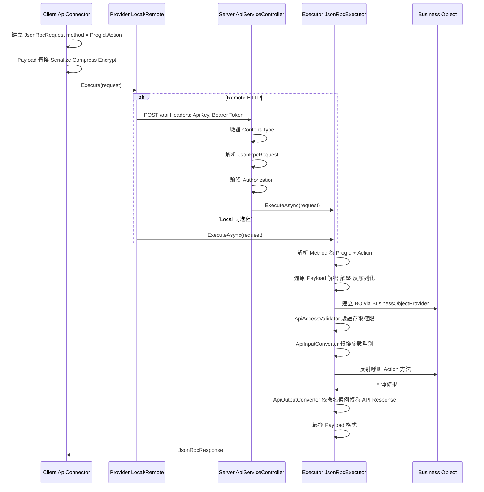

# 端到端開發指引

> 本文件說明 Bee.NET 框架的核心開發流程，幫助開發者（與 AI Coding 工具）理解從定義到 API 的完整串接方式。

## 框架初始化順序

框架使用靜態入口點進行初始化，順序至關重要。

### 初始化流程

```text
┌─────────────────────────────────────────────────────┐
│ 1. BackendInfo.DefinePath = <定義檔路徑>              │
│ 2. BackendInfo.DefineAccess = new LocalDefineAccess() │
│    （或 RemoteDefineAccess）                          │
├─────────────────────────────────────────────────────┤
│ 3. settings = DefineAccess.GetSystemSettings()        │
│ 4. SysInfo.Initialize(settings.CommonConfiguration)   │
├─────────────────────────────────────────────────────┤
│ 5. BackendInfo.Initialize(                            │
│      settings.BackendConfiguration,                   │
│      autoCreateMasterKey: true)                       │
│    → 初始化 Provider、安全金鑰                         │
├─────────────────────────────────────────────────────┤
│ 6. RepositoryInfo（自動，首次存取觸發）                  │
│ 7. CacheFunc（自動，Lazy<T> 延遲初始化）                │
│ 8. ApiServiceOptions.Initialize(payloadOptions)       │
└─────────────────────────────────────────────────────┘
```

參考實作：`tests/Bee.Tests.Shared/GlobalFixture.cs`

## 請求處理管線

### 完整請求流程



### Payload 格式

| 格式 | 處理流程 | 適用場景 |
|------|----------|----------|
| Plain | 無轉換 | Local 呼叫、開發除錯 |
| Encoded | Serialize → Compress | 一般 API 呼叫 |
| Encrypted | Serialize → Compress → Encrypt | 敏感資料傳輸 |

降級規則：要求 Encrypted 但無加密金鑰時，自動降級為 Encoded。

## API 契約三層分離

框架將 API 型別分為三層，避免序列化屬性汙染商業邏輯：

### 層級對照

| 層級 | 組件 | 基底類別 | 特徵 |
|------|------|----------|------|
| Contract | Bee.Api.Contracts | 無（純介面） | `ILoginRequest`、`ILoginResponse` 等 |
| API Type | Bee.Api.Core | `ApiRequest` / `ApiResponse` | 實作 Contract 介面 + MessagePack `[Key]` 屬性 |
| BO Type | Bee.Business | `BusinessArgs` / `BusinessResult` | 實作 Contract 介面，純 POCO |

### 型別轉換流程

```text
Client 發送 → LoginRequest (API Type, MessagePack)
    ↓ JsonRpcExecutor
    ↓ ApiInputConverter 屬性對應（{Action}Request → {Action}Args）
BO 接收 → LoginArgs (BO Type, POCO)
    ↓ 商業邏輯處理
BO 回傳 → LoginResult (BO Type, POCO)
    ↓ ApiOutputConverter 命名慣例推導（{Action}Result → {Action}Response）
Client 接收 → LoginResponse (API Type, MessagePack)
```

### 關鍵元件

- **ApiInputConverter**：將 API Request 的屬性值對應到 BO Args（依屬性名稱匹配），並處理 HTTP 傳入的 `JsonElement`
- **ApiOutputConverter**：執行後將 BO `{Action}Result` 以反射自動對應到 `{Action}Response`，結果以 `ConcurrentDictionary` 快取（詳見 [ADR-007](adr/adr-007-convention-based-type-resolution.md)）
- **ApiContractRegistry**：供 MessagePack Typeless 序列化（Encoded / Encrypted 格式）使用的型別白名單，與輸出映射無關

## ExecFunc 自訂函式模式

ExecFunc 是框架提供的擴展機制，允許開發者新增自訂商業邏輯而不需修改框架核心。

### 開發步驟

#### 1. 定義 Handler 類別

繼承或實作 `IExecFuncHandler`，在對應的 Handler 類別中新增方法：

- 表單層級：`FormExecFuncHandler`
- 系統層級：`SystemExecFuncHandler`

#### 2. 實作方法

```csharp
// 表單層級範例
public class FormExecFuncHandler
{
    /// <summary>
    /// A simple greeting function.
    /// </summary>
    public void Hello(ExecFuncArgs args, ExecFuncResult result)
    {
        result.Parameters.Add("Hello", "Hello form-level BusinessObject");
    }
}

// 系統層級範例（需要認證）
public class SystemExecFuncHandler
{
    /// <summary>
    /// Upgrades the table schema for the specified database.
    /// </summary>
    [ExecFuncAccessControl(ApiAccessRequirement.Authenticated)]
    public void UpgradeTableSchema(ExecFuncArgs args, ExecFuncResult result)
    {
        string databaseId = args.Parameters.GetValue<string>("DatabaseId");
        string dbName = args.Parameters.GetValue<string>("DbName");
        string tableName = args.Parameters.GetValue<string>("TableName");

        var repo = RepositoryInfo.SystemProvider.DatabaseRepository;
        bool upgraded = repo.UpgradeTableSchema(databaseId, dbName, tableName);
        result.Parameters.Add("Upgraded", upgraded);
    }
}
```

#### 3. Client 端呼叫

```csharp
// 表單層級
var connector = new FormApiConnector("Employee", accessToken);
var result = connector.ExecFunc("Hello", new ParameterCollection());

// 系統層級
var sysConnector = new SystemApiConnector(accessToken);
var result = sysConnector.ExecFunc("UpgradeTableSchema", new ParameterCollection
{
    { "DatabaseId", "main" },
    { "DbName", "MyDb" },
    { "TableName", "Employee" }
});
```

### 執行流程

```text
Client: connector.ExecFunc("Hello", params)
  → ApiConnector.Execute<ExecFuncResult>("ExecFunc", args)
  → JsonRpcRequest { method: "Employee.ExecFunc" }
  → JsonRpcExecutor 呼叫 FormBusinessObject.ExecFunc()
  → BusinessObject.DoExecFunc()
  → BusinessFunc.InvokeExecFunc()
    → handler.GetType().GetMethod("Hello")  // 反射取得方法
    → 檢查 [ExecFuncAccessControl] 屬性
    → method.Invoke(handler, args, result)  // 反射呼叫
  → 回傳 ExecFuncResult
```

## FormSchema 驅動開發

FormSchema 是框架的定義中樞，同時驅動 UI、資料庫與驗證規則。

### 核心概念

```text
FormSchema（Single Source of Truth）
├── ProgId: "Employee"
├── DisplayName: "員工管理"
├── Tables: FormTableCollection
│   ├── Master: FormTable
│   │   ├── TableName: "Employee"
│   │   ├── DbTableName: "dbo.Employee"
│   │   └── Fields: FormFieldCollection
│   └── Detail: FormTable（明細表）
│       ├── TableName: "EmployeeHistory"
│       └── Fields: FormFieldCollection
│
├── → 衍生 TableSchema（資料庫維度）
├── → 衍生 FormLayout（UI 維度）
└── → 驅動 SqlFormCommandBuilder（SQL 產生）
```

### FormSchema → SQL 產生

```text
FormApiConnector 查詢資料
  → FormBusinessObject 處理請求
  → SqlFormCommandBuilder(progId)
    → 從 BackendInfo.DefineAccess 取得 FormSchema
    → SelectCommandBuilder.Build(tableName, fields, filter, sort)
      → IFromBuilder: 產生 FROM 子句（含 JOIN）
      → IWhereBuilder: 從 FilterCondition 產生 WHERE 子句
      → ISelectBuilder: 產生 SELECT 欄位清單
      → ISortBuilder: 產生 ORDER BY 子句
    → 回傳參數化的 DbCommandSpec
  → DbAccess.Execute(spec) 執行查詢
```

### FilterCondition 查詢建構

```csharp
// 建立篩選條件
var filter = new FilterGroup(LogicalOperator.And)
{
    FilterCondition.Equal("Department", "IT"),
    FilterCondition.Contains("Name", "王"),
    FilterCondition.Between("Salary", 30000, 80000)
};
```

可用的比較運算子：`Equal`、`Like`、`Contains`、`StartsWith`、`Between`、`In`、`GreaterThan`、`LessThan` 等。
