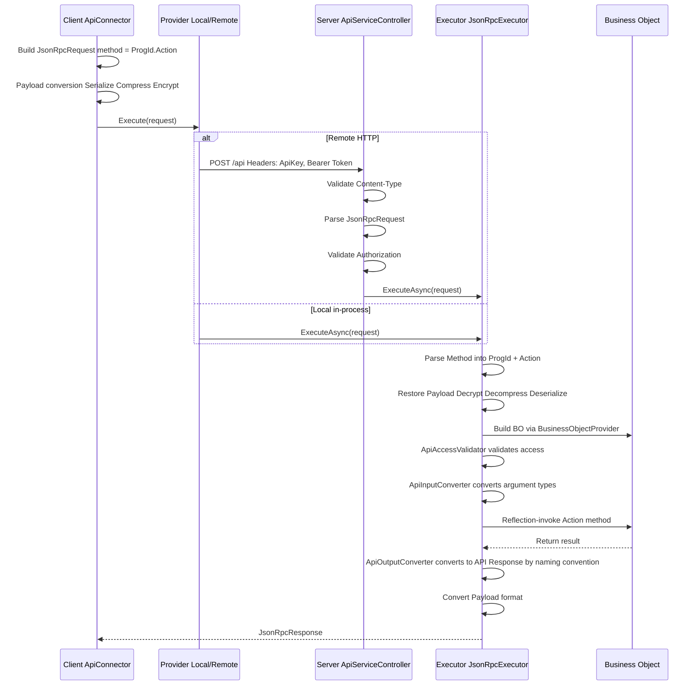

# End-to-End Development Cookbook

[繁體中文](development-cookbook.zh-TW.md)

> This document explains the core development flow of the Bee.NET framework, helping developers (and AI coding tools) understand the full chain from definition to API.

## Framework Initialization Order

The framework registers itself in the standard `IServiceCollection` DI container;
framework services are resolved through ctor injection — there is no static
entry point (service locator).

### Host Startup Flow

```text
┌─────────────────────────────────────────────────────┐
│ 1. paths = new PathOptions { DefinePath = "..." }   │
│ 2. settings = SystemSettingsLoader.Load(paths)      │
│ 3. SysInfo.Initialize(settings.CommonConfiguration) │
├─────────────────────────────────────────────────────┤
│ 4. services.AddBeeFramework(                        │
│      settings.BackendConfiguration,                 │
│      paths,                                         │
│      autoCreateMasterKey: true)                     │
│    → from Bee.Hosting (composition root)            │
│    → Registers IDefineStorage / IDefineAccess /     │
│      ICacheContainer / IDbConnectionManager /       │
│      ISessionInfoService / IBusinessObjectFactory / │
│      JsonRpcExecutor                                │
├─────────────────────────────────────────────────────┤
│ 5. provider = services.BuildServiceProvider()       │
│ 6. app.UseBeeFramework() (ASP.NET only — currently  │
│    a no-op hook reserved for future middleware)     │
└─────────────────────────────────────────────────────┘
```

Host package selection:

- **ASP.NET Core web host**: reference `Bee.Api.AspNetCore` (it transitively pulls in `Bee.Hosting`). Add `using Bee.Hosting;` for `AddBeeFramework` and `using Bee.Api.AspNetCore;` for `UseBeeFramework`.
- **Non-ASP.NET Core host** (WinForms / WPF / Console / Worker Service / integration tests): reference `Bee.Hosting` directly. No `Microsoft.AspNetCore.App` dependency. After `BuildServiceProvider()`, set `ApiClientInfo.LocalServiceProvider = sp` to enable `Bee.Api.Client`'s near-end (in-process) mode.

Reference implementation: `tests/Bee.Tests.Shared/TestProcessBootstrap.cs` — applies
the same flow for the test process with `tests/Define/` as the `DefinePath`.

## Request Processing Pipeline

### Full Request Flow



### Payload Formats

| Format | Pipeline | Use Cases |
|--------|----------|-----------|
| Plain | No transformation | Local calls, dev debugging |
| Encoded | Serialize → Compress | General API calls |
| Encrypted | Serialize → Compress → Encrypt | Sensitive data transmission |

Downgrade rule: requesting Encrypted without an encryption key automatically downgrades to Encoded.

## API Contract Three-Tier Separation

The framework separates API types into three tiers, preventing serialization attributes from polluting business logic:

### Tier Mapping

| Tier | Assembly | Base Class | Characteristics |
|------|----------|------------|-----------------|
| Contract | Bee.Api.Contracts | None (pure interface) | `ILoginRequest`, `ILoginResponse`, etc. |
| API Type | Bee.Api.Core | `ApiRequest` / `ApiResponse` | Implements Contract interface + MessagePack `[Key]` attributes |
| BO Type | Bee.Business | `BusinessArgs` / `BusinessResult` | Implements Contract interface, pure POCO |

### Type Conversion Flow

```text
Client sends → LoginRequest (API Type, MessagePack)
    ↓ JsonRpcExecutor
    ↓ ApiInputConverter property mapping ({Action}Request → {Action}Args)
BO receives → LoginArgs (BO Type, POCO)
    ↓ business logic
BO returns → LoginResult (BO Type, POCO)
    ↓ ApiOutputConverter naming convention ({Action}Result → {Action}Response)
Client receives → LoginResponse (API Type, MessagePack)
```

### Key Components

- **ApiInputConverter**: maps API Request property values to BO Args (matched by property name) and handles `JsonElement` from HTTP input
- **ApiOutputConverter**: after execution, automatically maps BO `{Action}Result` to `{Action}Response` via reflection; results cached in `ConcurrentDictionary` (see [ADR-007](adr/adr-007-convention-based-type-resolution.md))
- **ApiContractRegistry**: type whitelist used by MessagePack Typeless serialization (Encoded / Encrypted formats); unrelated to output mapping

## ExecFunc Custom Function Pattern

ExecFunc is the framework's extension mechanism, allowing developers to add custom business logic without modifying the framework core.

### Development Steps

#### 1. Define a Handler Class

Inherit or implement `IExecFuncHandler`, and add methods to the corresponding handler class:

- Form-level: `FormExecFuncHandler`
- System-level: `SystemExecFuncHandler`

#### 2. Implement Methods

```csharp
// Form-level example
public class FormExecFuncHandler
{
    /// <summary>
    /// A simple greeting function.
    /// </summary>
    public void Hello(ExecFuncArgs args, ExecFuncResult result)
    {
        result.Parameters.Add("Hello", "Hello form-level BusinessObject");
    }
}

// System-level example (authentication required)
public class SystemExecFuncHandler
{
    private readonly ISystemRepositoryFactory _systemFactory;

    public SystemExecFuncHandler(ISystemRepositoryFactory systemFactory)
    {
        _systemFactory = systemFactory;
    }

    /// <summary>
    /// Upgrades the table schema for the specified database.
    /// </summary>
    [ExecFuncAccessControl(ApiAccessRequirement.Authenticated)]
    public void UpgradeTableSchema(ExecFuncArgs args, ExecFuncResult result)
    {
        string databaseId = args.Parameters.GetValue<string>("DatabaseId");
        string dbName = args.Parameters.GetValue<string>("DbName");
        string tableName = args.Parameters.GetValue<string>("TableName");

        var repo = _systemFactory.CreateDatabaseRepository();
        bool upgraded = repo.UpgradeTableSchema(databaseId, dbName, tableName);
        result.Parameters.Add("Upgraded", upgraded);
    }
}
```

#### 3. Client-Side Invocation

```csharp
// Form-level
var connector = new FormApiConnector("Employee", accessToken);
var result = connector.ExecFunc("Hello", new ParameterCollection());

// System-level
var sysConnector = new SystemApiConnector(accessToken);
var result = sysConnector.ExecFunc("UpgradeTableSchema", new ParameterCollection
{
    { "DatabaseId", "main" },
    { "DbName", "MyDb" },
    { "TableName", "Employee" }
});
```

### Execution Flow

```text
Client: connector.ExecFunc("Hello", params)
  → ApiConnector.Execute<ExecFuncResult>("ExecFunc", args)
  → JsonRpcRequest { method: "Employee.ExecFunc" }
  → JsonRpcExecutor calls FormBusinessObject.ExecFunc()
  → BusinessObject.DoExecFunc()
  → BusinessFunc.InvokeExecFunc()
    → handler.GetType().GetMethod("Hello")  // reflection lookup
    → check [ExecFuncAccessControl] attribute
    → method.Invoke(handler, args, result)  // reflection invocation
  → return ExecFuncResult
```

## FormSchema-Driven Development

FormSchema is the framework's definition hub, simultaneously driving UI, database, and validation rules.

### Core Concept

```text
FormSchema (Single Source of Truth)
├── ProgId: "Employee"
├── DisplayName: "Employee Management"
├── CategoryId: "common"        ← required, determines which DbCategory the derived TableSchema belongs to
├── Tables: FormTableCollection
│   ├── Master: FormTable
│   │   ├── TableName: "Employee"
│   │   ├── DbTableName: "dbo.Employee"
│   │   └── Fields: FormFieldCollection
│   └── Detail: FormTable (detail table)
│       ├── TableName: "EmployeeHistory"
│       └── Fields: FormFieldCollection
│
├── → derives TableSchema (database dimension)
├── → derives FormLayout (UI dimension)
└── → drives IFormCommandBuilder family (SQL generation)
```

### CategoryId and DbCategory Routing

Every FormSchema must specify `CategoryId`, which corresponds to the `Id` of a `<DbCategory Id="...">` in `DbCategorySettings.xml`. `CategoryId` simultaneously determines:

- TableSchemas derived from this FormSchema are persisted under the `TableSchema/{categoryId}/` subdirectory
- Which database connection the tables of this FormSchema belong to (derived via DbCategory → `DbScope` → `IRepositoryDatabaseRouter`)

`SaveFormSchema` validates that `CategoryId` is non-empty (via `TableSchemaGenerator.GetCategoryId(formSchema)`); throws `InvalidOperationException` when missing.

### Resolving DatabaseId in a BO Method

A BO method should never hard-code a `databaseId` string or read `SessionInfo.CompanyId` / `CompanyInfo` directly. Use the `BusinessObject` base helpers instead:

```csharp
// FormSchema-driven CRUD — one-liner, auto-routed
var repository = CreateDataFormRepository(ProgId);
// Equivalent to:
// Services.GetRequiredService<IFormRepositoryFactory>()
//         .CreateDataFormRepository(ProgId, AccessToken);

// Custom bo repo — resolve databaseId for the target scope, then build the repo
var dbId = ResolveDatabaseId(DbScope.Log);   // "log" (no session needed)
var dbId = ResolveDatabaseId(DbScope.Company); // routes via session.CompanyId → CompanyInfo.CompanyDatabaseId
var repo = new MonthlySalesReportRepo(Services.GetRequiredService<IDbAccessFactory>(), dbId);
```

`DbScope` resolution rules:

| `DbScope` | Resolved `databaseId` | Requires session? |
|-----------|----------------------|-------------------|
| `Common` | Fixed `"common"` | No |
| `Log` | Fixed `"log"` | No (Login / Logout etc. can write audit log pre-EnterCompany) |
| `Company` | `SessionInfo.CompanyId` → `CompanyInfo.CompanyDatabaseId` | Yes — throws `UnauthorizedAccessException` / `CompanyNotEntered` if not ready |

See [ADR-010 §「後續延伸：執行時路由」](adr/adr-010-logical-database-category.md) for the routing design and [ADR-012](adr/adr-012-session-company-context.md) for the session lifecycle that drives `DbScope.Company`.

### FormSchema → SQL Generation

```text
FormApiConnector queries data
  → FormBusinessObject handles the request
  → IFormCommandBuilder (per-DB provider) is used
    → Retrieves FormSchema from IDefineAccess (DI ctor injected)
    → SelectCommandBuilder.Build(tableName, fields, filter, sort)
      → IFromBuilder: produce FROM clause (with JOIN)
      → IWhereBuilder: produce WHERE clause from FilterCondition
      → ISelectBuilder: produce SELECT field list
      → ISortBuilder: produce ORDER BY clause
    → returns parameterized DbCommandSpec
  → DbAccess.Execute(spec) executes the query
```

### FilterCondition Query Construction

```csharp
// Build a filter
var filter = new FilterGroup(LogicalOperator.And)
{
    FilterCondition.Equal("Department", "IT"),
    FilterCondition.Contains("Name", "Wang"),
    FilterCondition.Between("Salary", 30000, 80000)
};
```

Available comparison operators: `Equal`, `Like`, `Contains`, `StartsWith`, `Between`, `In`, `GreaterThan`, `LessThan`, etc.

## Frontend API Connection Patterns

Bee.NET supports three categories of frontend hosts, each consuming the API in a structurally different way. For the design rationale see [ADR-013](adr/adr-013-frontend-api-connection-strategy.md); this section covers the **practical usage** for each category.

### Decision Tree

> Which category does your frontend belong to?

```
What kind of frontend are you building?
│
├── Desktop / native UI (MAUI / WinForms / WPF / Avalonia)
│   → Use the Bee.UI.* family via the ClientInfo static singleton
│   → See "Desktop" section below
│
├── Blazor Server (ASP.NET Core server-rendered)
│   → Use Bee.Web.Blazor.Server with DI-scoped connectors
│   → See "Blazor Server" section below
│
└── Blazor WASM (Browser WebAssembly)
    → Use Bee.Web.Blazor.Wasm with RemoteApiProvider (HTTP) — forced
    → See "Blazor WASM" section below
```

### Desktop (Bee.UI.* family)

Desktop frontends manage connection state through the `Bee.UI.Core.ClientInfo` static singleton, which fits the "one process = one user" model.

**1. Call `Initialize` at app startup**:

```csharp
// MyApp/Program.cs (or App.xaml.cs / MainActivity, etc.)
using Bee.UI.Core;

// 1. Implement IUIViewService (provides the connection settings dialog)
public class MyUIViewService : IUIViewService
{
    public bool ShowApiConnect()
    {
        // Show a dialog asking the user for the endpoint; return true if confirmed.
        // Concrete implementation depends on the UI framework (MAUI ContentPage / WinForms Form, etc.).
    }
}

// 2. Initialize at startup
var supportedConnectTypes = SupportedConnectTypes.Both; // both Local and Remote allowed
if (!ClientInfo.Initialize(new MyUIViewService(), supportedConnectTypes))
{
    // The user cancelled connection setup; exit the app.
    return;
}
```

Internally `Initialize` reads the `{ExeName}.Settings.xml` file, tries the endpoint, and falls back to `IUIViewService.ShowApiConnect()` if unreachable.

**2. Apply login result**:

```csharp
var loginResponse = await ClientInfo.SystemApiConnector.LoginAsync(userId, password);
ClientInfo.ApplyLoginResult(loginResponse);
// ClientInfo.AccessToken / UserInfo are now populated
```

**3. Use connectors via `ClientInfo`**:

```csharp
// System-level API
var pingResult = await ClientInfo.SystemApiConnector.PingAsync();

// Form-level API (FormBO)
var formConnector = ClientInfo.CreateFormApiConnector("Employee");
var listResult = await formConnector.GetListAsync(selectFields: "EmpId,EmpName");

// Definition data (FormSchema, TableSchema, etc.)
var schema = ClientInfo.DefineAccess.GetFormSchema("Employee");
```

**4. Switch endpoint (user changes server)**:

```csharp
ClientInfo.SetEndpoint("https://new-server.example.com/api");
// Internally resets AccessToken and re-triggers the ApplyLoginResult flow.
```

### Blazor Server (Bee.Web.Blazor.Server)

Blazor Server uses ASP.NET Core DI to inject connectors. **Each SignalR circuit gets its own DI scope**, preventing cross-user data leakage.

**1. Register in `Program.cs`**:

```csharp
using Bee.Hosting; // AddBeeFramework

var builder = WebApplication.CreateBuilder(args);

// Backend services (DbConnectionManager / IDefineAccess / BO, etc.)
builder.Services.AddBeeFramework(backendConfiguration, pathOptions);

// Bee.Web.Blazor.Server RCL services
builder.Services.AddBeeWebBlazorServer();

// Standard Blazor Server setup
builder.Services.AddRazorComponents().AddInteractiveServerComponents();

var app = builder.Build();
app.UseBeeFramework(); // JSON-RPC middleware
app.MapRazorComponents<App>().AddInteractiveServerRenderMode();
app.Run();
```

**2. Inject connectors in a Razor component**:

```razor
@page "/employees"
@inject SystemApiConnector SystemConnector

<h3>Employees</h3>

@code {
    private GetListResponse? listResult;

    protected override async Task OnInitializedAsync()
    {
        var formConnector = new FormApiConnector(/* via DI or factory */);
        listResult = await formConnector.GetListAsync(selectFields: "EmpId,EmpName");
    }
}
```

**3. Local vs Remote mode**:

- **Local mode (in-process)**: `Bee.Web.Blazor.Server` and the backend share the same ASP.NET Core process, so `LocalApiProvider` can call directly without HTTP overhead.
- **Remote mode (HTTP)**: Blazor Server and the backend run in different processes / servers and communicate via `RemoteApiProvider` over HTTP.

The host application registers an `IApiProvider` implementation at startup to choose the mode (`LocalApiProvider` / `RemoteApiProvider`).

### Blazor WASM (Bee.Web.Blazor.Wasm)

Blazor WASM runs inside the browser sandbox and is **forced to use `RemoteApiProvider`** (it cannot load backend assemblies).

**1. Register in `Program.cs`**:

```csharp
using Microsoft.AspNetCore.Components.WebAssembly.Hosting;

var builder = WebAssemblyHostBuilder.CreateDefault(args);
builder.RootComponents.Add<App>("#app");

// HttpClient pointing at the API server endpoint
builder.Services.AddScoped(sp => new HttpClient
{
    BaseAddress = new Uri("https://api.example.com/")
});

// Bee.Web.Blazor.Wasm RCL services (registers RemoteApiProvider automatically)
builder.Services.AddBeeWebBlazorWasm();

await builder.Build().RunAsync();
```

**2. Razor component usage is identical to Blazor Server**:

```razor
@page "/employees"
@inject SystemApiConnector SystemConnector

@code {
    protected override async Task OnInitializedAsync()
    {
        var formConnector = new FormApiConnector(/* ... */);
        var result = await formConnector.GetListAsync(selectFields: "EmpId,EmpName");
    }
}
```

**3. Strict constraint**:

> ⚠️ **`Bee.Web.Blazor.Wasm` must not depend on any backend project** (`Bee.Repository` / `Bee.Business` / `Bee.Hosting`, etc.) — the browser runtime cannot load server-only assemblies. The constraint is enforced by the dependency chain (`Bee.Api.Client → Bee.Api.Core → Bee.Api.Contracts/Definition` are all pure data/protocol layers).

### MAUI (Phase 1 pending)

`Bee.UI.Maui` is currently a [Phase 0 placeholder](plans/plan-add-bee-ui-maui.md) (plain `net10.0` class library) and belongs to the **`Bee.UI.*` family**, so its API-connection pattern is the same as the "Desktop" section above — through the `ClientInfo` static singleton.

Phase 1 (when the first concrete control is implemented) will expand the csproj to MAUI multi-target (iOS / Android / macOS / Windows). At that point MAUI-specific examples (`IUIViewService` implemented via MAUI `ContentPage`, app startup flow, etc.) will be added.

### Quick Reference

| Frontend | Connection abstraction | State storage | Mode | Registration |
|---------|-----------------------|--------------|------|-------------|
| Desktop (MAUI / WinForms) | `ClientInfo` static | Local file + `IEndpointStorage` | Local or Remote | `ClientInfo.Initialize` at startup |
| Blazor Server | DI scope | Circuit-bound | Local or Remote | `AddBeeFramework` + `AddBeeWebBlazorServer` |
| Blazor WASM | DI scope | Browser memory | **Remote only** | `AddBeeWebBlazorWasm` + `HttpClient` |
