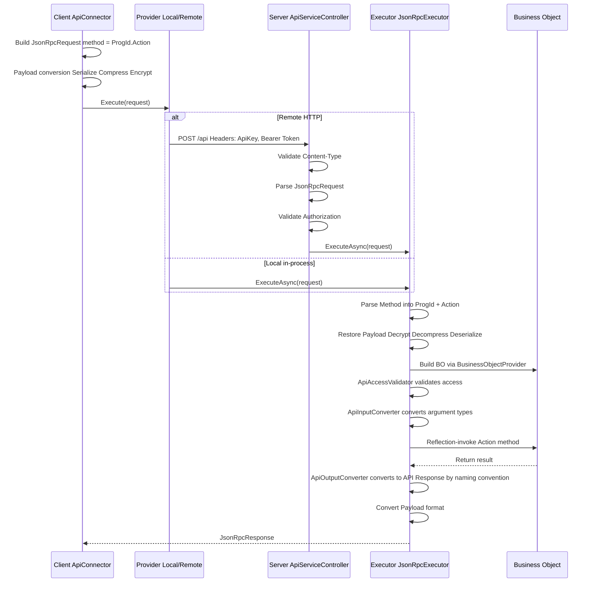

# End-to-End Development Cookbook

[繁體中文](development-cookbook.zh-TW.md)

> This document explains the core development flow of the Bee.NET framework, helping developers (and AI coding tools) understand the full chain from definition to API.

## Framework Initialization Order

After Phase 5 the framework registers itself in the standard `IServiceCollection`
DI container; framework services are resolved through ctor injection rather than
static entry points.

### Host Startup Flow

```text
┌─────────────────────────────────────────────────────┐
│ 1. paths = new PathOptions { DefinePath = "..." }   │
│ 2. settings = SystemSettingsLoader.Load(paths)      │
│ 3. SysInfo.Initialize(settings.CommonConfiguration) │
├─────────────────────────────────────────────────────┤
│ 4. services.AddBeeFramework(                        │
│      settings.BackendConfiguration,                 │
│      paths,                                         │
│      autoCreateMasterKey: true)                     │
│    → Registers IDefineStorage / IDefineAccess /     │
│      ICacheContainer / IDbConnectionManager /       │
│      ISessionInfoService / IBusinessObjectFactory / │
│      JsonRpcExecutor                                │
├─────────────────────────────────────────────────────┤
│ 5. provider = services.BuildServiceProvider()       │
│ 6. app.UseBeeFramework() (ASP.NET only)             │
│    → Eager-resolves IDbConnectionManagerBootstrapper│
│      (wires the transitional DbConnectionManager    │
│      static for legacy `new DbAccess(id)` sites)    │
└─────────────────────────────────────────────────────┘
```

Reference implementation: `tests/Bee.Tests.Shared/TestProcessBootstrap.cs` — applies
the same flow for the test process with `tests/Define/` as the `DefinePath`.

## Request Processing Pipeline

### Full Request Flow



### Payload Formats

| Format | Pipeline | Use Cases |
|--------|----------|-----------|
| Plain | No transformation | Local calls, dev debugging |
| Encoded | Serialize → Compress | General API calls |
| Encrypted | Serialize → Compress → Encrypt | Sensitive data transmission |

Downgrade rule: requesting Encrypted without an encryption key automatically downgrades to Encoded.

## API Contract Three-Tier Separation

The framework separates API types into three tiers, preventing serialization attributes from polluting business logic:

### Tier Mapping

| Tier | Assembly | Base Class | Characteristics |
|------|----------|------------|-----------------|
| Contract | Bee.Api.Contracts | None (pure interface) | `ILoginRequest`, `ILoginResponse`, etc. |
| API Type | Bee.Api.Core | `ApiRequest` / `ApiResponse` | Implements Contract interface + MessagePack `[Key]` attributes |
| BO Type | Bee.Business | `BusinessArgs` / `BusinessResult` | Implements Contract interface, pure POCO |

### Type Conversion Flow

```text
Client sends → LoginRequest (API Type, MessagePack)
    ↓ JsonRpcExecutor
    ↓ ApiInputConverter property mapping ({Action}Request → {Action}Args)
BO receives → LoginArgs (BO Type, POCO)
    ↓ business logic
BO returns → LoginResult (BO Type, POCO)
    ↓ ApiOutputConverter naming convention ({Action}Result → {Action}Response)
Client receives → LoginResponse (API Type, MessagePack)
```

### Key Components

- **ApiInputConverter**: maps API Request property values to BO Args (matched by property name) and handles `JsonElement` from HTTP input
- **ApiOutputConverter**: after execution, automatically maps BO `{Action}Result` to `{Action}Response` via reflection; results cached in `ConcurrentDictionary` (see [ADR-007](adr/adr-007-convention-based-type-resolution.md))
- **ApiContractRegistry**: type whitelist used by MessagePack Typeless serialization (Encoded / Encrypted formats); unrelated to output mapping

## ExecFunc Custom Function Pattern

ExecFunc is the framework's extension mechanism, allowing developers to add custom business logic without modifying the framework core.

### Development Steps

#### 1. Define a Handler Class

Inherit or implement `IExecFuncHandler`, and add methods to the corresponding handler class:

- Form-level: `FormExecFuncHandler`
- System-level: `SystemExecFuncHandler`

#### 2. Implement Methods

```csharp
// Form-level example
public class FormExecFuncHandler
{
    /// <summary>
    /// A simple greeting function.
    /// </summary>
    public void Hello(ExecFuncArgs args, ExecFuncResult result)
    {
        result.Parameters.Add("Hello", "Hello form-level BusinessObject");
    }
}

// System-level example (authentication required)
public class SystemExecFuncHandler
{
    private readonly ISystemRepositoryFactory _systemFactory;

    public SystemExecFuncHandler(ISystemRepositoryFactory systemFactory)
    {
        _systemFactory = systemFactory;
    }

    /// <summary>
    /// Upgrades the table schema for the specified database.
    /// </summary>
    [ExecFuncAccessControl(ApiAccessRequirement.Authenticated)]
    public void UpgradeTableSchema(ExecFuncArgs args, ExecFuncResult result)
    {
        string databaseId = args.Parameters.GetValue<string>("DatabaseId");
        string dbName = args.Parameters.GetValue<string>("DbName");
        string tableName = args.Parameters.GetValue<string>("TableName");

        var repo = _systemFactory.CreateDatabaseRepository();
        bool upgraded = repo.UpgradeTableSchema(databaseId, dbName, tableName);
        result.Parameters.Add("Upgraded", upgraded);
    }
}
```

#### 3. Client-Side Invocation

```csharp
// Form-level
var connector = new FormApiConnector("Employee", accessToken);
var result = connector.ExecFunc("Hello", new ParameterCollection());

// System-level
var sysConnector = new SystemApiConnector(accessToken);
var result = sysConnector.ExecFunc("UpgradeTableSchema", new ParameterCollection
{
    { "DatabaseId", "main" },
    { "DbName", "MyDb" },
    { "TableName", "Employee" }
});
```

### Execution Flow

```text
Client: connector.ExecFunc("Hello", params)
  → ApiConnector.Execute<ExecFuncResult>("ExecFunc", args)
  → JsonRpcRequest { method: "Employee.ExecFunc" }
  → JsonRpcExecutor calls FormBusinessObject.ExecFunc()
  → BusinessObject.DoExecFunc()
  → BusinessFunc.InvokeExecFunc()
    → handler.GetType().GetMethod("Hello")  // reflection lookup
    → check [ExecFuncAccessControl] attribute
    → method.Invoke(handler, args, result)  // reflection invocation
  → return ExecFuncResult
```

## FormSchema-Driven Development

FormSchema is the framework's definition hub, simultaneously driving UI, database, and validation rules.

### Core Concept

```text
FormSchema (Single Source of Truth)
├── ProgId: "Employee"
├── DisplayName: "Employee Management"
├── CategoryId: "common"        ← required, determines which DbCategory the derived TableSchema belongs to
├── Tables: FormTableCollection
│   ├── Master: FormTable
│   │   ├── TableName: "Employee"
│   │   ├── DbTableName: "dbo.Employee"
│   │   └── Fields: FormFieldCollection
│   └── Detail: FormTable (detail table)
│       ├── TableName: "EmployeeHistory"
│       └── Fields: FormFieldCollection
│
├── → derives TableSchema (database dimension)
├── → derives FormLayout (UI dimension)
└── → drives IFormCommandBuilder family (SQL generation)
```

### CategoryId and DbCategory Routing

Every FormSchema must specify `CategoryId`, which corresponds to the `Id` of a `<DbCategory Id="...">` in `DbCategorySettings.xml`. `CategoryId` simultaneously determines:

- TableSchemas derived from this FormSchema are persisted under the `TableSchema/{categoryId}/` subdirectory
- Which database connection the tables of this FormSchema belong to (derived via DbCategory)

`SaveFormSchema` validates that `CategoryId` is non-empty (via `TableSchemaGenerator.GetCategoryId(formSchema)`); throws `InvalidOperationException` when missing.

### FormSchema → SQL Generation

```text
FormApiConnector queries data
  → FormBusinessObject handles the request
  → IFormCommandBuilder (per-DB provider) is used
    → Retrieves FormSchema from BackendInfo.DefineAccess
    → SelectCommandBuilder.Build(tableName, fields, filter, sort)
      → IFromBuilder: produce FROM clause (with JOIN)
      → IWhereBuilder: produce WHERE clause from FilterCondition
      → ISelectBuilder: produce SELECT field list
      → ISortBuilder: produce ORDER BY clause
    → returns parameterized DbCommandSpec
  → DbAccess.Execute(spec) executes the query
```

### FilterCondition Query Construction

```csharp
// Build a filter
var filter = new FilterGroup(LogicalOperator.And)
{
    FilterCondition.Equal("Department", "IT"),
    FilterCondition.Contains("Name", "Wang"),
    FilterCondition.Between("Salary", 30000, 80000)
};
```

Available comparison operators: `Equal`, `Like`, `Contains`, `StartsWith`, `Between`, `In`, `GreaterThan`, `LessThan`, etc.
