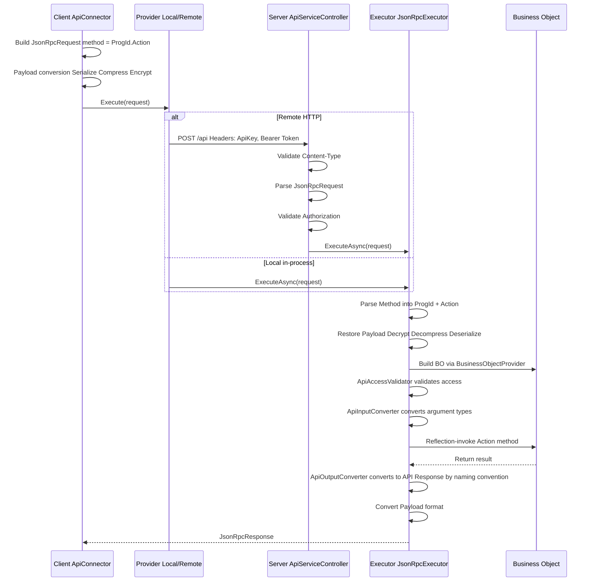

# End-to-End Development Cookbook

[繁體中文](development-cookbook.zh-TW.md)

> This document explains the core development flow of the Bee.NET framework, helping developers (and AI coding tools) understand the full chain from definition to API.

## Framework Initialization Order

The framework registers itself in the standard `IServiceCollection` DI container;
framework services are resolved through ctor injection — there is no static
entry point (service locator).

### Host Startup Flow

```text
┌─────────────────────────────────────────────────────┐
│ 1. paths = new PathOptions { DefinePath = "..." }   │
│ 2. settings = SystemSettingsLoader.Load(paths)      │
│ 3. SysInfo.Initialize(settings.CommonConfiguration) │
├─────────────────────────────────────────────────────┤
│ 4. services.AddBeeFramework(                        │
│      settings.BackendConfiguration,                 │
│      paths,                                         │
│      autoCreateMasterKey: true)                     │
│    → from Bee.Hosting (composition root)            │
│    → Registers IDefineStorage / IDefineAccess /     │
│      ICacheContainer / IDbConnectionManager /       │
│      ISessionInfoService / ILanguageService /       │
│      IBusinessObjectFactory / JsonRpcExecutor       │
├─────────────────────────────────────────────────────┤
│ 5. provider = services.BuildServiceProvider()       │
│ 6. app.UseBeeFramework() (ASP.NET only — currently  │
│    a no-op hook reserved for future middleware)     │
└─────────────────────────────────────────────────────┘
```

Host package selection:

- **ASP.NET Core web host**: reference `Bee.Api.AspNetCore` (it transitively pulls in `Bee.Hosting`). Add `using Bee.Hosting;` for `AddBeeFramework` and `using Bee.Api.AspNetCore;` for `UseBeeFramework`.
- **Non-ASP.NET Core host** (WinForms / WPF / Console / Worker Service / integration tests): reference `Bee.Hosting` directly. No `Microsoft.AspNetCore.App` dependency. After `BuildServiceProvider()`, set `ApiClientInfo.LocalServiceProvider = sp` to enable `Bee.Api.Client`'s near-end (in-process) mode.

Reference implementation: `tests/Bee.Tests.Shared/TestProcessBootstrap.cs` — applies
the same flow for the test process with `tests/Define/` (merged with the embedded
framework defaults at process start) as the `DefinePath`.

### First-time `DefinePath` setup

Step 1 of the startup flow requires `DefinePath` to exist with the framework's
minimum define files (`st_*` TableSchemas, `SystemSettings.xml`, `DatabaseSettings.xml`,
`DbCategorySettings.xml`, framework-shipped Department / Employee forms). The
framework ships these as embedded resources in `Bee.Definition.dll`; consumers
materialise them once into the target directory before first run.

```bash
# install the framework CLI (one-time, machine-wide)
dotnet tool install -g Bee.Cli

# materialise framework defaults into your DefinePath
dotnet bee defines materialize --path ./Define

# tweak SystemSettings (set MasterKeySource) + DatabaseSettings (add connection strings)
# then start the app — DefinePath is now wired up
```

The CLI is a thin shell over `Bee.Definition.Defaults.MaterializeTo(...)`; the
same API is available programmatically for hosts that prefer to materialise from
code, and `tools/DefineEditor` calls it automatically when you open a folder.
Skip-existing is the default so re-running never overwrites your customisations.

See [Framework-Reserved Names](framework-reserved-names.md) for the complete
list of files and consumer extension guidelines.

## Request Processing Pipeline

### Full Request Flow



### Payload Formats

| Format | Pipeline | Use Cases |
|--------|----------|-----------|
| Plain | No transformation | Local calls, dev debugging |
| Encoded | Serialize → Compress | General API calls |
| Encrypted | Serialize → Compress → Encrypt | Sensitive data transmission |

Downgrade rule: requesting Encrypted without an encryption key automatically downgrades to Encoded.

## API Contract Three-Tier Separation

The framework separates API types into three tiers, preventing serialization attributes from polluting business logic:

### Tier Mapping

| Tier | Assembly | Base Class | Characteristics |
|------|----------|------------|-----------------|
| Contract | Bee.Api.Contracts | None (pure interface) | `ILoginRequest`, `ILoginResponse`, etc. |
| API Type | Bee.Api.Core | `ApiRequest` / `ApiResponse` | Implements Contract interface + MessagePack `[Key]` attributes |
| BO Type | Bee.Business | `BusinessArgs` / `BusinessResult` | Implements Contract interface, pure POCO |

### Type Conversion Flow

```text
Client sends → LoginRequest (API Type, MessagePack)
    ↓ JsonRpcExecutor
    ↓ ApiInputConverter property mapping ({Action}Request → {Action}Args)
BO receives → LoginArgs (BO Type, POCO)
    ↓ business logic
BO returns → LoginResult (BO Type, POCO)
    ↓ ApiOutputConverter naming convention ({Action}Result → {Action}Response)
Client receives → LoginResponse (API Type, MessagePack)
```

### Key Components

- **ApiInputConverter**: maps API Request property values to BO Args (matched by property name) and handles `JsonElement` from HTTP input
- **ApiOutputConverter**: after execution, automatically maps BO `{Action}Result` to `{Action}Response` via reflection; results cached in `ConcurrentDictionary` (see [ADR-007](adr/adr-007-convention-based-type-resolution.md))
- **ApiContractRegistry**: type whitelist used by MessagePack Typeless serialization (Encoded / Encrypted formats); unrelated to output mapping

## ExecFunc Custom Function Pattern

ExecFunc is the framework's extension mechanism, allowing developers to add custom business logic without modifying the framework core.

### Development Steps

#### 1. Define a Handler Class

Inherit or implement `IExecFuncHandler`, and add methods to the corresponding handler class:

- Form-level: `FormExecFuncHandler`
- System-level: `SystemExecFuncHandler`

#### 2. Implement Methods

```csharp
// Form-level example
public class FormExecFuncHandler
{
    /// <summary>
    /// A simple greeting function.
    /// </summary>
    public void Hello(ExecFuncArgs args, ExecFuncResult result)
    {
        result.Parameters.Add("Hello", "Hello form-level BusinessObject");
    }
}

// System-level example (authentication required)
public class SystemExecFuncHandler
{
    private readonly ISystemRepositoryFactory _systemFactory;

    public SystemExecFuncHandler(ISystemRepositoryFactory systemFactory)
    {
        _systemFactory = systemFactory;
    }

    /// <summary>
    /// Upgrades the table schema for the specified database.
    /// </summary>
    [ExecFuncAccessControl(ApiAccessRequirement.Authenticated)]
    public void UpgradeTableSchema(ExecFuncArgs args, ExecFuncResult result)
    {
        string databaseId = args.Parameters.GetValue<string>("DatabaseId");
        string dbName = args.Parameters.GetValue<string>("DbName");
        string tableName = args.Parameters.GetValue<string>("TableName");

        var repo = _systemFactory.CreateDatabaseRepository();
        bool upgraded = repo.UpgradeTableSchema(databaseId, dbName, tableName);
        result.Parameters.Add("Upgraded", upgraded);
    }
}
```

#### 3. Client-Side Invocation

```csharp
// Form-level
var connector = new FormApiConnector("Employee", accessToken);
var result = connector.ExecFunc("Hello", new ParameterCollection());

// System-level
var sysConnector = new SystemApiConnector(accessToken);
var result = sysConnector.ExecFunc("UpgradeTableSchema", new ParameterCollection
{
    { "DatabaseId", "main" },
    { "DbName", "MyDb" },
    { "TableName", "Employee" }
});
```

### Execution Flow

```text
Client: connector.ExecFunc("Hello", params)
  → ApiConnector.Execute<ExecFuncResult>("ExecFunc", args)
  → JsonRpcRequest { method: "Employee.ExecFunc" }
  → JsonRpcExecutor calls FormBusinessObject.ExecFunc()
  → BusinessObject.DoExecFunc()
  → BusinessFunc.InvokeExecFunc()
    → handler.GetType().GetMethod("Hello")  // reflection lookup
    → check [ExecFuncAccessControl] attribute
    → method.Invoke(handler, args, result)  // reflection invocation
  → return ExecFuncResult
```

## FormSchema-Driven Development

FormSchema is the framework's definition hub, simultaneously driving UI, database, and validation rules.

### Core Concept

```text
FormSchema (Single Source of Truth)
├── ProgId: "Employee"
├── DisplayName: "Employee Management"
├── CategoryId: "common"        ← required, determines which DbCategory the derived TableSchema belongs to
├── Tables: FormTableCollection
│   ├── Master: FormTable
│   │   ├── TableName: "Employee"
│   │   ├── DbTableName: "dbo.Employee"
│   │   └── Fields: FormFieldCollection
│   └── Detail: FormTable (detail table)
│       ├── TableName: "EmployeeHistory"
│       └── Fields: FormFieldCollection
│
├── → derives TableSchema (database dimension)
├── → derives FormLayout (UI dimension)
└── → drives IFormCommandBuilder family (SQL generation)
```

### CategoryId and DbCategory Routing

Every FormSchema must specify `CategoryId`, which corresponds to the `Id` of a `<DbCategory Id="...">` in `DbCategorySettings.xml`. `CategoryId` simultaneously determines:

- TableSchemas derived from this FormSchema are persisted under the `TableSchema/{categoryId}/` subdirectory
- Which database connection the tables of this FormSchema belong to (derived via DbCategory → `DbScope` → `IRepositoryDatabaseRouter`)

`SaveFormSchema` validates that `CategoryId` is non-empty (via `TableSchemaGenerator.GetCategoryId(formSchema)`); throws `InvalidOperationException` when missing.

### Resolving DatabaseId in a BO Method

A BO method should never hard-code a `databaseId` string or read `SessionInfo.CompanyId` / `CompanyInfo` directly. Use the `BusinessObject` base helpers instead:

```csharp
// FormSchema-driven CRUD — one-liner, auto-routed
var repository = CreateDataFormRepository(ProgId);
// Equivalent to:
// Services.GetRequiredService<IFormRepositoryFactory>()
//         .CreateDataFormRepository(ProgId, AccessToken);

// Custom bo repo — resolve databaseId for the target scope, then build the repo
var dbId = ResolveDatabaseId(DbScope.Log);   // "log" (no session needed)
var dbId = ResolveDatabaseId(DbScope.Company); // routes via session.CompanyId → CompanyInfo.CompanyDatabaseId
var repo = new MonthlySalesReportRepo(Services.GetRequiredService<IDbAccessFactory>(), dbId);
```

`DbScope` resolution rules:

| `DbScope` | Resolved `databaseId` | Requires session? |
|-----------|----------------------|-------------------|
| `Common` | Fixed `"common"` | No |
| `Log` | Fixed `"log"` | No (Login / Logout etc. can write audit log pre-EnterCompany) |
| `Company` | `SessionInfo.CompanyId` → `CompanyInfo.CompanyDatabaseId` | Yes — throws `UnauthorizedAccessException` / `CompanyNotEntered` if not ready |

See [ADR-010 §「後續延伸：執行時路由」](adr/adr-010-logical-database-category.md) for the routing design and [ADR-012](adr/adr-012-session-company-context.md) for the session lifecycle that drives `DbScope.Company`.

### Customising the BO for a ProgId

The framework instantiates `FormBusinessObject` by default for every `ProgId`. When a form needs behaviour that goes beyond the FormSchema-driven CRUD pipeline (custom validation, domain events, AnyCode SQL, etc.), subclass `FormBusinessObject` and bind the subclass through `ProgramSettings.xml`.

#### 1. Subclass `FormBusinessObject`

```csharp
namespace MyErp.Business;

public class CustomerBo : FormBusinessObject
{
    public CustomerBo(IBeeContext ctx, Guid accessToken, string progId, bool isLocalCall = true)
        : base(ctx, accessToken, progId, isLocalCall) { }

    // Override hooks or add custom methods exposed via [ApiAccessControl].
    public override SaveResult SaveData(SaveArgs args) { /* custom logic */ }
}
```

#### 2. Bind the subclass in `ProgramSettings.xml`

```xml
<ProgramItem ProgId="Customer"
             DisplayName="Customer Management"
             BusinessObject="MyErp.Business.CustomerBo, MyErp.Business" />
```

`BusinessObject` uses the assembly-qualified format (`"Namespace.Type, AssemblyName"`). When empty, the resolver falls back to `FormBusinessObject` — so you only need to declare `BusinessObject` for the ProgIds that actually need customisation.

#### 3. Resolution behaviour

`ProgramSettingsFormBoTypeResolver` (registered by `AddBeeFramework`) looks up `ProgramItem.BusinessObject`, loads the type via `AssemblyLoader`, and verifies it derives from `FormBusinessObject`. Any failure (missing file, unresolved type, wrong base class) falls back to `FormBusinessObject` rather than failing the request — incremental adoption is safe.

Resolved types are cached for the lifetime of the in-memory `ProgramSettings` instance; when `ProgramSettingsCache` reloads the file (via its file watcher), the cache resets automatically.

### FormSchema → SQL Generation

```text
FormApiConnector queries data
  → FormBusinessObject handles the request
  → IFormCommandBuilder (per-DB provider) is used
    → Retrieves FormSchema from IDefineAccess (DI ctor injected)
    → SelectCommandBuilder.Build(tableName, fields, filter, sort)
      → IFromBuilder: produce FROM clause (with JOIN)
      → IWhereBuilder: produce WHERE clause from FilterCondition
      → ISelectBuilder: produce SELECT field list
      → ISortBuilder: produce ORDER BY clause
    → returns parameterized DbCommandSpec
  → DbAccess.Execute(spec) executes the query
```

### FilterCondition Query Construction

```csharp
// Build a filter
var filter = new FilterGroup(LogicalOperator.And)
{
    FilterCondition.Equal("Department", "IT"),
    FilterCondition.Contains("Name", "Wang"),
    FilterCondition.Between("Salary", 30000, 80000)
};
```

Available comparison operators: `Equal`, `Like`, `Contains`, `StartsWith`, `Between`, `In`, `GreaterThan`, `LessThan`, etc.

## Numeric Semantics, Company Decimals, and Rounding

Numeric fields declare a semantic **`NumberKind`** on `FormField` (propagated to `LayoutFieldBase`). The kind drives three things — the display format, whether the value is rounded on write, and where the decimal places come from. The members and framework defaults are the signed-off contract in [plan-numeric-core.md](plans/plan-numeric-core.md).

| `NumberKind` | Rounding policy | Decimals source | Framework default | Use |
|-------------|-----------------|-----------------|:-----------------:|-----|
| `Quantity` / `Weight` | `Round` | `Unit` (falls back to company) | 0 / 3 | quantities, weights |
| `Amount` | `Round` | `Currency` (falls back to company) | 2 | amounts, tax, totals |
| `Percent` | `Round` | `Company` | 2 | percentages |
| `UnitPrice` / `Cost` | `Preserve` | `Company` (display-only) | 4 | prices, costs |
| `ExchangeRate` | `Preserve` | `SystemFixed` | 5 | exchange rates |

> The `Currency` source is resolved by the multi-currency increment (below); the `Unit` source still falls back to the company override table until the unit-of-measure increment replaces that fallback. The enum and the table above do not change.

### Two rules that are easy to get wrong

- **Round-then-sum (ERP invariant).** For `Round` kinds, a total must equal the **sum of already-rounded details**, never a full-precision sum rounded once at the end. Round each detail with `NumberFormatResolver.RoundByKind(value, kind, company)` — or the currency-aware `RoundByKind(value, kind, ctx, refCode)` for amounts (below) — then add the rounded values. This guarantees `Σ details == total`.
- **Preserve never writes a rounded value.** `UnitPrice` / `Cost` / `ExchangeRate` are stored at input precision; their decimals are display-only. `RoundByKind` returns these values unchanged. Rounding a source value injects error downstream — do not do it. (For API import, the only hard boundary is DB scale; see the persistence-boundary note in [plan-numeric-formatting.md](plans/plan-numeric-formatting.md) §2.4.)

### Display format is baked at delivery

`SystemBusinessObject.LoadAndLocalizeSchema` clones the cached `FormSchema` and calls `NumberFormatApplier.Bake(clone, company)`, which sets `FormField.NumberFormat` (e.g. `"N2"`, `"P4"`, `"N5"`) on every `NumberKind` field that has no explicit format. An author-supplied `NumberFormat` always wins. The cached schema is never mutated — baking runs on the per-call clone only (see the immutability note on that method).

Because the format is resolved from the session company's decimals, the same schema delivered to two companies can carry different formats (e.g. `Percent` at `P2` vs `P4`). `SystemFixed` kinds (`ExchangeRate`) ignore any company override and always use the framework default.

### Multi-currency: amounts resolve by their currency at runtime

`Amount` decimals follow the **currency**, not the company (JPY = 0, USD = 2, BHD = 3 — like SAP TCURX). The currency master is the system-level define **`CurrencySettings`** (`DefineType.CurrencySettings`, curated ISO 4217 table; each `CurrencyItem` carries a `Rounding` natural minor unit from which decimals are derived). It ships to the client through the ordinary `GetDefine` channel; a missing master is fine — amounts then fall back to the framework default of 2.

Each amount field binds a **currency key field** (SAP CUKY) via `FormField.CurrencyField`; the master document currency lives on `FormSchema.CurrencyField` (by convention `sys_currency`). The resolution priority for an amount's currency is: **explicit `CurrencyField` → master `sys_currency` → company `DefaultCurrency` → framework 2**. Detail amount fields read the master row's currency. At delivery, `Bake` **does not bake** `Amount` formats (their decimals depend on the runtime currency value — the UI resolves them per row); it instead stamps the effective currency-reference field onto each amount field so the UI knows what to watch.

Server-side rounding uses the currency-aware overloads with a `RoundingContext` (`Company` + `CurrencySettings`):

- **Per-detail:** `NumberFormatResolver.RoundByKind(value, NumberKind.Amount, ctx, currencyCode)` rounds to the currency's natural decimals. Round-then-sum as usual — original and home amounts each round to their own currency independently.
- **Home currency:** `home_amount = RoundByKind(amount × rate, Amount, ctx, homeCurrency)` — the already-rounded original amount times the full-precision (preserve) rate, rounded to the home currency's decimals. The home currency defaults to `CompanyInfo.DefaultCurrency`.
- **Final cash rounding (optional):** `RoundCash(total, currencyCode, ctx)` snaps the final payable to the company's per-currency cash-rounding unit (SAP T001R, `CompanyInfo.CashRounding`, e.g. CHF → 0.05); with no override it stays at the currency's natural unit (no extra rounding). The deliberate difference `payable − total` is booked to a rounding account by the caller.

The currency decimals are **system-wide** (in `CurrencySettings`); only the **cash-rounding unit** is company-overridable (`CompanyInfo.CashRounding`). The per-company `CompanyInfo.AllowedCurrencies` whitelist bounds which currencies a document may pick (empty = all system currencies).

### Units of measure: quantities/weights resolve by their unit at runtime

`Quantity` / `Weight` decimals follow the **unit of measure**, not the company (KG = 3, PCS = 0 — like SAP T006), exactly parallel to amounts and currency. The unit master is the system-level define **`UnitSettings`** (`DefineType.UnitSettings`, curated table; each `UnitItem` stores its `Decimals` directly). It ships to the client through the ordinary `GetDefine` channel; a missing master falls back to the framework default.

Each quantity/weight field binds a **unit field** (SAP UNIT) via `FormField.UnitField` (there is no master-level unit — units are per row). The resolution priority is: **bound `UnitField` value → company decimals → framework default**. At delivery, `Bake` does not bake fields that bind a `UnitField` (runtime by unit); unbound quantity/weight fields fall back to the company decimals and are baked. Server-side rounding uses `RoundByKind(value, kind, ctx, unitCode)` with a `RoundingContext` carrying `UnitSettings`; round-then-sum holds per unit (a mixed-unit column has no meaningful total). The grid and `NumericEdit` resolve the unit per cell/row the same way as currency (`AmountColumnSummary` gates a mixed-unit footer total just like mixed currency).

### DB storage precision is a capacity ceiling, not a display/calc setting

Numeric columns use `Decimal` with a single framework-wide high scale (e.g. `Scale=8`), independent of any company or currency decimals — so there is no per-company/per-currency `ALTER`. The display decimals (`NumberFormat`) and the calculation decimals (`RoundByKind`) are orthogonal to the DB scale; the scale only bounds how much precision the column can hold.

## Cross-Process Cache Invalidation

In-process caches (`Bee.ObjectCaching`) are evicted immediately on the writing process (`SaveX → Remove()`). To propagate an invalidation to **other processes / nodes** — required for multi-node deployments and for caches backed by the database (e.g. `CompanyInfo`, or definitions under `DbDefineStorage`) — use the database-backed notification mechanism. Design rationale is in [ADR-017](adr/adr-017-db-cache-invalidation.md); this section covers practical usage.

### Making a cache invalidatable — nothing to do

Any cache held by `ICacheContainer` that derives from `KeyObjectCache<T>` / `ObjectCache<T>` is **automatically** invalidatable: it implements `IEvictableCache` with `CacheGroup` defaulting to the cached type's name (`CompanyInfoCache` → `"CompanyInfo"`, `FormSchemaCache` → `"FormSchema"`). The container builds a `group → cache` dispatch map at construction. **Add a new cache to the container and it participates — no registration.**

### Triggering an invalidation — bump in the same transaction

When a writer changes source data in a way that matters to a cache, it bumps the notification row **in the same transaction as the data change**:

```csharp
// "group:entity" key whose group equals the target cache's type name
_cacheNotify.Touch($"CompanyInfo:{companyId}", transaction, databaseType);
```

Conventions for the `"group:entity"` key:

- **group** = the cached type's name (`CompanyInfo`, `FormSchema`, `LanguageResource`, …).
- **entity** = exactly the key the cache's `Remove` uses. Single-key caches pass the key as-is (`progId`, `layoutId`); composite-key caches use the **dot** form (`TableSchema` → `"common.st_user"`, `LanguageResource` → `"zh-TW.common"`); single-object caches use `"*"` (`"DbCategorySettings:*"`).

> ⚠️ The bump **must** commit in the same transaction as the data change. Committing it separately lets the poller observe the new version before the data is visible, which reloads a stale value and marks it fresh — permanently stale. `DbDefineStorage.SaveX` already does this; custom repositories must pass their write `DbTransaction` to `Touch`.

### How eviction reaches other nodes

`CacheNotifyPoller` (a hosted service) on each node polls `st_cache_notify` every `IntervalSeconds`, detects keys whose `cache_version` advanced (incremental fetch by `sys_update_time`, idempotent by version), and calls `ICacheContainer.TryEvict(cacheKey)` → the matching cache's entry is removed → the next read reloads from source (lazy). No push, no message bus: every node independently polls the same table.

### Configuration (`BackendConfiguration.CacheNotifyOptions`)

| Key | Default | Notes |
|-----|---------|-------|
| `Enabled` | `true` | Registers the poller. A pure **single-process** single-node deployment may disable it (local writes evict immediately). Multiple processes on one machine still need it. |
| `IntervalSeconds` | `5` | Polling interval; effectively the cross-node staleness bound. Each poll is one indexed query that usually returns zero rows, so the load cost is negligible — tune by latency tolerance, not cost. |
| `MarginSeconds` | `5` | Overlap look-back covering long-transaction boundary cases. |
| `DatabaseId` | `common` | Database whose `st_cache_notify` is polled. |

> The mechanism uses the **database server clock only** (never the app clock) and never converts time zones, so it is correct regardless of host time zone. Set the database server to **UTC** so stored `sys_update_time` values are UTC (see [ADR-017](adr/adr-017-db-cache-invalidation.md)).

## Frontend API Connection Patterns

Bee.NET supports three categories of frontend hosts, each consuming the API in a structurally different way. For the design rationale see [ADR-013](adr/adr-013-frontend-api-connection-strategy.md); this section covers the **practical usage** for each category.

### Decision Tree

> Which category does your frontend belong to?

```
What kind of frontend are you building?
│
├── Desktop / native UI (MAUI / WinForms / WPF / Avalonia)
│   → Use the Bee.UI.* family via the ClientInfo static singleton
│   → See "Desktop" section below
│
├── Blazor Server (ASP.NET Core server-rendered)
│   → Use Bee.Web.Blazor.Server with DI-scoped connectors
│   → See "Blazor Server" section below
│
└── Blazor WASM (Browser WebAssembly)
    → Use Bee.Web.Blazor.Wasm with RemoteApiProvider (HTTP) — forced
    → See "Blazor WASM" section below
```

### Desktop (Bee.UI.* family)

Desktop frontends manage connection state through the `Bee.UI.Core.ClientInfo` static singleton, which fits the "one process = one user" model.

**1. Call `Initialize` at app startup**:

```csharp
// MyApp/Program.cs (or App.xaml.cs / MainActivity, etc.)
using Bee.UI.Core;

// 1. Implement IUIViewService (provides the connection settings dialog)
public class MyUIViewService : IUIViewService
{
    public bool ShowApiConnect()
    {
        // Show a dialog asking the user for the endpoint; return true if confirmed.
        // Concrete implementation depends on the UI framework (MAUI ContentPage / WinForms Form, etc.).
    }
}

// 2. Initialize at startup
var supportedConnectTypes = SupportedConnectTypes.Both; // both Local and Remote allowed
if (!ClientInfo.Initialize(new MyUIViewService(), supportedConnectTypes))
{
    // The user cancelled connection setup; exit the app.
    return;
}
```

Internally `Initialize` reads the `{ExeName}.Settings.xml` file, tries the endpoint, and falls back to `IUIViewService.ShowApiConnect()` if unreachable.

**2. Apply login result**:

```csharp
var loginResponse = await ClientInfo.SystemApiConnector.LoginAsync(userId, password);
ClientInfo.ApplyLoginResult(loginResponse);
// ClientInfo.AccessToken / UserInfo are now populated
```

**3. Use connectors via `ClientInfo`**:

```csharp
// System-level API
var pingResult = await ClientInfo.SystemApiConnector.PingAsync();

// Form-level API (FormBO)
var formConnector = ClientInfo.CreateFormApiConnector("Employee");
var listResult = await formConnector.GetListAsync(selectFields: "EmpId,EmpName");

// Definition data (FormSchema, TableSchema, etc.)
var schema = ClientInfo.DefineAccess.GetFormSchema("Employee");
```

**4. Switch endpoint (user changes server)**:

```csharp
ClientInfo.SetEndpoint("https://new-server.example.com/api");
// Internally resets AccessToken and re-triggers the ApplyLoginResult flow.
```

### Blazor Server (Bee.Web.Blazor.Server)

Blazor Server uses ASP.NET Core DI to inject connectors. **Each SignalR circuit gets its own DI scope**, preventing cross-user data leakage.

**1. Register in `Program.cs`**:

```csharp
using Bee.Hosting; // AddBeeFramework

var builder = WebApplication.CreateBuilder(args);

// Backend services (DbConnectionManager / IDefineAccess / BO, etc.)
builder.Services.AddBeeFramework(backendConfiguration, pathOptions);

// Bee.Web.Blazor.Server RCL services
builder.Services.AddBeeWebBlazorServer();

// Standard Blazor Server setup
builder.Services.AddRazorComponents().AddInteractiveServerComponents();

var app = builder.Build();
app.UseBeeFramework(); // JSON-RPC middleware
app.MapRazorComponents<App>().AddInteractiveServerRenderMode();
app.Run();
```

**2. Inject connectors in a Razor component**:

```razor
@page "/employees"
@inject SystemApiConnector SystemConnector

<h3>Employees</h3>

@code {
    private GetListResponse? listResult;

    protected override async Task OnInitializedAsync()
    {
        var formConnector = new FormApiConnector(/* via DI or factory */);
        listResult = await formConnector.GetListAsync(selectFields: "EmpId,EmpName");
    }
}
```

**3. Local vs Remote mode**:

- **Local mode (in-process)**: `Bee.Web.Blazor.Server` and the backend share the same ASP.NET Core process, so `LocalApiProvider` can call directly without HTTP overhead.
- **Remote mode (HTTP)**: Blazor Server and the backend run in different processes / servers and communicate via `RemoteApiProvider` over HTTP.

The host application registers an `IApiProvider` implementation at startup to choose the mode (`LocalApiProvider` / `RemoteApiProvider`).

### Blazor WASM (Bee.Web.Blazor.Wasm)

Blazor WASM runs inside the browser sandbox and is **forced to use `RemoteApiProvider`** (it cannot load backend assemblies).

**1. Register in `Program.cs`**:

```csharp
using Microsoft.AspNetCore.Components.WebAssembly.Hosting;

var builder = WebAssemblyHostBuilder.CreateDefault(args);
builder.RootComponents.Add<App>("#app");

// HttpClient pointing at the API server endpoint
builder.Services.AddScoped(sp => new HttpClient
{
    BaseAddress = new Uri("https://api.example.com/")
});

// Bee.Web.Blazor.Wasm RCL services (registers RemoteApiProvider automatically)
builder.Services.AddBeeWebBlazorWasm();

await builder.Build().RunAsync();
```

**2. Razor component usage is identical to Blazor Server**:

```razor
@page "/employees"
@inject SystemApiConnector SystemConnector

@code {
    protected override async Task OnInitializedAsync()
    {
        var formConnector = new FormApiConnector(/* ... */);
        var result = await formConnector.GetListAsync(selectFields: "EmpId,EmpName");
    }
}
```

**3. Strict constraint**:

> ⚠️ **`Bee.Web.Blazor.Wasm` must not depend on any backend project** (`Bee.Repository` / `Bee.Business` / `Bee.Hosting`, etc.) — the browser runtime cannot load server-only assemblies. The constraint is enforced by the dependency chain (`Bee.Api.Client → Bee.Api.Core → Bee.Api.Contracts/Definition` are all pure data/protocol layers).

### Avalonia desktop (Bee.UI.Avalonia)

`Bee.UI.Avalonia` belongs to the **`Bee.UI.*` family**, so its API-connection pattern matches the "Desktop" section above — through the `ClientInfo` static singleton with a per-process token model.

Ships FormSchema-driven controls (`FormView` for a single record, `ListView` for the list, `GridControl` for grids, plus a field-editor family with `FormScope` ambient binding, all backed by `FormDataObject`) plus a file-backed `FileEndpointStorage` (persists endpoint at `Environment.SpecialFolder.LocalApplicationData/<appName>/endpoint.txt`). Single `net10.0` TFM; lower-bound pins are `Avalonia 12.0.0` + `Avalonia.Controls.DataGrid 12.0.0` (latest stable for the DataGrid sub-package). Hosts may bring a newer `Avalonia 12.0.x` transitively.

```csharp
// Avalonia host bootstrap — wire EndpointStorage BEFORE any UI control instantiates.
public static void Main(string[] args)
{
    ApiClientInfo.ApiKey = "my-app";
    ApiClientInfo.SupportedConnectTypes = SupportedConnectTypes.Remote;
    ClientInfo.EndpointStorage = new FileEndpointStorage("MyApp");

    BuildAvaloniaApp().StartWithClassicDesktopLifetime(args);
}
```

`FormView` resolves `Schema` / `FormConnector` / `AccessToken` from `ClientInfo` when the host only sets `ProgId`, mirroring the MAUI `FormPage` fallback. `GridControl` (a `ContentControl` composite exposing an inner `DataGrid` as `InnerGrid`) renders cells through `DataGridTemplateColumn` + `FuncDataTemplate<DataRowView>` + code-fetch (not `Binding "[FieldName]"`) — see [ADR-020](adr/adr-020-avalonia-datagrid-binding-strategy.md) for why — and offers two editing models through `GridEditMode` (`InCell` cell editing / `EditForm` popup row editing); see [ADR-021](adr/adr-021-avalonia-datagrid-editing-strategy.md). Field editors bind ambiently: set `FormScope.DataObject` once on a container and every descendant editor with a `FieldName` wires itself.

Worked examples: [`samples/Avalonia.Demo`](../samples/Avalonia.Demo/README.md) (full CRUD flow) and [`samples/Avalonia.DemoCenter`](../samples/Avalonia.DemoCenter/README.md) (control demo center).

### MAUI (Bee.UI.Maui)

`Bee.UI.Maui` belongs to the **`Bee.UI.*` family**, so its API-connection pattern is the same as the "Desktop" section above — through the `ClientInfo` static singleton.

Phase 1 has shipped the first FormSchema-driven controls (`DynamicForm` + `FormDataObject`); the csproj references `Microsoft.Maui.Controls` on a `net10.0` shared-logic TFM as the default. Platform TFMs (`net10.0-android` / `net10.0-ios` / `net10.0-maccatalyst` / `net10.0-windows`) are opt-in via `-p:BeeUiMauiFullPlatforms=true` and require the matching MAUI workloads. NuGet publishing remains deferred until a more complete control set is ready.

### Quick Reference

| Frontend | Connection abstraction | Token tenancy | Endpoint persistence | Mode | Registration |
|---------|-----------------------|---------------|--------------------|------|-------------|
| Desktop (Avalonia / MAUI / WinForms) | `ClientInfo` static | **1 user / process** (`ClientInfo._accessToken` static) | Local file + `IEndpointStorage` | Local or Remote | `ClientInfo.Initialize` at startup |
| Blazor Server | DI scope | **N users / process** (per SignalR circuit) | appsettings / startup injection | Local or Remote | `AddBeeFramework` + `AddBeeWebBlazorServer` |
| Blazor WASM | DI scope | 1 user / WASM heap | localStorage / JS interop | **Remote only** | `AddBeeWebBlazorWasm` + `HttpClient` |

> ⚠️ **Do not use `Bee.UI.Core.ClientInfo` in Blazor environments.** Its `_accessToken` is a `private static Guid` — only **one** AccessToken per process. In Blazor Server, where one process serves N concurrent user circuits, a later login overwrites the prior user's token, causing cross-user data leakage. See [ADR-013](adr/adr-013-frontend-api-connection-strategy.md).
