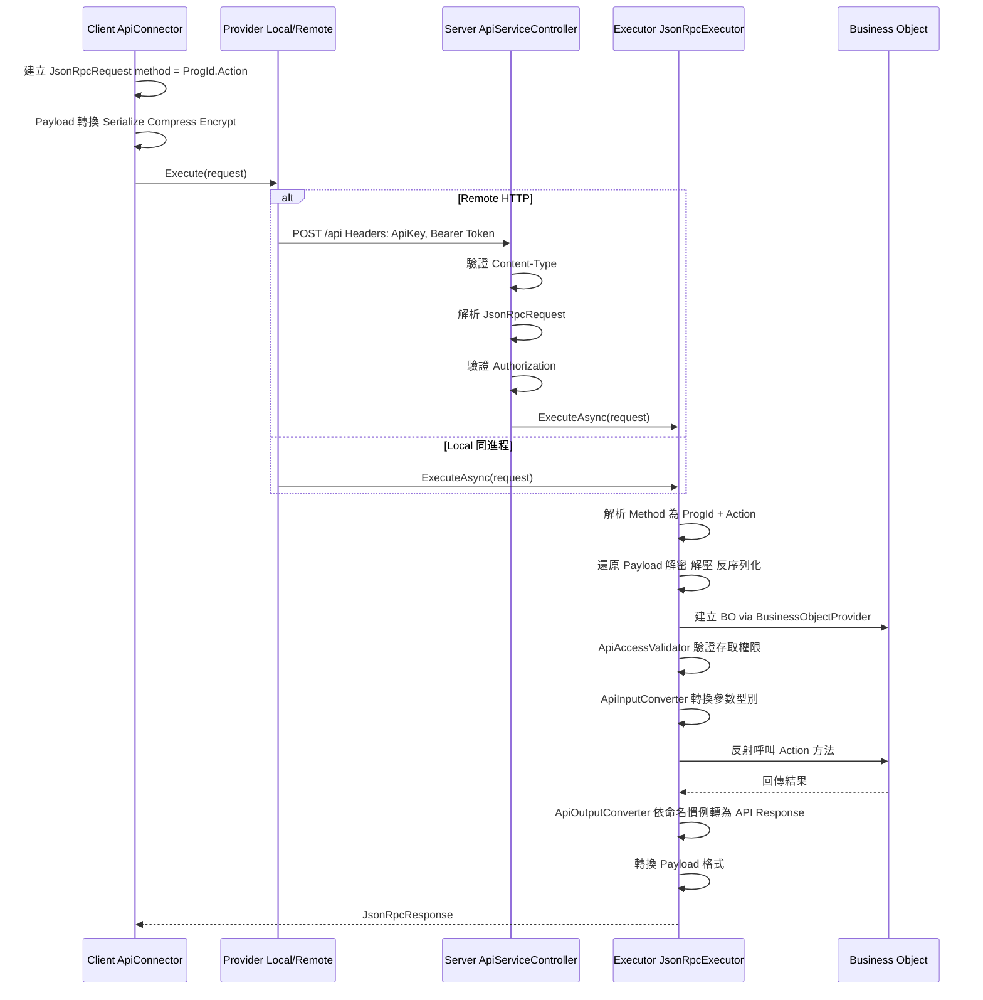

# 端到端開發指引

[English](development-cookbook.md)

> 本文件說明 Bee.NET 框架的核心開發流程，幫助開發者（與 AI Coding 工具）理解從定義到 API 的完整串接方式。

## 框架初始化順序

框架以標準 `IServiceCollection` DI 容器註冊；所有 framework 服務透過
ctor 注入解析，無靜態入口點（service locator）。

### Host 啟動流程

```text
┌─────────────────────────────────────────────────────┐
│ 1. paths = new PathOptions { DefinePath = "..." }    │
│ 2. settings = SystemSettingsLoader.Load(paths)       │
│ 3. SysInfo.Initialize(settings.CommonConfiguration)  │
├─────────────────────────────────────────────────────┤
│ 4. services.AddBeeFramework(                         │
│      settings.BackendConfiguration,                  │
│      paths,                                          │
│      autoCreateMasterKey: true)                      │
│    → 來自 Bee.Hosting（composition root）            │
│    → 註冊 IDefineStorage / IDefineAccess /           │
│      ICacheContainer / IDbConnectionManager /        │
│      ISessionInfoService / ILanguageService /        │
│      IBusinessObjectFactory / JsonRpcExecutor        │
├─────────────────────────────────────────────────────┤
│ 5. provider = services.BuildServiceProvider()        │
│ 6. app.UseBeeFramework()（僅 ASP.NET — 目前為 no-op，│
│    保留作未來 middleware 註冊點）                    │
└─────────────────────────────────────────────────────┘
```

宿主套件選擇：

- **ASP.NET Core web host**：引用 `Bee.Api.AspNetCore`（會透過遞移帶入 `Bee.Hosting`）。啟動程式加上 `using Bee.Hosting;`（取 `AddBeeFramework`）與 `using Bee.Api.AspNetCore;`（取 `UseBeeFramework`）
- **非 ASP.NET Core 宿主**（WinForms / WPF / Console / Worker Service / 整合測試）：直接引用 `Bee.Hosting`，不會拖入 `Microsoft.AspNetCore.App`。`BuildServiceProvider()` 後設定 `ApiClientInfo.LocalServiceProvider = sp` 即可啟用 `Bee.Api.Client` 的近端（in-process）模式

參考實作：`tests/Bee.Tests.Shared/TestProcessBootstrap.cs` — 以 `tests/Define/`
作為 `DefinePath` 套用同一流程。

## 請求處理管線

### 完整請求流程



### Payload 格式

| 格式 | 處理流程 | 適用場景 |
|------|----------|----------|
| Plain | 無轉換 | Local 呼叫、開發除錯 |
| Encoded | Serialize → Compress | 一般 API 呼叫 |
| Encrypted | Serialize → Compress → Encrypt | 敏感資料傳輸 |

降級規則：要求 Encrypted 但無加密金鑰時，自動降級為 Encoded。

## API 契約三層分離

框架將 API 型別分為三層，避免序列化屬性汙染商業邏輯：

### 層級對照

| 層級 | 組件 | 基底類別 | 特徵 |
|------|------|----------|------|
| Contract | Bee.Api.Contracts | 無（純介面） | `ILoginRequest`、`ILoginResponse` 等 |
| API Type | Bee.Api.Core | `ApiRequest` / `ApiResponse` | 實作 Contract 介面 + MessagePack `[Key]` 屬性 |
| BO Type | Bee.Business | `BusinessArgs` / `BusinessResult` | 實作 Contract 介面，純 POCO |

### 型別轉換流程

```text
Client 發送 → LoginRequest (API Type, MessagePack)
    ↓ JsonRpcExecutor
    ↓ ApiInputConverter 屬性對應（{Action}Request → {Action}Args）
BO 接收 → LoginArgs (BO Type, POCO)
    ↓ 商業邏輯處理
BO 回傳 → LoginResult (BO Type, POCO)
    ↓ ApiOutputConverter 命名慣例推導（{Action}Result → {Action}Response）
Client 接收 → LoginResponse (API Type, MessagePack)
```

### 關鍵元件

- **ApiInputConverter**：將 API Request 的屬性值對應到 BO Args（依屬性名稱匹配），並處理 HTTP 傳入的 `JsonElement`
- **ApiOutputConverter**：執行後將 BO `{Action}Result` 以反射自動對應到 `{Action}Response`，結果以 `ConcurrentDictionary` 快取（詳見 [ADR-007](adr/adr-007-convention-based-type-resolution.md)）
- **ApiContractRegistry**：供 MessagePack Typeless 序列化（Encoded / Encrypted 格式）使用的型別白名單，與輸出映射無關

## ExecFunc 自訂函式模式

ExecFunc 是框架提供的擴展機制，允許開發者新增自訂商業邏輯而不需修改框架核心。

### 開發步驟

#### 1. 定義 Handler 類別

繼承或實作 `IExecFuncHandler`，在對應的 Handler 類別中新增方法：

- 表單層級：`FormExecFuncHandler`
- 系統層級：`SystemExecFuncHandler`

#### 2. 實作方法

```csharp
// 表單層級範例
public class FormExecFuncHandler
{
    /// <summary>
    /// A simple greeting function.
    /// </summary>
    public void Hello(ExecFuncArgs args, ExecFuncResult result)
    {
        result.Parameters.Add("Hello", "Hello form-level BusinessObject");
    }
}

// 系統層級範例（需要認證）
public class SystemExecFuncHandler
{
    private readonly ISystemRepositoryFactory _systemFactory;

    public SystemExecFuncHandler(ISystemRepositoryFactory systemFactory)
    {
        _systemFactory = systemFactory;
    }

    /// <summary>
    /// Upgrades the table schema for the specified database.
    /// </summary>
    [ExecFuncAccessControl(ApiAccessRequirement.Authenticated)]
    public void UpgradeTableSchema(ExecFuncArgs args, ExecFuncResult result)
    {
        string databaseId = args.Parameters.GetValue<string>("DatabaseId");
        string dbName = args.Parameters.GetValue<string>("DbName");
        string tableName = args.Parameters.GetValue<string>("TableName");

        var repo = _systemFactory.CreateDatabaseRepository();
        bool upgraded = repo.UpgradeTableSchema(databaseId, dbName, tableName);
        result.Parameters.Add("Upgraded", upgraded);
    }
}
```

#### 3. Client 端呼叫

```csharp
// 表單層級
var connector = new FormApiConnector("Employee", accessToken);
var result = connector.ExecFunc("Hello", new ParameterCollection());

// 系統層級
var sysConnector = new SystemApiConnector(accessToken);
var result = sysConnector.ExecFunc("UpgradeTableSchema", new ParameterCollection
{
    { "DatabaseId", "main" },
    { "DbName", "MyDb" },
    { "TableName", "Employee" }
});
```

### 執行流程

```text
Client: connector.ExecFunc("Hello", params)
  → ApiConnector.Execute<ExecFuncResult>("ExecFunc", args)
  → JsonRpcRequest { method: "Employee.ExecFunc" }
  → JsonRpcExecutor 呼叫 FormBusinessObject.ExecFunc()
  → BusinessObject.DoExecFunc()
  → BusinessFunc.InvokeExecFunc()
    → handler.GetType().GetMethod("Hello")  // 反射取得方法
    → 檢查 [ExecFuncAccessControl] 屬性
    → method.Invoke(handler, args, result)  // 反射呼叫
  → 回傳 ExecFuncResult
```

## FormSchema 驅動開發

FormSchema 是框架的定義中樞，同時驅動 UI、資料庫與驗證規則。

### 核心概念

```text
FormSchema（Single Source of Truth）
├── ProgId: "Employee"
├── DisplayName: "員工管理"
├── CategoryId: "common"        ← 必填，決定衍生 TableSchema 落於哪個 DbCategory
├── Tables: FormTableCollection
│   ├── Master: FormTable
│   │   ├── TableName: "Employee"
│   │   ├── DbTableName: "dbo.Employee"
│   │   └── Fields: FormFieldCollection
│   └── Detail: FormTable（明細表）
│       ├── TableName: "EmployeeHistory"
│       └── Fields: FormFieldCollection
│
├── → 衍生 TableSchema（資料庫維度）
├── → 衍生 FormLayout（UI 維度）
└── → 驅動 SqlFormCommandBuilder（SQL 產生）
```

### CategoryId 與 DbCategory 路由

每個 FormSchema 必須指定 `CategoryId`，對應 `DbCategorySettings.xml` 中某個 `<DbCategory Id="...">` 的識別碼。`CategoryId` 同時決定：

- 該 FormSchema 衍生的所有 `TableSchema` 應持久化於 `TableSchema/{categoryId}/` 子目錄
- 該 FormSchema 對應的資料表所屬的資料庫連線（透過 DbCategory → `DbScope` → `IRepositoryDatabaseRouter` 解析）

`SaveFormSchema` 會驗證 `CategoryId` 必填（透過 `TableSchemaGenerator.GetCategoryId(formSchema)`），未設定時拋出 `InvalidOperationException`。

### BO 方法中取得 DatabaseId

BO 方法**不應**寫死 `databaseId` 字串，也**不應**自行讀 `SessionInfo.CompanyId` / `CompanyInfo`。改用 `BusinessObject` 基底提供的 helper：

```csharp
// FormSchema-driven CRUD —— one-liner，自動路由
var repository = CreateDataFormRepository(ProgId);
// 等同於：
// Services.GetRequiredService<IFormRepositoryFactory>()
//         .CreateDataFormRepository(ProgId, AccessToken);

// 自訂 bo repo —— 取目標 scope 的 databaseId 再建 repo
var dbId = ResolveDatabaseId(DbScope.Log);   // "log"（不需 session）
var dbId = ResolveDatabaseId(DbScope.Company); // 透過 session.CompanyId → CompanyInfo.CompanyDatabaseId
var repo = new MonthlySalesReportRepo(Services.GetRequiredService<IDbAccessFactory>(), dbId);
```

`DbScope` 解析規則：

| `DbScope` | 解析後 `databaseId` | 需要 session？ |
|-----------|---------------------|---------------|
| `Common` | 固定 `"common"` | 否 |
| `Log` | 固定 `"log"` | 否（Login / Logout 等 pre-EnterCompany 方法可寫 audit log） |
| `Company` | `SessionInfo.CompanyId` → `CompanyInfo.CompanyDatabaseId` | 是——未準備好會拋 `UnauthorizedAccessException` / `CompanyNotEntered` |

詳見 [ADR-010 §「後續延伸：執行時路由」](adr/adr-010-logical-database-category.md) 與 [ADR-012](adr/adr-012-session-company-context.md)。

### 客製化 ProgId 對應的 BO

框架預設每個 ProgId 都以 `FormBusinessObject` 具現化。當特定表單需要超出 FormSchema 驅動 CRUD 的行為(客製驗證、領域事件、AnyCode SQL 等),繼承 `FormBusinessObject` 並透過 `ProgramSettings.xml` 綁定子類別。

#### 1. 繼承 `FormBusinessObject`

```csharp
namespace MyErp.Business;

public class CustomerBo : FormBusinessObject
{
    public CustomerBo(IBeeContext ctx, Guid accessToken, string progId, bool isLocalCall = true)
        : base(ctx, accessToken, progId, isLocalCall) { }

    // 覆寫鉤子或新增以 [ApiAccessControl] 公開的客製方法。
    public override SaveResult SaveData(SaveArgs args) { /* 客製邏輯 */ }
}
```

#### 2. 在 `ProgramSettings.xml` 綁定子類別

```xml
<ProgramItem ProgId="Customer"
             DisplayName="客戶維護"
             BusinessObject="MyErp.Business.CustomerBo, MyErp.Business" />
```

`BusinessObject` 使用 assembly-qualified 格式(`"Namespace.Type, AssemblyName"`)。未填時 resolver fallback 回 `FormBusinessObject`——只需要為「真的要客製」的 ProgId 填 `BusinessObject`。

#### 3. 解析行為

`ProgramSettingsFormBoTypeResolver`(由 `AddBeeFramework` 註冊)讀取 `ProgramItem.BusinessObject`、透過 `AssemblyLoader` 載入型別、驗證繼承自 `FormBusinessObject`。任何失敗(檔案不存在、型別解析失敗、繼承不對)皆 fallback 回 `FormBusinessObject` 而非中斷請求——支援漸進採用。

解析結果在記憶體內的 `ProgramSettings` 實例存活期間快取;當 `ProgramSettingsCache` 透過 file watcher 重載檔案時,快取自動 reset。

### FormSchema → SQL 產生

```text
FormApiConnector 查詢資料
  → FormBusinessObject 處理請求
  → SqlFormCommandBuilder(progId)
    → 從 IDefineAccess（DI ctor 注入）取得 FormSchema
    → SelectCommandBuilder.Build(tableName, fields, filter, sort)
      → IFromBuilder: 產生 FROM 子句（含 JOIN）
      → IWhereBuilder: 從 FilterCondition 產生 WHERE 子句
      → ISelectBuilder: 產生 SELECT 欄位清單
      → ISortBuilder: 產生 ORDER BY 子句
    → 回傳參數化的 DbCommandSpec
  → DbAccess.Execute(spec) 執行查詢
```

### FilterCondition 查詢建構

```csharp
// 建立篩選條件
var filter = new FilterGroup(LogicalOperator.And)
{
    FilterCondition.Equal("Department", "IT"),
    FilterCondition.Contains("Name", "王"),
    FilterCondition.Between("Salary", 30000, 80000)
};
```

可用的比較運算子：`Equal`、`Like`、`Contains`、`StartsWith`、`Between`、`In`、`GreaterThan`、`LessThan` 等。

## 跨 process 快取失效

in-process 快取（`Bee.ObjectCaching`）在發生寫入的那個 process 會即時失效（`SaveX → Remove()`）。要把失效傳播到**其他 process / 節點** —— 多節點部署、以及由資料庫載入的快取（如 `CompanyInfo`，或 `DbDefineStorage` 下的定義）需要此能力 —— 使用資料庫通知機制。設計理由見 [ADR-017](adr/adr-017-db-cache-invalidation.md)；本節講實務用法。

### 讓快取可被失效 —— 不用做任何事

任何由 `ICacheContainer` 持有、繼承自 `KeyObjectCache<T>` / `ObjectCache<T>` 的快取都**自動**可被失效：它實作 `IEvictableCache`，`CacheGroup` 預設 = 被快取型別名（`CompanyInfoCache` → `"CompanyInfo"`、`FormSchemaCache` → `"FormSchema"`）。容器在建構時建好「群組 → 快取」分派表。**新增快取加進容器即自動納入 —— 零註冊。**

### 觸發失效 —— 在同一 transaction 內 bump

當寫入端改動了「對某快取有意義」的來源資料,就在**改資料的同一 transaction** 內 bump 通知列：

```csharp
// "群組:實體" key,群組須等於目標快取的型別名
_cacheNotify.Touch($"CompanyInfo:{companyId}", transaction, databaseType);
```

`"群組:實體"` key 的慣例：

- **群組** = 被快取型別名（`CompanyInfo`、`FormSchema`、`LanguageResource`…）。
- **實體** = 與該快取 `Remove` 所用的 key 完全一致。單鍵快取直接傳該 key（`progId`、`layoutId`）；複合鍵快取用**點**形式（`TableSchema` → `"common.st_user"`、`LanguageResource` → `"zh-TW.common"`）；單物件快取用 `"*"`（`"DbCategorySettings:*"`）。

> ⚠️ bump **必須**與資料變更在同一 transaction 提交。分開提交會讓 poller 在資料可見前就看到新版本 → reload 讀到舊值並標記新鮮 → 永久 stale。`DbDefineStorage.SaveX` 已如此處理；自訂 repository 必須把自己的寫入 `DbTransaction` 傳給 `Touch`。

### 失效如何傳到其他節點

各節點的 `CacheNotifyPoller`（hosted service）每 `IntervalSeconds` 輪詢 `st_cache_notify`,找出 `cache_version` 變大的 key（以 `sys_update_time` 增量抓取、以 version 冪等判定）,呼叫 `ICacheContainer.TryEvict(cacheKey)` → 對應快取項被移除 → 下次讀取從來源 lazy 重載。無 push、無訊息匯流排：每個節點各自輪詢同一張表。

### 設定（`BackendConfiguration.CacheNotifyOptions`）

| 鍵 | 預設 | 說明 |
|----|------|------|
| `Enabled` | `true` | 註冊 poller。純**單一 process** 單節點可停用（本地寫入即時失效）。同機多 process 仍需要。 |
| `IntervalSeconds` | `5` | 輪詢間隔；實質是跨節點失效延遲。每輪只是一筆走索引、多回 0 列的查詢,負載可忽略 —— 依延遲容忍度調,而非成本。 |
| `MarginSeconds` | `5` | 增量重疊回看,cover 長交易邊界情況。 |
| `DatabaseId` | `common` | 被輪詢的 `st_cache_notify` 所在資料庫。 |

> 本機制**只用資料庫伺服器時鐘**（從不用 app 端時鐘）且全程不轉時區,故不受主機時區影響。將資料庫伺服器設為 **UTC**,存入的 `sys_update_time` 即為 UTC（見 [ADR-017](adr/adr-017-db-cache-invalidation.md)）。

## Frontend API 連線模式

Bee.NET 支援三類前端 host，每類消費 API 的方式結構不同。設計理由見 [ADR-013](adr/adr-013-frontend-api-connection-strategy.md)，本節說明各自的**實際使用方式**。

### 決策樹

> 你的前端屬於哪類？

```
你的前端是什麼？
│
├── 桌面端 / native UI（MAUI / WinForms / WPF / Avalonia）
│   → 使用 Bee.UI.* family，透過 ClientInfo static singleton
│   → 參考下方「桌面端」章節
│
├── Blazor Server（ASP.NET Core server-rendered）
│   → 使用 Bee.Web.Blazor.Server，DI scope 注入 connector
│   → 參考下方「Blazor Server」章節
│
└── Blazor WASM（Browser WebAssembly）
    → 使用 Bee.Web.Blazor.Wasm，強制 RemoteApiProvider（HTTP）
    → 參考下方「Blazor WASM」章節
```

### 桌面端（Bee.UI.* family）

桌面端透過 `Bee.UI.Core.ClientInfo` static singleton 管理連線狀態，
適用於「一個 process = 一個使用者」的環境。

**1. App 啟動時呼叫 `Initialize`**：

```csharp
// MyApp/Program.cs (或 App.xaml.cs / MainActivity 等 entry point)
using Bee.UI.Core;

// 1. 實作 IUIViewService（提供連線設定對話框）
public class MyUIViewService : IUIViewService
{
    public bool ShowApiConnect()
    {
        // 彈出讓使用者輸入 endpoint 的 dialog；返回 true 表示輸入完成
        // 實作細節依 UI framework（MAUI ContentPage / WinForms Form 等）
    }
}

// 2. 啟動時 Initialize
var supportedConnectTypes = SupportedConnectTypes.Both; // Local + Remote 都支援
if (!ClientInfo.Initialize(new MyUIViewService(), supportedConnectTypes))
{
    // 使用者取消連線設定，App 結束
    return;
}
```

`Initialize` 內部：讀檔(`{ExeName}.Settings.xml`) → 嘗試 endpoint → 不可達則呼叫 `IUIViewService.ShowApiConnect()` 讓使用者重設。

**2. 登入後 `ApplyLoginResult`**：

```csharp
var loginResponse = await ClientInfo.SystemApiConnector.LoginAsync(userId, password);
ClientInfo.ApplyLoginResult(loginResponse);
// 此時 ClientInfo.AccessToken / UserInfo 已就緒
```

**3. 透過 ClientInfo 取得 connector 呼叫 API**：

```csharp
// System-level API
var pingResult = await ClientInfo.SystemApiConnector.PingAsync();

// Form-level API（FormBO）
var formConnector = ClientInfo.CreateFormApiConnector("Employee");
var listResult = await formConnector.GetListAsync(selectFields: "EmpId,EmpName");

// Definition data（如 FormSchema、TableSchema）
var schema = ClientInfo.DefineAccess.GetFormSchema("Employee");
```

**4. 切換 endpoint（使用者更換 server）**：

```csharp
ClientInfo.SetEndpoint("https://new-server.example.com/api");
// 內部會 reset AccessToken，重新觸發 ApplyLoginResult 流程
```

### Blazor Server（Bee.Web.Blazor.Server）

Blazor Server 透過 ASP.NET Core DI 容器注入 connector，**每個 SignalR circuit 一個 scope**，避免 cross-user data leak。

**1. `Program.cs` 註冊**：

```csharp
using Bee.Hosting; // AddBeeFramework

var builder = WebApplication.CreateBuilder(args);

// 後端服務（DbConnectionManager / IDefineAccess / BO 等）
builder.Services.AddBeeFramework(backendConfiguration, pathOptions);

// Bee.Web.Blazor.Server RCL 元件庫的 services
builder.Services.AddBeeWebBlazorServer();

// Blazor Server 標準設定
builder.Services.AddRazorComponents().AddInteractiveServerComponents();

var app = builder.Build();
app.UseBeeFramework(); // JSON-RPC middleware
app.MapRazorComponents<App>().AddInteractiveServerRenderMode();
app.Run();
```

**2. Razor component 中注入 connector**：

```razor
@page "/employees"
@inject SystemApiConnector SystemConnector

<h3>Employees</h3>

@code {
    private GetListResponse? listResult;

    protected override async Task OnInitializedAsync()
    {
        var formConnector = new FormApiConnector(/* 透過 DI 或 factory */);
        listResult = await formConnector.GetListAsync(selectFields: "EmpId,EmpName");
    }
}
```

**3. Local vs Remote 模式**：

- **Local mode（in-process）**：`Bee.Web.Blazor.Server` 與後端跑在同一個 ASP.NET Core process,可走 `LocalApiProvider` 直接呼叫,無 HTTP 開銷
- **Remote mode（HTTP）**：Blazor Server 與後端分屬不同 process / server,走 `RemoteApiProvider` 經 HTTP

宿主在 startup 註冊 `IApiProvider` 實作決定模式（`LocalApiProvider` / `RemoteApiProvider`）。

### Blazor WASM（Bee.Web.Blazor.Wasm）

Blazor WASM 跑在 Browser 沙箱內，**強制 RemoteApiProvider**(無法載入後端組件)。

**1. `Program.cs` 註冊**：

```csharp
using Microsoft.AspNetCore.Components.WebAssembly.Hosting;

var builder = WebAssemblyHostBuilder.CreateDefault(args);
builder.RootComponents.Add<App>("#app");

// HttpClient 指向 API server endpoint
builder.Services.AddScoped(sp => new HttpClient
{
    BaseAddress = new Uri("https://api.example.com/")
});

// Bee.Web.Blazor.Wasm RCL services（會自動註冊 RemoteApiProvider）
builder.Services.AddBeeWebBlazorWasm();

await builder.Build().RunAsync();
```

**2. Razor component 用法同 Blazor Server**：

```razor
@page "/employees"
@inject SystemApiConnector SystemConnector

@code {
    protected override async Task OnInitializedAsync()
    {
        var formConnector = new FormApiConnector(/* ... */);
        var result = await formConnector.GetListAsync(selectFields: "EmpId,EmpName");
    }
}
```

**3. 嚴格限制**：

> ⚠️ **`Bee.Web.Blazor.Wasm` 嚴禁相依任何後端組件**（`Bee.Repository` / `Bee.Business` / `Bee.Hosting` 等）—— Browser 執行環境無法載入 server-only 組件。此約束由相依鏈強制（`Bee.Api.Client → Bee.Api.Core → Bee.Api.Contracts/Definition` 全為純資料 / 協定層）。

### MAUI（Bee.UI.Maui）

`Bee.UI.Maui` 歸 **`Bee.UI.*` family**，所以連 API 的方式與「桌面端」章節相同 —— 透過 `ClientInfo` static singleton。

Phase 1 已交付首版 FormSchema 驅動控制項（`DynamicForm` + `FormDataObject`），csproj 以 `net10.0` 共通邏輯 TFM 為預設並引用 `Microsoft.Maui.Controls`。平台 TFM（`net10.0-android` / `net10.0-ios` / `net10.0-maccatalyst` / `net10.0-windows`）透過 `-p:BeeUiMauiFullPlatforms=true` opt-in（需安裝對應 MAUI workload）。NuGet 發版仍延後至控制項套件較完整時統一處理。

### 速查表

| 前端 | 連線抽象 | Token 承載 | Endpoint 持久化 | 模式 | 註冊方式 |
|------|---------|-----------|---------------|------|---------|
| 桌面端（MAUI / WinForms） | `ClientInfo` static | **1 個使用者 / process**（`ClientInfo._accessToken` static） | 本機檔案 + `IEndpointStorage` | Local 或 Remote | 啟動時 `ClientInfo.Initialize` |
| Blazor Server | DI scope | **N 個使用者 / process**（per SignalR circuit） | appsettings / 啟動注入 | Local 或 Remote | `AddBeeFramework` + `AddBeeWebBlazorServer` |
| Blazor WASM | DI scope | 1 個使用者 / WASM heap | localStorage / JS interop | **強制 Remote** | `AddBeeWebBlazorWasm` + HttpClient |

> ⚠️ **不要在 Blazor 環境使用 `Bee.UI.Core.ClientInfo`**：`_accessToken` 為 `private static Guid`，一個 process 內只能存 **1 個** AccessToken。Blazor Server 同 process 服務 N 個 user circuit 時，後登入者會覆蓋前者，造成 cross-user data leak。詳見 [ADR-013](adr/adr-013-frontend-api-connection-strategy.md)。
