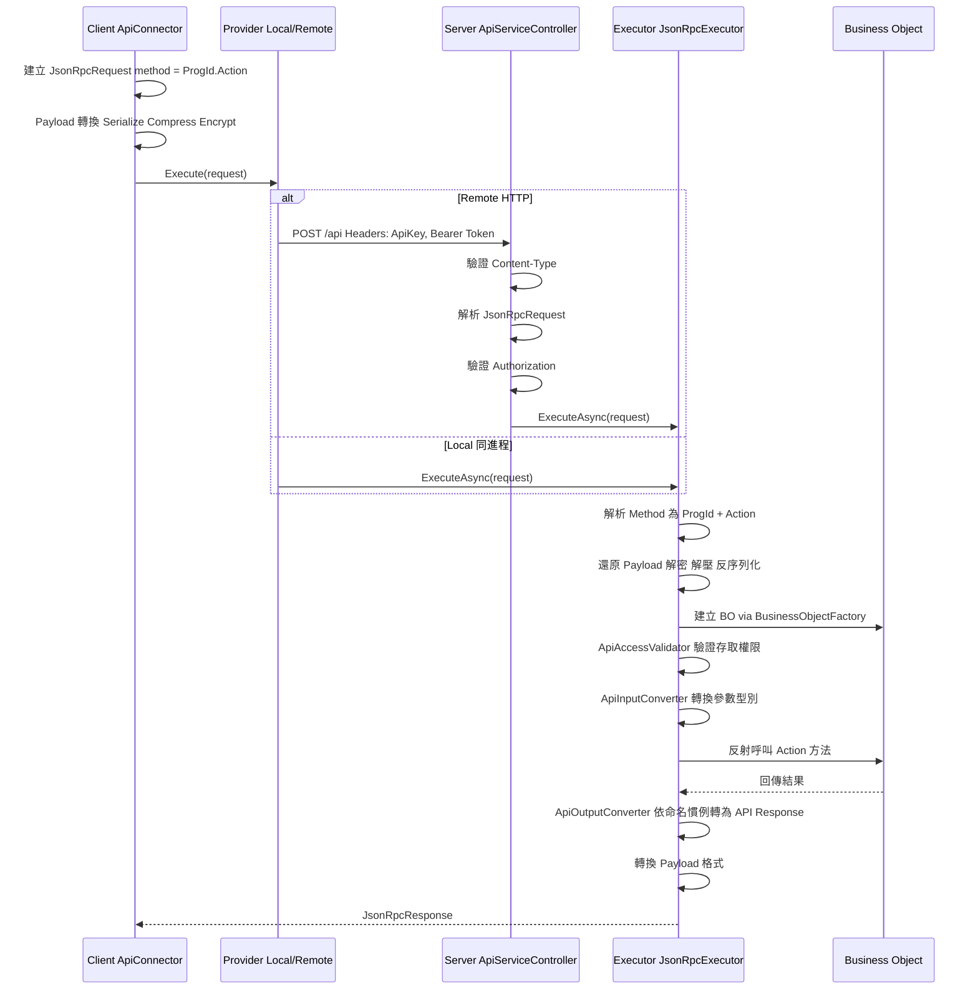

# 端到端開發指引

[English](development-cookbook.md) · [← 文件索引](README.zh-TW.md)

> 本文件說明 Bee.NET 框架的核心開發流程，幫助開發者（與 AI Coding 工具）理解從定義到 API 的完整串接方式。

## 框架初始化順序

框架以標準 `IServiceCollection` DI 容器註冊；所有 framework 服務透過
ctor 注入解析，無靜態入口點（service locator）。

### Host 啟動流程

```text
┌─────────────────────────────────────────────────────┐
│ 1. paths = new PathOptions { DefinePath = "..." }    │
│ 2. settings = SystemSettingsLoader.Load(paths)       │
│ 3. SysInfo.Initialize(settings.CommonConfiguration)  │
├─────────────────────────────────────────────────────┤
│ 4. services.AddBeeFramework(                         │
│      settings.BackendConfiguration,                  │
│      paths,                                          │
│      autoCreateMasterKey: true)                      │
│    → 來自 Bee.Hosting（composition root）            │
│    → 註冊 IDefineStorage / IDefineAccess /           │
│      ICacheContainer / IDbConnectionManager /        │
│      ISessionInfoService / ILanguageService /        │
│      IBusinessObjectFactory / JsonRpcExecutor        │
├─────────────────────────────────────────────────────┤
│ 5. provider = services.BuildServiceProvider()        │
│ 6. app.UseBeeFramework()（僅 ASP.NET — 啟動期檢查，  │
│    不註冊任何 middleware 或 endpoint）               │
└─────────────────────────────────────────────────────┘
```

宿主套件選擇：

- **ASP.NET Core web host**：引用 `Bee.Api.AspNetCore`（會透過遞移帶入 `Bee.Hosting`）。啟動程式加上 `using Bee.Hosting;`（取 `AddBeeFramework`）與 `using Bee.Api.AspNetCore;`（取 `UseBeeFramework`）
- **非 ASP.NET Core 宿主**（WinForms / WPF / Console / Worker Service / 整合測試）：直接引用 `Bee.Hosting`，不會拖入 `Microsoft.AspNetCore.App`。`BuildServiceProvider()` 後設定 `ApiClientInfo.LocalServiceProvider = sp` 即可啟用 `Bee.Api.Client` 的近端（in-process）模式

參考實作：`tests/Bee.Tests.Shared/TestProcessBootstrap.cs` — 以 `tests/Define/`
（process 啟動時與 embedded 框架預設合併後的結果）作為 `DefinePath` 套用同一流程。

### 首次 `DefinePath` 初始化

啟動流程的第一步要求 `DefinePath` 已存在框架最小定義檔組（`st_*` TableSchema、
`SystemSettings.xml`、`DatabaseSettings.xml`、`DbCategorySettings.xml`、框架預設
的 Department / Employee 表單）。這些檔以 embedded resource 形式 ship 在
`Bee.Definition.dll` 內；消費者首次啟動前 materialize 一次到目標目錄即可。

```bash
# 一次性安裝框架 CLI（per-machine）
dotnet tool install -g Bee.Cli

# materialize 框架預設到自家 DefinePath
dotnet bee defines materialize --path ./Define

# 編輯 SystemSettings（設 MasterKeySource）+ DatabaseSettings（補連線字串）
# 然後啟動 app —— DefinePath 已就緒
```

CLI 是 `Bee.Definition.Defaults.MaterializeTo(...)` 的 thin shell；宿主想在
code 內 materialize 可直接呼叫同一支 API，而 `tools/DefineEditor` 開啟資料夾時
也會自動呼叫。預設 skip-existing，重跑不會蓋掉客製。

完整檔案列表與消費者擴充指引見 [框架保留命名](framework-reserved-names.zh-TW.md)。

## 請求處理管線

### 完整請求流程


```mermaid
sequenceDiagram
    participant C as Client ApiConnector
    participant P as Provider Local/Remote
    participant S as Server ApiServiceController
    participant E as Executor JsonRpcExecutor
    participant B as Business Object

    C->>C: 建立 JsonRpcRequest method = ProgId.Action
    C->>C: Payload 轉換 Serialize Compress Encrypt
    C->>P: Execute(request)

    alt Remote HTTP
        P->>S: POST /api Headers: ApiKey, Bearer Token
        S->>S: 驗證 Content-Type
        S->>S: 解析 JsonRpcRequest
        S->>S: 驗證 Authorization
        S->>E: ExecuteAsync(request)
    else Local 同進程
        P->>E: ExecuteAsync(request)
    end

    E->>E: 解析 Method 為 ProgId + Action
    E->>E: 還原 Payload 解密 解壓 反序列化
    E->>B: 建立 BO via BusinessObjectFactory
    E->>E: ApiAccessValidator 驗證存取權限
    E->>E: ApiInputConverter 轉換參數型別
    E->>B: 反射呼叫 Action 方法
    B-->>E: 回傳結果
    E->>E: ApiOutputConverter 依命名慣例轉為 API Response
    E->>E: 轉換 Payload 格式
    E-->>C: JsonRpcResponse
```

### Payload 格式

| 格式 | 處理流程 | 適用場景 |
|------|----------|----------|
| Plain | 無轉換 | Local 呼叫、開發除錯 |
| Encoded | Serialize → Compress | 一般 API 呼叫 |
| Encrypted | Serialize → Compress → Encrypt | 敏感資料傳輸 |

降級規則：要求 Encrypted 但無加密金鑰時，自動降級為 Encoded。

## API 契約三層分離

框架將 API 型別分為三層，避免序列化屬性汙染商業邏輯：

### 層級對照

| 層級 | 組件 | 基底類別 | 特徵 |
|------|------|----------|------|
| Contract | Bee.Api.Contracts | 無（純介面） | `ILoginRequest`、`ILoginResponse` 等 |
| API Type | Bee.Api.Core | `ApiRequest` / `ApiResponse` | 實作 Contract 介面 + MessagePack `[Key]` 屬性 |
| BO Type | Bee.Business | `BusinessArgs` / `BusinessResult` | 實作 Contract 介面，純 POCO |

### 型別轉換流程

```text
Client 發送 → LoginRequest (API Type, MessagePack)
    ↓ JsonRpcExecutor
    ↓ ApiInputConverter 屬性對應（{Action}Request → {Action}Args）
BO 接收 → LoginArgs (BO Type, POCO)
    ↓ 商業邏輯處理
BO 回傳 → LoginResult (BO Type, POCO)
    ↓ ApiOutputConverter 命名慣例推導（{Action}Result → {Action}Response）
Client 接收 → LoginResponse (API Type, MessagePack)
```

### 關鍵元件

- **ApiInputConverter**：將 API Request 的屬性值對應到 BO Args（依屬性名稱匹配），並處理 HTTP 傳入的 `JsonElement`
- **ApiOutputConverter**：執行後將 BO `{Action}Result` 以反射自動對應到 `{Action}Response`，結果以 `ConcurrentDictionary` 快取（詳見 [ADR-007](adr/adr-007-convention-based-type-resolution.md)）
- **ApiContractRegistry**：供 MessagePack Typeless 序列化（Encoded / Encrypted 格式）使用的型別白名單，與輸出映射無關

## ExecFunc 自訂函式模式

ExecFunc 是框架提供的擴展機制，允許開發者新增自訂商業邏輯而不需修改框架核心。

### 開發步驟

#### 1. 定義 Handler 類別

繼承或實作 `IExecFuncHandler`，在對應的 Handler 類別中新增方法：

- 表單層級：`FormExecFuncHandler`
- 系統層級：`SystemExecFuncHandler`

#### 2. 實作方法

```csharp
// 表單層級範例
public class FormExecFuncHandler
{
    /// <summary>
    /// A simple greeting function.
    /// </summary>
    public void Hello(ExecFuncArgs args, ExecFuncResult result)
    {
        result.Parameters.Add("Hello", "Hello form-level BusinessObject");
    }
}

// 系統層級範例（需要認證）
public class SystemExecFuncHandler
{
    private readonly IRepositoryFactory _repositoryFactory;

    public SystemExecFuncHandler(IRepositoryFactory repositoryFactory)
    {
        _repositoryFactory = repositoryFactory;
    }

    /// <summary>
    /// Upgrades the table schema for the specified database.
    /// </summary>
    [ExecFuncAccessControl(ApiAccessRequirement.Authenticated)]
    public void UpgradeTableSchema(ExecFuncArgs args, ExecFuncResult result)
    {
        string databaseId = args.Parameters.GetValue<string>("DatabaseId");
        string dbName = args.Parameters.GetValue<string>("DbName");
        string tableName = args.Parameters.GetValue<string>("TableName");

        var repo = _repositoryFactory.Create<IDatabaseRepository>();
        bool upgraded = repo.UpgradeTableSchema(databaseId, dbName, tableName);
        result.Parameters.Add("Upgraded", upgraded);
    }
}
```

#### 3. Client 端呼叫

```csharp
// 表單層級
var connector = new FormApiConnector(accessToken, "Employee");
var response = await connector.ExecFuncAsync(new ExecFuncRequest { FuncId = "Hello" });

// 系統層級
var sysConnector = new SystemApiConnector(accessToken);
var response = await sysConnector.ExecFuncAsync(new ExecFuncRequest
{
    FuncId = "UpgradeTableSchema",
    Parameters = new ParameterCollection
    {
        { "DatabaseId", "main" },
        { "DbName", "MyDb" },
        { "TableName", "Employee" }
    }
});
```

### 執行流程

```text
Client: await connector.ExecFuncAsync(new ExecFuncRequest { FuncId = "Hello" })
  → ApiConnector.ExecuteAsync<ExecFuncResponse>("ExecFunc", args)
  → JsonRpcRequest { method: "Employee.ExecFunc" }
  → JsonRpcExecutor 呼叫 FormBusinessObject.ExecFunc()
  → BusinessObject.DoExecFunc()
  → handler.InvokeExecFunc()  // ExecFuncHandlerExtensions 擴充方法
    → handler.GetType().GetMethod("Hello")  // 反射取得方法
    → 檢查 [ExecFuncAccessControl] 屬性
    → method.Invoke(handler, args, result)  // 反射呼叫
  → 回傳 ExecFuncResult
```

## FormSchema 驅動開發

FormSchema 是框架的定義中樞，同時驅動 UI、資料庫與驗證規則。

### 核心概念

```text
FormSchema（Single Source of Truth）
├── ProgId: "Employee"
├── DisplayName: "員工管理"
├── CategoryId: "common"        ← 必填，決定衍生 TableSchema 落於哪個 DbCategory
├── Tables: FormTableCollection
│   ├── Master: FormTable
│   │   ├── TableName: "Employee"
│   │   ├── DbTableName: "dbo.Employee"
│   │   └── Fields: FormFieldCollection
│   └── Detail: FormTable（明細表）
│       ├── TableName: "EmployeeHistory"
│       └── Fields: FormFieldCollection
│
├── → 衍生 TableSchema（資料庫維度）
├── → 衍生 FormLayout（UI 維度）
└── → 驅動 SqlFormCommandBuilder（SQL 產生）
```

### CategoryId 與 DbCategory 路由

每個 FormSchema 必須指定 `CategoryId`，對應 `DbCategorySettings.xml` 中某個 `<DbCategory Id="...">` 的識別碼。`CategoryId` 同時決定：

- 該 FormSchema 衍生的所有 `TableSchema` 應持久化於 `TableSchema/{categoryId}/` 子目錄
- 該 FormSchema 對應的資料表所屬的資料庫連線（透過 DbCategory → `DbScope` → `IRepositoryDatabaseRouter` 解析）

`SaveFormSchema` 會驗證 `CategoryId` 必填（透過 `TableSchemaGenerator.GetCategoryId(formSchema)`），未設定時拋出 `InvalidOperationException`。

### BO 方法中取得 DatabaseId

BO 方法**不應**寫死 `databaseId` 字串，也**不應**自行讀 `SessionInfo.CompanyId` / `CompanyInfo`。改用 `BusinessObject` 基底提供的 helper：

```csharp
// FormSchema-driven CRUD —— one-liner，自動路由
var repository = CreateDataFormRepository(ProgId);
// 等同於：
// Services.GetRequiredService<IRepositoryFactory>()
//         .CreateFormRepository<IDataFormRepository>(AccessToken, ProgId);

// 自訂 bo repo —— 取目標 scope 的 databaseId 再建 repo
var dbId = ResolveDatabaseId(DbScope.Log);   // "log"（不需 session）
var dbId = ResolveDatabaseId(DbScope.Company); // 透過 session.CompanyId → CompanyInfo.CompanyDatabaseId
var repo = new MonthlySalesReportRepo(Services.GetRequiredService<IDbAccessFactory>(), dbId);
```

`DbScope` 解析規則：

| `DbScope` | 解析後 `databaseId` | 需要 session？ |
|-----------|---------------------|---------------|
| `Common` | 固定 `"common"` | 否 |
| `Log` | 固定 `"log"` | 否（Login / Logout 等 pre-EnterCompany 方法可寫 audit log） |
| `Company` | `SessionInfo.CompanyId` → `CompanyInfo.CompanyDatabaseId` | 是——未準備好會拋 `UnauthorizedAccessException` / `CompanyNotEntered` |

詳見 [ADR-010 §「後續延伸：執行時路由」](adr/adr-010-logical-database-category.md) 與 [ADR-012](adr/adr-012-session-company-context.md)。

### 客製化 ProgId 對應的 BO

框架預設每個 ProgId 都以 `FormBusinessObject` 具現化。當特定表單需要超出 FormSchema 驅動 CRUD 的行為(客製驗證、領域事件、AnyCode SQL 等),繼承 `FormBusinessObject` 並透過 `ProgramSettings.xml` 綁定子類別。

#### 1. 繼承 `FormBusinessObject`

```csharp
namespace MyErp.Business;

public class CustomerBo : FormBusinessObject
{
    public CustomerBo(IBeeContext ctx, Guid accessToken, string progId, bool isLocalCall = true)
        : base(ctx, accessToken, progId, isLocalCall) { }

    // 覆寫 Do* 鉤子(見下一節)或新增以 [ApiAccessControl] 公開的客製方法。
    protected override void DoBeforeSave(SaveContext context)
    {
        base.DoBeforeSave(context);
        // 客製驗證或計算欄位
    }
}
```

#### 2. 在 `ProgramSettings.xml` 綁定子類別

```xml
<ProgramItem ProgId="Customer"
             DisplayName="客戶維護"
             BusinessObject="MyErp.Business.CustomerBo, MyErp.Business" />
```

`BusinessObject` 使用 assembly-qualified 格式(`"Namespace.Type, AssemblyName"`)。未填時 resolver fallback 回 `FormBusinessObject`——只需要為「真的要客製」的 ProgId 填 `BusinessObject`。

#### 3. 解析行為

`ProgramSettingsBoTypeResolver`(由 `AddBeeFramework` 註冊)讀取 `ProgramItem.BusinessObject`、透過 `AssemblyLoader` 載入型別、驗證繼承自 `BusinessObject`。**一般 progId** 的任何失敗(檔案不存在、型別解析失敗、繼承不對)皆 fallback 回 `FormBusinessObject` 而非中斷請求——支援漸進採用。

**保留字 progId** `System` 與 `AuditLog` 受更嚴的規則約束:型別載不到、或不衍生自該軸的框架物件,會讓 host 起不來而非降級。那裡若沿用靜默退回,症狀會是 JSON-RPC「找不到方法」,把診斷者導向 API 層而非真正的成因(註冊表)。host 啟動時若發現缺項會自行補寫,既有的 `ProgramSettings.xml` 不需手動改。

解析結果在記憶體內的 `ProgramSettings` 實例存活期間快取;當 `ProgramSettingsCache` 透過 file watcher 重載檔案時,快取自動 reset。

### BO 擴充點與交易邊界

`Save` 與 `Delete` 各切成三段可覆寫的步驟。**要客製就覆寫其中一段,不要覆寫 public 方法**——
授權與 record-scope 檢查寫在 public 方法裡,覆寫它等於把那些檢查一併接手。

```text
Save:   DoBeforeSave  →  DoSave  →  [變更稽核]  →  DoAfterSave
Delete: DoBeforeDelete → DoDelete → [刪除稽核]  → DoAfterDelete
                          ↑
                    只有這一段在資料庫交易中
```

交易由 repository 在 `DoSave` / `DoDelete` 內部開啟並提交。其餘全部在交易外——**包含你在覆寫中
加在 `base.DoSave(context)` 前後的程式碼**。

這條邊界是刻意的:`DoBeforeSave` 會求值運算式、查 lookup、可能呼叫其他 BO,而 `DoAfterSave`
正是發通知、呼叫外部系統該待的位置。把交易撐過這些呼叫,等於讓鎖持有時間被外部延遲綁架,
連線池耗盡與分散式死結都由此而來。

#### 中止流程

丟 `UserMessageException`——框架的業務流程中止訊號。它以 `JsonRpcErrorCode.UserMessage` 傳到
用戶端並還原成同一型別,訊息原樣呈現給使用者。schema 驅動的規則引擎,其 `BeforeSave` 驗證規則
走的也是同一個機制。

```csharp
protected override void DoBeforeSave(SaveContext context)
{
    base.DoBeforeSave(context);
    if (/* 業務條件不成立 */)
        throw new UserMessageException("此客戶已超出信用額度。");
}
```

#### 三個必須納入設計的後果

**`DoBeforeSave` 的驗證有 TOCTOU 空窗。** 讀到「庫存足夠」之後、`DoSave` 執行之前,另一個交易
可能已把庫存扣光,而本次存檔照樣寫入。丟例外解決的是「怎麼中止」,不會讓檢查結果在寫入當下仍然
成立。**需要原子性的檢查要放進交易內**——條件式 UPDATE、唯一索引,或 repository 子類裡的 check
constraint。`DoBeforeSave` 的讀取只適合擋明顯錯誤的輸入,不能當並發防線。

**變更稽核與資料不是原子的。** 它寫在 `DoSave` 回傳之後,所以「資料寫成功、稽核寫失敗」有可能
發生。把稽核拉進交易會讓 `DoSave` 不只是持久化,且需要在 BO 層提供交易 API;框架選擇接受這個
落差。

**`DoAfterSave` 失敗時資料已經存進去了。** 例外會往上拋、該次呼叫回報失敗,但交易在這一段開始前
就已提交。放在這裡的副作用必須能被重試,或交給佇列而非同步執行——通知同步送出後失敗,就沒有任何
東西可以重試。

#### 邏輯必須與資料同交易時

寫進 repository,不要寫在 BO。繼承 `DataFormRepository` 並延伸它的 `Save`,讓額外的
statement 加入同一個批次——見下一節。

### 業務 plugin

繼承是把 BO 換掉;**plugin** 是在既有的那個 BO 上加一段。客製屬於「追加」時用 plugin
——存檔前多一道檢查、存檔後發個通知;需要攔截或取代框架既有行為時才繼承。

| 需求 | 手段 | 能力 |
|------|------|------|
| 攔截或取代既有邏輯 | 繼承 BO 覆寫 `Do*` 子方法 | 可包夾 `base.DoXxx()` 前後,也可完全不呼叫 |
| 在既有邏輯之後追加 | plugin | 只有後置一個控點 |

兩者可疊著用:plugin 跑在該段**最終實作之後**,不論那是框架的還是客製子類的。

#### 怎麼寫

繼承 `FormBusinessPlugin`,只 override 需要的時點。

```csharp
public class CreditLimitPlugin : FormBusinessPlugin
{
    public CreditLimitPlugin(IBeeContext ctx, Guid accessToken, string progId)
        : base(ctx, accessToken, progId) { }

    public override void BeforeSave(SaveContext context)
    {
        if (/* 超出額度 */)
            throw new UserMessageException("此客戶已超出信用額度。");
    }
}
```

建構子的三個參數與客製 repository 相同,其後可再宣告自己的相依——會由容器注入。

#### 四個時點

| 時點 | 執行位置 | 拿得到什麼 |
|------|---------|-----------|
| `BeforeSave` | 規則引擎之後、**稽核快照之前** | `SaveContext`,資料集仍可修改 |
| `AfterSave` | 持久化與變更稽核之後 | `SaveContext`,含 `RefreshedDataSet` 與 `AffectedRows` |
| `BeforeDelete` | guard 規則之後、刪除之前 | `DeleteContext`,含 `Snapshot` |
| `AfterDelete` | 刪除與刪除稽核之後 | `DeleteContext`,含 `Snapshot` 與 `RowsAffected` |

**`BeforeSave` 是 plugin 唯一能安全改資料的位置**:它在稽核快照與持久化之前,所以改動會被寫入
**也會**被稽核記到。到了 `AfterSave` 資料已存檔——改 `DataSet` 沒有作用,改 `RefreshedDataSet`
才會影響呼叫端收到的內容。

**四個時點全部在資料庫交易之外**,交易只涵蓋 `DoSave` / `DoDelete`。後果見上方
「BO 擴充點與交易邊界」。

#### 每次操作一個實例

一次 `Save`(或 `Delete`)只建構每個 plugin 一次,該次呼叫的所有時點共用它,因此
`BeforeSave` 算出的東西可以放 instance field 給 `AfterSave` 用——這正是「一個需求橫跨兩個時點
仍是一個類別」的原因。實例不會跨呼叫共用,所以不需要考慮鎖。

#### 怎麼綁

plugin 依 progId、依租戶綁在 `{CustomizePath}/{customizeId}/PluginSettings.xml`。
**宣告順序即執行順序**,沒有 priority 數字。

```xml
<PluginSettings>
  <Items>
    <ProgramPluginItem ProgId="Order">
      <Plugins>
        <PluginItem Type="MyErp.Plugins.CreditLimitPlugin, MyErp.Plugins" />
        <PluginItem Type="MyErp.Plugins.OrderSyncPlugin, MyErp.Plugins" />
      </Plugins>
    </ProgramPluginItem>
  </Items>
</PluginSettings>
```

設定檔只列型別、不列時點,所以光看檔案不知道哪個 plugin 在哪個時點跑;
`FormPluginChain.TypesForStage` 回答這件事,供維護工具顯示。

套裝層的 `{DefinePath}/PluginSettings.xml` 同樣會被讀取,兩層**相加**:套裝鏈先跑、租戶鏈後跑。
因此租戶**無法停用**套裝的 plugin——要拿掉套裝行為,請繼承 BO 覆寫該子方法。

租戶檔透過 `SystemBO.GetCustomizePluginSettings` / `SaveCustomizePluginSettings` 維護。兩者皆為
`LocalOnly`:這些綁定決定「哪些程式碼會在存檔與刪除流程裡執行」,所以維護工具跑在主機上、
in-process。儲存時會逐一驗證每個綁定型別——必須可載入、繼承 `FormBusinessPlugin`、且至少
override 一個時點——一筆不合格就整份拒存。

#### 失敗,以及送往其他系統的副作用

丟例外會中止整個操作,與從 `Do*` 覆寫丟出完全一樣;要給使用者看的訊息用
`UserMessageException`。

在 `After` 時點資料已經提交,所以丟例外等於「對已存檔的資料回報失敗」。這對最常見的
「把異動同步到其他系統」影響最大:

| 可靠性要求 | 正確位置 |
|---|---|
| 不能漏(財務、庫存、對外承諾) | 在客製 repository 的交易內登記 outbox 列,由背景 worker 送出 |
| 盡力而為,或有對帳作業兜底 | `AfterSave` / `AfterDelete` plugin 直接送 |

與其他系統往來的 plugin 也應自行判斷失敗是否值得中止使用者的作業。框架預設「丟出即中斷」是因為
驗證類 plugin 需要它——但別讓外部系統的可用性決定一筆資料能不能存檔。

#### plugin 與 schema 規則的分界

兩者都在擴充表單行為,分界值得寫明:

| | schema 規則(`FormSchema`) | plugin |
|---|---|---|
| 存放於 | 表單定義內——**不可客製** | `PluginSettings.xml`——依租戶 |
| 寫法 | 宣告式運算式 | 編譯後的型別 |
| 適用 | 欄位預設值、計算欄、驗證 | 跨表、跨系統的副作用 |
| 部署方式 | 改定義檔 | 交付組件 |

### 為 ProgId 客製 Repository

資料存取以同樣方式綁在同一筆註冊表項目上。繼承 `DataFormRepository`,把 BO 需要的成員宣告在擴充自 `IDataFormRepository` 的介面上,再於 `ProgramItem.Repository` 指名該型別:

```csharp
public interface IOrderRepository : IDataFormRepository
{
    string GetStoredStatus(Guid rowId);
}

public sealed class OrderRepository : DataFormRepository, IOrderRepository
{
    public OrderRepository(IRepositoryContext ctx, Guid accessToken, string progId)
        : base(ctx, accessToken, progId) { }

    public string GetStoredStatus(Guid rowId) { /* CreateDbAccess().Execute(...) */ }
}
```

```xml
<ProgramItem ProgId="Order"
             DisplayName="訂單"
             BusinessObject="MyErp.Business.OrderBo, MyErp.Business"
             Repository="MyErp.Repositories.OrderRepository, MyErp.Repositories" />
```

BO 端以自己的介面取得它,免 cast、也不需指名資料庫——綁定來自註冊表,路由來自 form schema 的 `CategoryId`:

```csharp
private IOrderRepository Repository() => CreateFormRepository<IOrderRepository>();
```

**與 `BusinessObject` 不同,`Repository` 型別載不到是直接拋。** 資料存取沒有無害的降級模式:退回等於讓這支程式的讀寫改跑作者刻意替換掉的通用 SQL,而故障會延後到資料已經錯了的時候才浮現。

子類可以有自己的相依——工廠以 `ActivatorUtilities` 建構它,介面型別的建構子參數會自 DI 注入。但**不得**再宣告第二個 `string` 或 `Guid` 參數,那兩個型別已被工廠的引數佔用。

### FormSchema → SQL 產生

```text
FormApiConnector 查詢資料
  → FormBusinessObject 處理請求
  → SqlFormCommandBuilder(progId)
    → 從 IDefineAccess（DI ctor 注入）取得 FormSchema
    → SelectCommandBuilder.Build(tableName, fields, filter, sort)
      → IFromBuilder: 產生 FROM 子句（含 JOIN）
      → IWhereBuilder: 從 FilterCondition 產生 WHERE 子句
      → ISelectBuilder: 產生 SELECT 欄位清單
      → ISortBuilder: 產生 ORDER BY 子句
    → 回傳參數化的 DbCommandSpec
  → DbAccess.Execute(spec) 執行查詢
```

### FilterCondition 查詢建構

```csharp
// 建立篩選條件
var filter = new FilterGroup(LogicalOperator.And)
{
    FilterCondition.Equal("Department", "IT"),
    FilterCondition.Contains("Name", "王"),
    FilterCondition.Between("Salary", 30000, 80000)
};
```

可用的比較運算子：`Equal`、`Like`、`Contains`、`StartsWith`、`Between`、`In`、`GreaterThan`、`LessThan` 等。

## 數值語意、公司小數位與捨入

數值欄位在 `FormField` 上宣告一個語意化的 **`NumberKind`**（會傳遞到 `LayoutFieldBase`）。這個 kind 驅動三件事 —— 顯示格式、寫入時是否捨入、以及小數位數的來源。各成員、框架預設值，以及設計理由（為何 round-then-sum、為何金額於執行時解析、為何 DB scale 與此正交）為已簽核的合約，見 [ADR-026](adr/adr-026-numeric-semantics-rounding.md)。

| `NumberKind` | 捨入策略 | 小數位來源 | 框架預設 | 用途 |
|-------------|---------|-----------|:-------:|-----|
| `Quantity` / `Weight` | `Round` | `Unit`（回退至公司） | 0 / 3 | 數量、重量 |
| `Amount` | `Round` | `Currency`（回退至公司） | 2 | 金額、稅額、合計 |
| `Percent` | `Round` | `Company` | 2 | 百分比 |
| `UnitPrice` / `Cost` | `Preserve` | `Company`（僅顯示用） | 4 | 單價、成本 |
| `ExchangeRate` | `Preserve` | `SystemFixed` | 5 | 匯率 |

> `Currency` 來源由多幣別增量（見下）解析；`Unit` 來源在單位（unit-of-measure）增量取代該回退之前，仍回退至公司覆寫表。列舉與上表不變。

### 兩條容易寫錯的規則

- **Round-then-sum（ERP 不變量）。** 對 `Round` 類 kind，合計必須等於**已個別捨入的明細之和**，絕不是全精度加總後才在最後捨入一次。每筆明細先以 `NumberFormatResolver.RoundByKind(value, kind, company)` 捨入 —— 金額則用幣別感知的 `RoundByKind(value, kind, ctx, refCode)`（見下）—— 再把已捨入的值相加。這保證 `Σ 明細 == 合計`。
- **`Preserve` 絕不寫入捨入後的值。** `UnitPrice` / `Cost` / `ExchangeRate` 以輸入精度儲存；其小數位僅供顯示。`RoundByKind` 對這些值原樣返回。對來源值捨入會把誤差注入下游 —— 不要這麼做。（就 API 匯入而言，唯一的硬邊界是 DB scale；見 [ADR-026](adr/adr-026-numeric-semantics-rounding.md) 中的持久化邊界決策 D6。）

### 顯示格式於交付時烘焙（bake）

`SystemBusinessObject.LoadAndLocalizeSchema` 複製（clone）快取的 `FormSchema` 並呼叫 `NumberFormatApplier.Bake(clone, company)`，對每個沒有明確格式的 `NumberKind` 欄位設定 `FormField.NumberFormat`（例如 `"N2"`、`"P4"`、`"N5"`）。作者自行提供的 `NumberFormat` 永遠優先。快取的 schema 絕不被異動 —— 烘焙只在每次呼叫的 clone 上執行（見該方法的不可變性註解）。

由於格式是從 session 公司的小數位解析而來，同一份 schema 交付給兩家公司可能帶有不同格式（例如 `Percent` 為 `P2` vs `P4`）。`SystemFixed` 類 kind（`ExchangeRate`）忽略任何公司覆寫，永遠使用框架預設。

### 多幣別：金額於執行時依其幣別解析

`Amount` 的小數位跟隨**幣別**而非公司（JPY = 0、USD = 2、BHD = 3 —— 類似 SAP TCURX）。幣別主檔為系統層級定義 **`CurrencySettings`**（`DefineType.CurrencySettings`，精選的 ISO 4217 表；每個 `CurrencyItem` 帶有一個 `Rounding` 自然最小單位，小數位由此導出）。它透過一般的 `GetDefine` 通道送達 client；主檔缺漏也沒關係 —— 金額此時回退至框架預設 2。

每個金額欄位透過 `FormField.CurrencyField` 綁定一個**幣別 key 欄位**（SAP CUKY）；主單據幣別位於 `FormSchema.CurrencyField`（慣例為 `sys_currency`）。金額幣別的解析優先序為：**明確的 `CurrencyField` → 主檔 `sys_currency` → 公司 `DefaultCurrency` → 框架 2**。明細金額欄位讀取主列的幣別。交付時，`Bake` **不烘焙** `Amount` 格式（其小數位依執行時的幣別值而定 —— UI 逐列解析）；改為把有效的幣別參照欄位標記到每個金額欄位上，讓 UI 知道要監看哪個欄位。

伺服器端捨入使用帶 `RoundingContext`（`Company` + `CurrencySettings`）的幣別感知多載：

- **逐明細：** `NumberFormatResolver.RoundByKind(value, NumberKind.Amount, ctx, currencyCode)` 捨入至該幣別的自然小數位。照常 round-then-sum —— 原幣與本位幣金額各自獨立捨入至其幣別。
- **本位幣：** `home_amount = RoundByKind(amount × rate, Amount, ctx, homeCurrency)` —— 已捨入的原幣金額乘上全精度（preserve）匯率，再捨入至本位幣的小數位。本位幣預設為 `CompanyInfo.DefaultCurrency`。
- **最終現金捨入（選用）：** `RoundCash(total, currencyCode, ctx)` 把最終應付金額對齊到公司的逐幣別現金捨入單位（SAP T001R、`CompanyInfo.CashRounding`，例如 CHF → 0.05）；未覆寫時維持該幣別的自然單位（不額外捨入）。刻意產生的差額 `payable − total` 由呼叫端記入捨入科目。

幣別小數位為**系統層級**（在 `CurrencySettings` 中）；只有**現金捨入單位**可由公司覆寫（`CompanyInfo.CashRounding`）。逐公司的 `CompanyInfo.AllowedCurrencies` 白名單限定一張單據可選用哪些幣別（空 = 所有系統幣別）。

### 計量單位：數量／重量於執行時依其單位解析

`Quantity` / `Weight` 的小數位跟隨**計量單位**而非公司（KG = 3、PCS = 0 —— 類似 SAP T006），與金額對幣別完全平行。單位主檔為系統層級定義 **`UnitSettings`**（`DefineType.UnitSettings`，精選表；每個 `UnitItem` 直接儲存其 `Decimals`）。它透過一般的 `GetDefine` 通道送達 client；主檔缺漏則回退至框架預設。

每個數量／重量欄位透過 `FormField.UnitField` 綁定一個**單位欄位**（SAP UNIT）（沒有主檔層級的單位 —— 單位是逐列的）。解析優先序為：**綁定的 `UnitField` 值 → 公司小數位 → 框架預設**。交付時，`Bake` 不烘焙綁定 `UnitField` 的欄位（執行時依單位）；未綁定的數量／重量欄位回退至公司小數位並被烘焙。伺服器端捨入使用帶有攜帶 `UnitSettings` 之 `RoundingContext` 的 `RoundByKind(value, kind, ctx, unitCode)`；round-then-sum 逐單位成立（混合單位的欄不存在有意義的合計）。Grid 與 `NumericEdit` 以與幣別相同的方式逐格／逐列解析單位（`AmountColumnSummary` 就像處理混合幣別一樣，對混合單位的頁尾合計設限）。

### DB 儲存精度是容量上限，不是顯示／計算設定

數值欄位使用 `Decimal`，搭配單一框架層級的高 scale（例如 `Scale=8`），與任何公司或幣別小數位無關 —— 因此沒有逐公司／逐幣別的 `ALTER`。顯示小數位（`NumberFormat`）與計算小數位（`RoundByKind`）與 DB scale 正交；scale 只限定該欄位能容納多少精度。

## 跨 process 快取失效

in-process 快取（`Bee.ObjectCaching`）在發生寫入的那個 process 會即時失效（`SaveX → Remove()`）。要把失效傳播到**其他 process / 節點** —— 多節點部署、以及由資料庫載入的快取（如 `CompanyInfo`，或 `DbDefineStorage` 下的定義）需要此能力 —— 使用資料庫通知機制。設計理由見 [ADR-017](adr/adr-017-db-cache-invalidation.md)；本節講實務用法。

### 讓快取可被失效 —— 不用做任何事

快取要參與跨 process 失效，須在自己的 `GetPolicy()` 宣告 notify key：

```csharp
policy.ChangeNotifyKey = changeSource.NotifyKey;
```

帶有該 key 的條目會取得一個綁定「該 key 已發布版本」的到期 token。**這個宣告是必要的** —— 沒有設定 `ChangeNotifyKey` 的快取，不論如何註冊都不會被 poller 失效。

### 觸發失效 —— 在同一 transaction 內 bump

當寫入端改動了「對某快取有意義」的來源資料,就在**改資料的同一 transaction** 內 bump 通知列：

```csharp
// "群組:實體" key,群組須等於目標快取的型別名
_cacheNotify.Touch($"CompanyInfo:{companyId}", transaction, databaseType);
```

`"群組:實體"` key 的慣例：

- **群組** = 被快取型別名（`CompanyInfo`、`FormSchema`、`LanguageResource`…）。
- **實體** = 與該快取 `Remove` 所用的 key 完全一致。單鍵快取直接傳該 key（`progId`、`layoutId`）；複合鍵快取用**點**形式（`TableSchema` → `"common.st_user"`、`LanguageResource` → `"zh-TW.common"`）；單物件快取用 `"*"`（`"DbCategorySettings:*"`）。

> ⚠️ bump **必須**與資料變更在同一 transaction 提交。分開提交會讓 poller 在資料可見前就看到新版本 → reload 讀到舊值並標記新鮮 → 永久 stale。`DbDefineStorage.SaveX` 已如此處理；自訂 repository 必須把自己的寫入 `DbTransaction` 傳給 `Touch`。

### 失效如何傳到其他節點

各節點的 `CacheNotifyPoller`（hosted service）每 `IntervalSeconds` 輪詢 `st_cache_notify`,找出 `cache_version` 變大的 key（以 `sys_update_time` 增量抓取、以 version 冪等判定）,並經 `CacheInfo.NotifyVersions` 發布新版本。`ChangeNotifyKey` 相符的條目會發現版本與自己擷取時不同,於下次讀取時過期並從來源 lazy 重載。不推送、不主動觸碰任何條目：每個節點各自輪詢同一張表。

### 設定（`BackendConfiguration.CacheNotifyOptions`）

| 鍵 | 預設 | 說明 |
|----|------|------|
| `Enabled` | `true` | 註冊 poller。純**單一 process** 單節點可停用（本地寫入即時失效）。同機多 process 仍需要。 |
| `IntervalSeconds` | `5` | 輪詢間隔；實質是跨節點失效延遲。每輪只是一筆走索引、多回 0 列的查詢,負載可忽略 —— 依延遲容忍度調,而非成本。 |
| `MarginSeconds` | `5` | 增量重疊回看,cover 長交易邊界情況。 |
| `DatabaseId` | `common` | 被輪詢的 `st_cache_notify` 所在資料庫。 |

> 本機制**只用資料庫伺服器時鐘**（從不用 app 端時鐘）且全程不轉時區,故不受主機時區影響。將資料庫伺服器設為 **UTC**,存入的 `sys_update_time` 即為 UTC（見 [ADR-017](adr/adr-017-db-cache-invalidation.md)）。

## Frontend API 連線模式

Bee.NET 支援三類前端 host，每類消費 API 的方式結構不同。設計理由見 [ADR-013](adr/adr-013-frontend-api-connection-strategy.md)，本節說明各自的**實際使用方式**。

### 決策樹

> 你的前端屬於哪類？

```
你的前端是什麼？
│
├── 桌面端 / native UI（Avalonia，或你自己的 WinForms / WPF host）
│   → 使用 Bee.UI.* family，透過 ClientInfo static singleton
│   → 參考下方「桌面端」章節
│
└── Blazor Server（ASP.NET Core server-rendered）
    → 使用 Bee.Web.Blazor.Server，DI scope 注入 connector
    → 參考下方「Blazor Server」章節
```

> 框架提供兩個 UI head：`Bee.UI.Avalonia` 與 `Bee.Web.Blazor.Server`。
> 其他 .NET 前端——WinForms、WPF、你自己的 Blazor WASM app——直接透過
> `Bee.Api.Client` 連後端，框架沒有對應套件。

### 桌面端（Bee.UI.* family）

桌面端透過 `Bee.UI.Core.ClientInfo` static singleton 管理連線狀態，
適用於「一個 process = 一個使用者」的環境。

**1. App 啟動時呼叫 `Initialize`**：

```csharp
// MyApp/Program.cs (或 App.xaml.cs / MainActivity 等 entry point)
using Bee.UI.Core;

// 1. 實作 IUIViewService（提供連線設定對話框）
public class MyUIViewService : IUIViewService
{
    public async Task<bool> ShowApiConnectAsync()
    {
        // 彈出讓使用者輸入 endpoint 的 dialog；返回 true 表示輸入完成
        // 實作細節依 UI framework（Avalonia Window / WinForms Form 等）
    }
}

// 2. 啟動時初始化——存取器全程非同步，需 await
var supportedConnectTypes = SupportedConnectTypes.Both; // Local + Remote 都支援
if (!await ClientInfo.InitializeAsync(new MyUIViewService(), supportedConnectTypes))
{
    // 使用者取消連線設定，App 結束
    return;
}
```

`InitializeAsync` 內部：讀檔(`{ExeName}.Settings.xml`) → 嘗試 endpoint → 不可達則呼叫 `IUIViewService.ShowApiConnectAsync()` 讓使用者重設。

**2. 登入後 `ApplyLoginResult`**：

```csharp
var loginResponse = await ClientInfo.SystemApiConnector.LoginAsync(userId, password);
ClientInfo.ApplyLoginResult(loginResponse);
// 此時 ClientInfo.AccessToken / UserInfo 已就緒
```

**3. 透過 ClientInfo 取得 connector 呼叫 API**：

```csharp
// System-level API
await ClientInfo.SystemApiConnector.PingAsync();   // 回傳 Task，無回傳值

// Form-level API（FormBO）
var formConnector = ClientInfo.CreateFormApiConnector("Employee");
var listResult = await formConnector.GetListAsync(selectFields: "EmpId,EmpName");

// Definition data（如 FormSchema、TableSchema）
var schema = ClientInfo.DefineAccess.GetFormSchema("Employee");
```

**4. 切換 endpoint（使用者更換 server）**：

```csharp
ClientInfo.SetEndpointAsync("https://new-server.example.com/api");
// 內部會 reset AccessToken，重新觸發 ApplyLoginResult 流程
```

### Blazor Server（Bee.Web.Blazor.Server）

Blazor Server 透過 ASP.NET Core DI 容器注入 connector，**每個 SignalR circuit 一個 scope**，避免 cross-user data leak。

**1. `Program.cs` 註冊**：

```csharp
using Bee.Hosting; // AddBeeFramework

var builder = WebApplication.CreateBuilder(args);

// 後端服務（IDbConnectionManager / IDefineAccess / BO 等）
builder.Services.AddBeeFramework(backendConfiguration, pathOptions);

// Bee.Web.Blazor.Server RCL 元件庫的 services
builder.Services.AddBeeBlazor();

// Blazor Server 標準設定
builder.Services.AddRazorComponents().AddInteractiveServerComponents();

var app = builder.Build();
app.UseBeeFramework();  // 僅啟動期檢查 —— 見下方說明
app.MapRazorComponents<App>().AddInteractiveServerRenderMode();
app.Run();
```

> `UseBeeFramework` 不註冊任何 middleware,也不註冊 endpoint —— 它做的是啟動期檢查
> （主要是在預設 `ApiAuthorizationValidator` 仍在使用時發出警告）。`POST /api` 端點來自繼承
> `ApiServiceController` 的 controller,因此宿主仍需 `AddControllers()` 與 `MapControllers()`。

**2. Razor component 中注入 connector**：

```razor
@page "/employees"
@inject SystemApiConnector SystemConnector

<h3>Employees</h3>

@code {
    private GetListResponse? listResult;

    protected override async Task OnInitializedAsync()
    {
        var formConnector = new FormApiConnector(/* 透過 DI 或 factory */);
        listResult = await formConnector.GetListAsync(selectFields: "EmpId,EmpName");
    }
}
```

**3. Local vs Remote 模式**：

- **Local mode（in-process）**：`Bee.Web.Blazor.Server` 與後端跑在同一個 ASP.NET Core process,可走 `LocalApiProvider` 直接呼叫,無 HTTP 開銷
- **Remote mode（HTTP）**：Blazor Server 與後端分屬不同 process / server,走 `RemoteApiProvider` 經 HTTP

宿主在 startup 註冊 `IJsonRpcProvider` 實作決定模式（`LocalApiProvider` / `RemoteApiProvider`）。

### Avalonia 桌面（Bee.UI.Avalonia）

`Bee.UI.Avalonia` 歸 **`Bee.UI.*` family**，所以連 API 的方式與「桌面端」章節相同 —— 透過 `ClientInfo` static singleton，per-process 一個 token。

內含 FormSchema 驅動控制項（`FormView` 單筆、`ListView` 清單、`GridControl` 表格，加上一組 field editor 與 `FormScope` ambient 綁定，皆以 `FormDataObject` 為資料中樞）與檔案後端 `FileEndpointStorage`（endpoint 落在 `Environment.SpecialFolder.LocalApplicationData/<appName>/endpoint.txt`）。單一 `net10.0` TFM；下限版本鎖在 `Avalonia 12.0.0` + `Avalonia.Controls.DataGrid 12.0.0`（後者目前 stable 最高就是 12.0.0），host 可以透過 transitive 帶更新的 12.0.x。

```csharp
// Avalonia host bootstrap — EndpointStorage 必須在任何 UI 控件 instantiate 前 wire 好。
public static void Main(string[] args)
{
    ApiClientInfo.ApiKey = "my-app";
    ApiClientInfo.SupportedConnectTypes = SupportedConnectTypes.Remote;
    ClientInfo.EndpointStorage = new FileEndpointStorage("MyApp");

    BuildAvaloniaApp().StartWithClassicDesktopLifetime(args);
}
```

`FormView` 在 host 只設 `ProgId` 時自動向 `ClientInfo` 取得 `Schema` / `FormConnector` / `AccessToken`。`GridControl`（`ContentControl` 組合式控件，內部 `DataGrid` 以 `InnerGrid` 公開）的 cell 走 `DataGridTemplateColumn` + `FuncDataTemplate<DataRowView>` + code-fetch（**不**走 `Binding "[FieldName]"`，原因詳見 [ADR-020](adr/adr-020-avalonia-datagrid-binding-strategy.md)），並以 `GridEditMode` 提供兩種編輯模型（`InCell` 逐格 / `EditForm` 彈窗整列，詳見 [ADR-021](adr/adr-021-avalonia-datagrid-editing-strategy.md)）。field editor 支援 ambient 綁定：容器設一次 `FormScope.DataObject`，子孫編輯器憑 `FieldName` 自動接線。

實際範例：[`apps/Bee.Northwind`](../apps/Bee.Northwind/README.zh-TW.md)（完整 CRUD 流程，四個 head）與 [`samples/Avalonia.DemoCenter`](../samples/Avalonia.DemoCenter/README.md)（控件 demo center）。

### 速查表

| 前端 | 連線抽象 | Token 承載 | Endpoint 持久化 | 模式 | 註冊方式 |
|------|---------|-----------|---------------|------|---------|
| 桌面端（Avalonia，或你自己的 WinForms / WPF host） | `ClientInfo` static | **1 個使用者 / process**（`ClientInfo._accessToken` static） | 本機檔案 + `IEndpointStorage` | Local 或 Remote | 啟動時 `ClientInfo.InitializeAsync` |
| Blazor Server | DI scope | **N 個使用者 / process**（per SignalR circuit） | appsettings / 啟動注入 | Local 或 Remote | `AddBeeFramework` + `AddBeeBlazor` |

> ⚠️ **不要在 Blazor 環境使用 `Bee.UI.Core.ClientInfo`**：`_accessToken` 為 `private static Guid`，一個 process 內只能存 **1 個** AccessToken。Blazor Server 同 process 服務 N 個 user circuit 時，後登入者會覆蓋前者，造成 cross-user data leak。詳見 [ADR-013](adr/adr-013-frontend-api-connection-strategy.md)。
