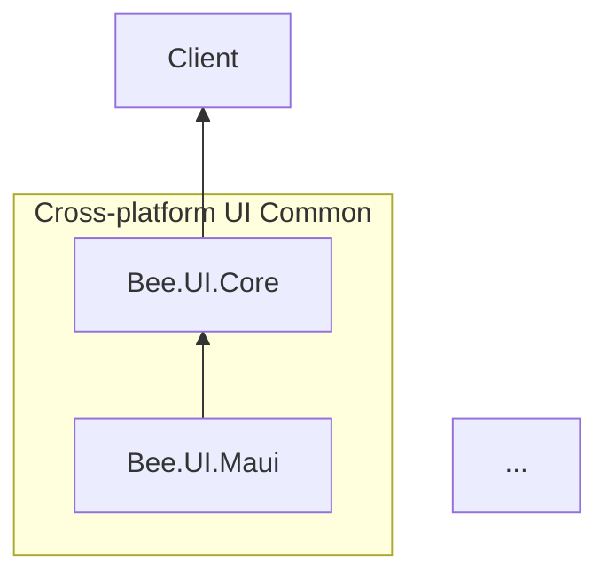

# 計畫:新增 Bee.UI.Maui 控制項專案骨架

**狀態:📝 擬定中**

## 1. 背景

bee-library 目前已有完整的後端 + Bee.UI.Core + Bee.Web.Blazor.* 結構,但缺少 native 前端的對應套件。
本計畫**加入 `Bee.UI.Maui` 空殼專案**作為:

- **架構完整性**:dependency-map mermaid 圖補上 UI family 的 MAUI sibling,
  讓「`Bee.UI.Core` 為 native UI 共通抽象」的設計意圖視覺化
- **命名 / 依賴方向 lock 住**:未來開發第一個 MAUI 控制項時 friction = 0
- **不實作任何具體控制項**:空殼 placeholder,只證明「build + pack 可行」

### 1.1 與 `Bee.Web.Blazor.*` 的定位對比

| 套件 | 透過誰連後端 | 部署環境 | 狀態管理 |
|------|---|---|---|
| `Bee.Web.Blazor.Server` | `Bee.Api.Client`(自帶 circuit) | ASP.NET Core Server | Razor component / circuit |
| `Bee.Web.Blazor.Wasm` | `Bee.Api.Client`(自帶 WASM 狀態) | Browser WASM | Razor component / WASM heap |
| **`Bee.UI.Maui`(本計畫)** | **`Bee.UI.Core` → `Bee.Api.Client`**(共用 `ClientInfo` static singleton) | **iOS / Android / macOS / Windows** | **`Bee.UI.Core.ClientInfo` 提供 endpoint / token / connector 狀態** |

呼應 `Bee.UI.*` family 判別準則:**消費 `Bee.UI.Core` 與否決定 prefix**。
- 消費 → `Bee.UI.Maui`、未來 `Bee.UI.WinForms` / `Bee.UI.Wpf`
- 不消費 → `Bee.Web.Blazor.*`(Blazor circuit / WASM 環境無檔案 IO 與 dialog service 概念,獨立 family 合理)

---

## 2. 範圍

### 2.1 動的部分

| 檔案 | 異動 |
|------|------|
| `src/Bee.UI.Maui/Bee.UI.Maui.csproj` | 新增,multi-target 多平台 |
| `src/Bee.UI.Maui/` 內 placeholder 檔 | 1 個 minimal class(見 §5) |
| `Bee.Library.slnx` | 加入 project 條目 |
| `.github/workflows/build-ci.yml` | 加 MAUI workload install + cache + smoke build 策略(見 §4) |
| `.github/workflows/nuget-publish.yml` | **本計畫先不加**(空殼不發 NuGet,見 §6) |
| `docs/dependency-map.md` + `.zh-TW.md` | mermaid + 架構要點 + `Bee.UI.*` family 判別準則 |

### 2.2 不動的部分

- 不實作任何實際控制項(`Bee.UI.Maui` 內僅 placeholder)
- 不修改 `Bee.UI.Core`(`ClientInfo` 已有需要的東西)
- 不建 `tests/Bee.UI.Maui.UnitTests`(空殼無測試對象;
  日後加實際控制項時再補,符合 testing.md「每個 src 對應 tests」規範時機)
- WinForms 專案(獨立 repo,本 plan 完全不處理)
- 修改 `Bee.UI.Core.ClientInfo` 為 thread-safe / DI-aware 等重構(留後續獨立任務)

---

## 3. csproj 兩階段設計

實作期間試 multi-target MAUI 後發現:本機 / CI 需要完整 MAUI workload + JDK + Android SDK
才能 build,對「placeholder 卡位」目的成本過高。改採兩階段:

### 3.1 Phase 0(本計畫實作):plain net10.0 placeholder

```xml
<Project Sdk="Microsoft.NET.Sdk">

  <PropertyGroup>
    <TargetFramework>net10.0</TargetFramework>
    <Nullable>enable</Nullable>
    <Description>Cross-platform MAUI control library for Bee.NET (placeholder; will become multi-target MAUI when the first concrete control lands).</Description>
    <PackageTags>bee.net;maui;ui;controls;mobile;desktop</PackageTags>
  </PropertyGroup>

  <ItemGroup>
    <ProjectReference Include="..\Bee.UI.Core\Bee.UI.Core.csproj" />
  </ItemGroup>

</Project>
```

設計重點:
- **`net10.0` 單一 TFM**:不依賴任何 platform workload,`dotnet build Bee.Library.slnx` 自動涵蓋
- **不啟用 `UseMaui`**:避免 MA002 implicit package reference warning 與 MAUI SDK 依賴
- **`<Description>` 明示 placeholder**:讀 csproj 第一眼就知道未來會變
- **`PackageTags` 保留 `maui;ui;controls;mobile;desktop`**:表達未來定位
- **`ProjectReference Bee.UI.Core`**:lock dependency 方向(這正是 plan 的核心目的)

### 3.2 Phase 1(未來:第一個實際控制項出現時)

當第一個 MAUI 控制項要實作時,**整個 csproj 改寫**為 MAUI multi-target:

```xml
<Project Sdk="Microsoft.NET.Sdk">
  <PropertyGroup>
    <TargetFrameworks>net10.0-android;net10.0-ios;net10.0-maccatalyst</TargetFrameworks>
    <TargetFrameworks Condition="$([MSBuild]::IsOSPlatform('windows'))">$(TargetFrameworks);net10.0-windows10.0.19041.0</TargetFrameworks>
    <UseMaui>true</UseMaui>
    <SingleProject>true</SingleProject>
    ...
  </PropertyGroup>
  <ItemGroup>
    <PackageReference Include="Microsoft.Maui.Controls" Version="..." />
    <ProjectReference Include="..\Bee.UI.Core\Bee.UI.Core.csproj" />
  </ItemGroup>
</Project>
```

到 Phase 1 時對應變動:
- CI build-ci.yml 加 MAUI workload install + cache
- 本機開發者裝 `maui-android` workload + JDK + Android SDK
- 評估是否加 `Bee.UI.Maui.UnitTests` 專案

Phase 1 變動量大,但等到有實際 use case 時做,**比現在 over-engineer 划算**。

### 3.3 為何不加 tests 專案

Phase 0 placeholder 無測試對象;Phase 1 評估時再決定(MAUI Class Library 的測試需 MAUI runtime,
單純 logic test 由 `Bee.UI.Core.UnitTests` 已涵蓋)。

---

## 4. CI build 策略

### 4.1 Phase 0(本計畫):無 CI 變動

`Bee.UI.Maui` 為 plain `net10.0` csproj,被 `dotnet build Bee.Library.slnx` 自動涵蓋,
**build-ci.yml 與 nuget-publish.yml 都不需修改**。

這正是 Phase 0 選用 plain net10.0 的關鍵益處:
- ubuntu-latest runner 不需 MAUI workload
- 不需 JDK / Android SDK
- 不需處理 multi-platform host 限制
- CI 時間不增加

### 4.2 Phase 1(未來)的 CI 變動

當 csproj 改 multi-target MAUI 時,屆時:

| 平台 | TFM | ubuntu | macos | windows |
|------|-----|---|---|---|
| Android | `net10.0-android` | ✅ | ✅ | ✅ |
| iOS | `net10.0-ios` | ❌(需 Xcode) | ✅ | ❌ |
| Mac Catalyst | `net10.0-maccatalyst` | ❌(需 Xcode) | ✅ | ❌ |
| Windows | `net10.0-windows...` | ❌ | ❌ | ✅ |

屆時推薦策略:
- **build-ci.yml**:維持 ubuntu-latest + 只 smoke build `net10.0-android`(`dotnet workload install maui-android` + cache);iOS / Maccatalyst / Windows 留給本機 / nuget-publish CI 驗證
- **nuget-publish.yml**:runner 改 macos-latest(可 pack iOS / Maccatalyst / Android),Windows TFM 透過 matrix 或 cross-compile
- **詳細變動範例**保留在本計畫 §4 git history 內(舊版 plan 已寫過完整 CI workflow 修改範本)

Phase 1 變動實作時再寫獨立計畫,本計畫不深入。

---

## 5. Placeholder 內容

空殼專案需要至少 1 個 `.cs` 檔讓 csproj 編譯有東西。選項:

### 5.1 推薦:`PlaceholderInfo.cs`(明確標示空殼)

```csharp
namespace Bee.UI.Maui;

/// <summary>
/// Placeholder type for the empty <c>Bee.UI.Maui</c> assembly.
/// </summary>
/// <remarks>
/// This assembly currently contains no controls. It exists as a project skeleton so
/// that the <c>Bee.UI.*</c> family structure (Core / Maui / future WinForms) is
/// complete in the dependency graph. The first concrete control will replace this
/// placeholder.
/// </remarks>
internal static class PlaceholderInfo
{
    /// <summary>
    /// Marker string indicating this is a placeholder build.
    /// </summary>
    internal const string Status = "Bee.UI.Maui: placeholder, no controls implemented yet.";
}
```

- `internal` 不污染對外 API surface
- XML doc 明確說明「為何存在」
- 未來第一個控制項加入時直接刪除這個檔

### 5.2 替代:`BeeContentView.cs`(預埋 base class)

預先建一個自訂 ContentView base class 供未來控制項繼承。但「預埋 design」風險:
- 第一個控制項實作時可能發現 base class 設計不對,要重新做
- 還沒有具體 use case 前 over-engineer

**不推薦**。Placeholder 應該越輕越好,等 use case 出現再加 base class。

---

## 6. NuGet Publish 處理(本計畫先不加)

`nuget-publish.yml` 三處(build / pack / release notes)**本計畫先不加** `Bee.UI.Maui`。

### 6.1 理由

- **空殼套件發版無意義**:沒人會 install 一個只含 PlaceholderInfo 的套件
- **避免污染 NuGet.org**:Bee.UI.Maui 4.x.x 第一版發出去後就是「歷史紀錄」,刪不掉只能 unlist
- **CI publish runner 限制**:`nuget-publish.yml` 目前跑 windows-latest,
  Windows host 可 pack Windows / Android target 但**無法 pack iOS / Maccatalyst**(需 macOS host)。
  完整支援需改 publish workflow 為 macos-latest 或 multi-runner matrix —— 等真實控制項上線再處理。

### 6.2 等到什麼時機加 NuGet publish

第一個實際控制項實作完成且要對外發佈時:
1. `nuget-publish.yml` runner 改 macos-latest(可 pack 所有平台 TFM)
2. 三處加 `Bee.UI.Maui`
3. release notes 加說明
4. 同步更新 `dependency-map` 從「規劃」改「已發佈」描述

---

## 7. 文件更新

### 7.1 `dependency-map.md` + `.zh-TW.md` mermaid

加入 `UICore` 與 `UIMaui` node 並建立箭頭:



`Bee.UI.Maui` 視為 `Bee.UI.Core` 的下游 consumer,直接放同 subgraph 表達 family 關係。

### 7.2 架構要點

加入「`Bee.UI.*` family 判別準則」段落(承之前對話定義):

```markdown
- **`Bee.UI.*` family 判別準則**:是否消費 `Bee.UI.Core` 抽象
  (`ClientInfo` / `IEndpointStorage` / `IUIViewService` 等)。
  - 消費 → `Bee.UI.*`(目前:`Bee.UI.Core`、`Bee.UI.Maui`;未來:`Bee.UI.WinForms` 等)
  - 不消費,自有狀態管理 → 走獨立 family(如 `Bee.Web.Blazor.*`)
```

### 7.3 專案數字更新

「14 個 / 15 個 src/ 專案」改為 **16 個**(若 mermaid 圖中 `Bee.UI.Maui` 為 placeholder 仍計入)。

---

## 8. 風險與緩解

### 8.1 CI workload 安裝時間

**風險**:首次 CI run `dotnet workload install maui-android` 約 1-3 min。

**緩解**:
- GitHub Actions cache(§4.4)
- 只裝 `maui-android` 而非完整 `maui`(體積最小)
- 若 cache miss 影響 critical path,可考慮 self-hosted runner 預裝 workload

### 8.2 空殼專案被誤認為已有功能

**風險**:讀者看到 `Bee.UI.Maui` 在 dependency-map 中,以為已有控制項可用。

**緩解**:
- `PlaceholderInfo.Status` 明確標示 "no controls implemented yet"
- `dependency-map.md` 加註「`Bee.UI.Maui` 為 placeholder skeleton,目前無對外發佈套件」
- `Bee.UI.Maui.csproj` 的 `<Description>` 寫明「cross-platform MAUI control library」(未來定位),
  不宣稱「已有控制項」

### 8.3 第一個真實控制項上線時 csproj 需大改

**風險**:現在 csproj 簡化太多,未來實作時要大幅調整(資源 / Handler / theming 等)。

**緩解**:
- 本計畫 csproj 已含 `UseMaui` / `SingleProject` / `SupportedOSPlatformVersion` 等 MAUI 標準屬性
- 未來新增控制項時 csproj 改動局限於:
  - 加 `Resources/` 與 `<MauiImage>` / `<MauiFont>` 等 ItemGroup
  - 加實際的 Handler / Platform-specific code(若需要)
- 不會「砍掉重練」

### 8.4 multi-target build host 不齊

**風險**:沒有 macOS 開發機的 contributor 無法本機驗證 iOS / Maccatalyst build。

**緩解**:
- 本計畫只在 Android target 做 smoke,大部分 contributor 用 Linux / Windows 都能跑
- iOS / Maccatalyst 驗證留給有 macOS 機的維護者(或 nuget-publish CI 上,雖然本計畫先不加)
- 文件註記「完整 multi-platform build 需 macOS host」

---

## 9. 不在本計畫範圍

- **任何實際 MAUI 控制項實作**(`BeeFormEntry` / `BeeDataGrid` 等)
- **Bee.UI.Core 的重構**(`ClientInfo` static state DI 化、async 化整鍵盤等)
- **`tests/Bee.UI.Maui.UnitTests`**(空殼無測試對象,等實際控制項出現)
- **WinForms 專案建立**(獨立 repo,完全不在本 repo 範圍)
- **NuGet publish 加入**(§6 已說明,等第一個實際控制項)
- **CI 改 macOS runner**(等第一個實際控制項 + iOS / Maccatalyst 驗證需求)
- **CHANGELOG 撰寫**(由 `/changelog-draft` 在發版時處理)
- **README 端對 Bee.UI.Maui 的 marketing 段落**(空殼不需 marketing)

---

## 10. Checklist

實作收尾時逐項勾選(Phase 0):

**csproj + placeholder**
- [ ] 建立 `src/Bee.UI.Maui/Bee.UI.Maui.csproj`(§3.1 plain net10.0 + ProjectReference Bee.UI.Core)
- [ ] 建立 `src/Bee.UI.Maui/PlaceholderInfo.cs`(§5.1 樣板)

**Solution 接入**
- [ ] `Bee.Library.slnx` 在 `src/` 區塊加 `Bee.UI.Maui` project 條目
- [ ] 不加 tests project(§2.2 明列不動)

**CI 整合(Phase 0)**
- [ ] 無 CI workflow 變動(plain net10.0 csproj 由 slnx build 自動涵蓋,見 §4.1)
- [ ] 確認既有 build / test 步驟不會因 Bee.UI.Maui 加入而 fail

**NuGet publish**
- [ ] `.github/workflows/nuget-publish.yml` **本計畫先不動**(§6)

**文件**
- [ ] `docs/dependency-map.md` mermaid + 架構要點 + family 判別準則 + placeholder 註記
- [ ] `docs/dependency-map.zh-TW.md` 對應雙語同步

**驗證**
- [ ] 本機:`dotnet build Bee.Library.slnx --configuration Release` 通過(0 警告 0 錯誤)
- [ ] 本機:既有 `./test.sh` 全部 pass

**plan 收尾**
- [ ] 本文件頂部狀態列改 `**狀態:✅ 已完成(YYYY-MM-DD)**`
- [ ] 開立 Phase 1 follow-up 提醒(第一個實際控制項實作時觸發 csproj 改寫 + CI workflow 更新)
