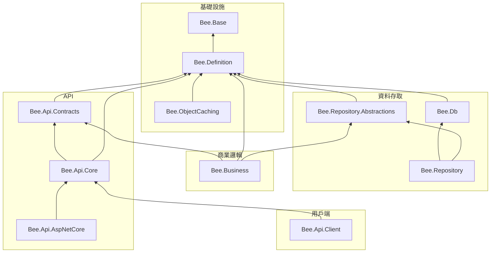

# AI Coding 輔助文件計畫

## 目標

新增補充文件，讓 AI Coding 工具能更準確地理解框架的運作方式、設計決策與禁止事項，減少幻覺與跨層違規。

## 產出文件清單

依優先順序排列，共 4 份文件（單一語言版本，以繁體中文撰寫）：

| # | 文件 | 目的 | 預估行數 |
|---|------|------|----------|
| 1 | `docs/development-cookbook.md` | 端到端實作指引 | 200-250 |
| 2 | `docs/dependency-map.md` | 專案相依性全景圖 | 60-80 |
| 3 | `docs/adr/` (目錄) | 架構決策紀錄 | 每篇 30-50 |
| 4 | `docs/development-constraints.md` | 開發限制與反模式 | 100-130 |

---

## 1. 端到端實作指引（Development Cookbook）

**檔案**：`docs/development-cookbook.md`

### 內容大綱

#### 1.1 框架初始化順序

說明 `BackendInfo` → `SysInfo` → `RepositoryInfo` → `CacheFunc` → `ApiServiceOptions` 的初始化順序與相依關係，包含：

- 各靜態入口的初始化時機與方法
- 必須遵守的順序（`BackendInfo.DefineAccess` 必須最先設定）
- 參考 `tests/Bee.Tests.Shared/GlobalFixture.cs` 的實際初始化範例

#### 1.2 請求處理流程（Request Pipeline）

以 Mermaid 序列圖呈現 Client → Server 的完整請求生命週期：

```
ApiConnector.Execute<T>()
  → JsonRpcRequest 建立（method = "ProgId.Action"）
  → Payload 轉換（Serialize → Compress → Encrypt）
  → IJsonRpcProvider.Execute()
    ├── LocalApiServiceProvider（同進程直接呼叫）
    └── RemoteApiServiceProvider（HTTP POST + Auth Headers）
  → ApiServiceController.PostAsync()
  → Authorization 驗證
  → JsonRpcExecutor.ExecuteAsync()
    → 解析 Method → ProgId + Action
    → BusinessObjectProvider 建立 BO
    → ApiAccessValidator 驗證存取權限
    → 反射呼叫 BO 方法
  → 回傳 JsonRpcResponse
```

#### 1.3 新增表單功能 Walkthrough

逐步說明如何新增一個完整的表單功能（以「員工管理」為例）：

1. **定義 FormSchema**：欄位、表格、關聯
2. **衍生 TableSchema**：資料庫結構
3. **建立 FormLayout**：UI 佈局
4. **實作 Business Object**：繼承 `FormBusinessObject`
5. **實作 ExecFunc Handler**：自訂商業邏輯
6. **Client 端呼叫**：使用 `FormApiConnector`

#### 1.4 ExecFunc 自訂函式模式

說明完整的 ExecFunc 開發流程：

- `ExecFuncArgs` / `ExecFuncResult` 的 Parameters 用法
- `FormExecFuncHandler` / `SystemExecFuncHandler` 的實作方式
- `ExecFuncAccessControlAttribute` 存取控制宣告
- `BusinessFunc.InvokeExecFunc()` 的反射呼叫機制
- 具體範例：`Hello()`、`UpgradeTableSchema()`

#### 1.5 API 契約三層分離模式

說明 Contract Interface → API Type → BO Type 的三層設計：

- `Bee.Api.Contracts`：純介面（`ILoginRequest`）
- `Bee.Api.Core`：API 型別（繼承 `ApiRequest`，有 MessagePack 屬性）
- `Bee.Business`：BO 型別（繼承 `BusinessArgs`，純 POCO）
- `ApiContractRegistry` 的型別對應機制
- `ApiInputConverter` 的屬性對應轉換

---

## 2. 專案相依性全景圖（Dependency Map）

**檔案**：`docs/dependency-map.md`

### 內容大綱

- Mermaid 圖表呈現 11 個專案的相依關係
- 依架構層級分組（基礎設施 / 資料存取 / 商業邏輯 / API / 用戶端）
- 標示外部套件相依（Newtonsoft.Json、MessagePack、System.Runtime.Caching 等）
- 標示 target framework 差異（netstandard2.0 + net10.0 vs. net10.0 only）



---

## 3. 架構決策紀錄（ADR）

**目錄**：`docs/adr/`

每份 ADR 採用固定格式：

```markdown
# ADR-NNN: 標題

## 狀態
已採納 / 已取代 / 已棄用

## 背景
為什麼需要做這個決策？

## 決策
選擇了什麼方案？

## 理由
為什麼選這個方案而不是其他方案？

## 影響
這個決策帶來的限制或後果
```

### 初始 ADR 清單

| ADR | 標題 | 核心問題 |
|-----|------|----------|
| ADR-001 | 使用 DataSet 作為跨層 DTO | 為什麼不用強型別 POCO？ |
| ADR-002 | 使用 Newtonsoft.Json 而非 System.Text.Json | 為什麼不遷移到 STJ？ |
| ADR-003 | 靜態 Service Locator 模式 | BackendInfo / RepositoryInfo 為什麼用靜態而非 DI？ |
| ADR-004 | MessagePack 作為 API Payload 序列化格式 | 為什麼不用 JSON？ |
| ADR-005 | FormSchema 定義驅動架構 | 為什麼用 Schema 驅動而非 Code-First？ |
| ADR-006 | 雙目標框架策略 | 為什麼同時支援 netstandard2.0 + net10.0？ |

> **注意**：ADR 內容需要與使用者確認，因為這些設計決策的「為什麼」只有原作者最清楚。計畫中先列出問題，執行時由 AI 根據程式碼推測初稿，再由使用者審閱修正。

---

## 4. 開發限制與反模式（Development Constraints）

**檔案**：`docs/development-constraints.md`

### 內容大綱

#### 4.1 初始化限制

- `BackendInfo.DefineAccess` 必須在所有其他元件之前設定
- `RepositoryInfo` 的靜態建構子會驗證 `DefineAccess != null`，違反時拋出 `InvalidOperationException`
- `BackendInfo.Initialize()` 必須在使用加密功能前呼叫（初始化安全金鑰）
- `ApiServiceOptions.Initialize()` 必須在處理 API 請求前呼叫

#### 4.2 跨層禁止事項

- 禁止 API 層直接引用 Repository 層（必須透過 Business Object）
- 禁止 Business Object 直接操作 `DbConnection`（必須透過 `DbAccess`）
- 禁止在 Client 端存取 `RepositoryInfo`（僅限 Server 端）
- 禁止跳過 Payload Pipeline 順序（Serialize → Compress → Encrypt）

#### 4.3 ExecFunc 開發限制

- ExecFunc 方法必須是 `public` 且非泛型（反射呼叫限制）
- 方法簽章固定為 `void MethodName(ExecFuncArgs args, ExecFuncResult result)`
- 未標記 `[ExecFuncAccessControl]` 的方法預設需要 `Authenticated`
- `FuncId` 對應方法名稱，大小寫敏感

#### 4.4 例外處理規則

- 僅以下例外類型會原樣回傳給 Client：
  - `UnauthorizedAccessException`、`ArgumentException`、`InvalidOperationException`
  - `NotSupportedException`、`FormatException`、`JsonRpcException`
- 其他例外一律轉為 "Internal server error"（生產環境）
- 開發環境（`IsDevelopment`）會回傳完整錯誤訊息

#### 4.5 安全限制

- 整合 `rules/security.md` 已有內容，不重複但交叉引用
- 補充：`SafeTypelessFormatter` 型別白名單機制
- 補充：`LoginAttemptTracker` 帳號鎖定規則（5 次失敗 / 15 分鐘鎖定）

#### 4.6 FormSchema 設計限制

- FormSchema 在執行時期為唯讀，不可動態新增欄位
- `SqlFormCommandBuilder.BuildInsertCommand()` 基底實作會拋出 `NotSupportedException`，子類別必須覆寫
- TableSchema 手動調整的部分（精度、索引、預設值）在 FormSchema 更新時會被保留

---

## 執行順序

1. **`docs/dependency-map.md`** — 最小、最快完成，立即提供全景視圖
2. **`docs/development-constraints.md`** — 防禦性文件，避免 AI 犯常見錯誤
3. **`docs/development-cookbook.md`** — 最大但最有價值，需要精確描述流程
4. **`docs/adr/`** — 需要使用者參與確認，最後執行

## CLAUDE.md 更新

所有文件完成後，更新 `.claude/CLAUDE.md` 的「架構參考」段落，加入新文件的引用：

```markdown
## 架構參考

實作任何功能或模組前，請先閱讀：
- 架構文件：`docs/architecture-overview.md`
- 相依性全景圖：`docs/dependency-map.md`
- 開發指引：`docs/development-cookbook.md`
- 開發限制：`docs/development-constraints.md`
- 架構決策紀錄：`docs/adr/`
```
